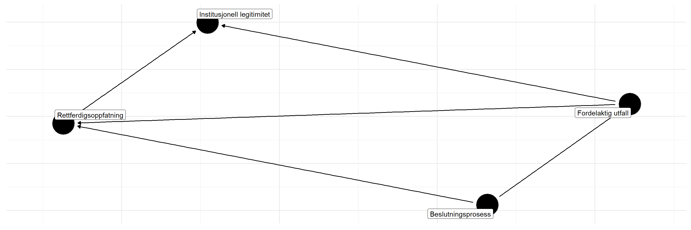

\newpage\doublespacing
# Bakgrunn og motivasjon {#bakgrunn}

## Byråkratisk omveltning
Den pågående automatiseringen av beslutningsprosesser i offentlig forvaltning representerer en omveltning innenfor byråkratisk myndighetsutøvelse. 
Tilgang på store mengder relevant digital data og økende muligheter for å behandle informasjonen gjør at oppgaver som tidligere måtte behandles manuelt kan overlates til hel- eller halvautomatiserte prosesser med vesentlig redusert menneskelig inngripen [@zarsky2016trouble]. 
På den ene siden gir denne utviklingen store effektiviseringsmuligheter og potensial for offentlige besparelser [@duwe2017effects].
Den representerer også en mulighet for å utvikle bedre, evidensbaserte beslutninger, som i sin tur kan bidra til å bevare tilliten og legitimiteten til offentlig forvaltning. 
På den andre siden er nettopp ivaretakelsen av forvaltningens legitimitet i befolkningen også et risikoaspekt i denne utviklingen. 
En frykt er at feil bruk kan lede til utfall som negativt forskjellsbehandler svakerestilte grupper i samfunnet, som igjen underminerer systemtilliten.

En arbeidsgruppe oppnevnt av den tidligere amerikanske president Barack Obama publiserte rapporter hvor de uttrykte bekymring for “kode-diskriminering» i automatiserte beslutninger, hvor diskriminering av sosiale grupper oppsto som en utilsiktet følge av måten stordatateknologi er strukturert og brukes. 
Dystopiske skildringer av “svart boks”-samfunn maler et skremmende bilde av et framtidssamfunn der innbyggernes skjebner blir bestemt av skjulte, upresise, og diskriminerende automatiske beslutningsprosesser [@barocas2016big; @pasquale2015black].
I de tilfeller oppmerksomheten når ut til allmennheten, har fokus tendert å handle om hvordan beslutningene slår ulikt ut sosiale grupper. 
Det amerikanske nyhetsmagasinet ProPublica viste hvordan prediksjonsmodeller som brukes til å forutsi gjentakelsesfare for lovbrudd blant fengselsinnsatte systematisk kategoriserte svarte insatte oftere enn hvite feilaktig som personer med høy risiko for å begå en ny forbrytelse når de løslates fra fengselet [@angwin2016machine].

Opplevd diskriminering fra myndighetenes side mot sosiale grupperinger er ikke noe nytt, og spesielt ikke i USA hvor automatiserte beslutninger har fått mest oppmerksomhet til nå. 
I Norge har vi mindre forskjeller mellom folk, både økonomisk, politisk og sosialt. 
Norge har også en høyt kompetent og effektiv offentlig forvaltning som jevnt over nyter høy tillit i befolkningen.
I overgangen til økt automatisering i forvaltningen er det viktig at tilliten og legitimiteten til offentlig forvaltning opprettholdes.

NAV er ledende i utviklingen av digitale tjenester og verktøy[@hansen2018digitalization], og utvikler systemer som kan nyttiggjøre seg framskritt som gjøres innenfor databehandling og analyse. 
Beslutningsprosesser som benytter seg av maskinlæring og kunstig intelligens vil være en del av løsningen for at NAV skal oppnå samfunnsoppdraget sitt om å bidra til at flere kommer i arbeid og færre på stønad, og samtidig sørge for at de som trenger det, får rett ytelse til rett tid gjennom en pålitelig og effektiv forvaltning. 
Maskinlæring og kunstig intelligens kan brukes både i helautomatiserte beslutningsprosesser, og som beslutningsstøtte for saksbehandlere. 
Et sentralt kjennetegn er at slike verktøy etterligner, erstatter og utvider menneskelig intelligent handling, og menneskelig beslutningstaking og vurdering.
Mulige områder hvor maskinlæring og kunstig intelligens kan benyttes i NAV er blant annet for å beregne sannsynlighet for at den arbeidsledige trenger bistand fra NAV; til å bestemme om en person i sykefravær skal kalles inn til oppfølgingsmøte fra NAV; og til å anbefale arbeidsrettede tiltak.
På veien mot bedre tjenester er det viktig at man har med seg brukerne –- det vil si innbyggerne i Norge -– og lager ansvarlige systemer som gir lik og rettferdig behandling uavhengig av sosial status.

## Beslutningsprosesser, rettferdighet og legitimitet
En massiv litteratur på prosedyrerettferdighet med utspring fra sosialpsykologi [@lind1988social] har hatt stor innvirkning på hvordan vi forstår relasjonene mellom innbyggere og myndighetene, og hvordan myndighetene bør forholde seg i møte med innbyggerne.
Når beslutningsprosessene dreier i retning av mer bruk av maskinlæring og kunstig intelligens, fungerer denne litteraturen som et velegnet rammeverk for å undersøke empirisk om, og i så fall hvordan, relasjonene mellom innbyggerne og myndighetene vil påvirkes av denne utviklingen.
Det vi vet fra eksperimentell forskning på politisk atferd er at både aspekter ved prosessen og utfallet i seg selv påvirker rettferdighetsoppfatningen av beslutningen og i sin tur villigheten til å akseptere beslutningen (se figur under). 
På kort sikt handler det om å skaffe aksept for enkeltbeslutninger. 
I et mer overordnet perspektiv dreier det seg om systemstøtte; om å sikre tillit og legitimitet til styresmaktene, og opprettholde tilfredsheten med demokratiet som styresett. 
Legitimitet forstår vi her som makten til å få noen til villig å føye seg etter en beslutning [@weber2009theory], som i sin tur gir myndighetene den autoriteten de trenger for å styre effektivt uten bruk av sanksjoner [@tyler2021people]. 
Demokratisk legitimitet viser til den legitimiteten som vinnes ved at beslutningene utgår fra folkeviljen [@rosanvallon2011democratic].
Både tillit og legitimitet omhandler relasjonen mellom innbyggere og myndighetene, og faller under det bredere konseptet om politisk støtte [@easton1965systems].

Prosessrelaterte spørsmål som har blitt studert er blant annet om rettferdighetsoppfatningen og aksepten av beslutningen påvirkes av forhold som er sentrale i demokratiske systemer.
Slike forhold kan for eksempel være grad av åpenhet rundt beslutningsprosessen [@de2014does], mulighet for direkte påvirkning på en avgjørelse [@EJPR:EJPR2052; @arnesen2017legitimacy; @christensen2020matter], hvem beslutningstakerne er, og hvor godt disse beslutningstakerne gjenspeiler befolkningen med tanke på sosial bakgrunn [@arnesen2018legitimacy; @clayton2019all]. 
Videre er et gjennomgående funn at dersom utfallet går imot ens egne ønsker, blir prosessen diskreditert [@esaiasson2016reconsidering].


```{r, out.width = "100%", fig.align = "center", fig.cap= "Antatt årsakssammenheng"}

```

Demokrati- og opinionsforskere har i liten grad studert hvordan overgangen til økt bruk av maskinlæring og kunstig intelligens i forvaltningens beslutningsprosesser kan påvirke systemtillit og legitimitet. 
Unntak er De Fine Licht & De Fine Licht [-@de2020artificial] som studerer rollen som åpenhet når det gjelder hvordan allmennheten oppfatter kunstig intelligens-beslutninger som legitim, og Binns et al [-@binns2018s] som foretar eksperimentelle studier som undersøker folks oppfatning av rettferdighet i algoritmiske beslutninger.
Vår kunnskap om hvordan overgangen vil påvirke innbyggernes oppfatninger av forvaltningen er imidlertid fortsatt begrenset, og behovet for befolkningsrepresentative studier med et demokratiperspektiv er stort.
Det er motivasjonen for å lage denne rapporten.

Rapporten presenterer resultatene fra en spørreundersøkelse gjennomført på et befolkningsrepresentativt utvalg av innbyggere i Norge.
Undersøkelsen tar for seg generelle holdninger til og kunnskap om maskinlæring og kunstig intelligens i befolkningen. 
Å bruke maskinlæring innebærer å få datamaskiner til å lære seg å løse oppgaver basert på et datamateriale. 
Ofte kan datamaskinen bli ekstremt treffsikker, men det krever typisk veldig mye datamateriale. 
Maskinlæring er i dag grunnlaget for alt fra automatisk stemmegjenkjenning til førerløse biler.
I den internasjonale litteraturen om prosesseringen av data med formål å forbedre og effektivisere beslutninger i forvaltningen brukes flere begreper om hverandre, så som "automatiserte beslutninger", "bruk av maskinlæring og kunstig intelligens i forvaltningen", og "algoritmestyrt forvaltning".
Vi bruker også begrepene til en viss grad om hverandre i denne rapporten, avhengig av hvilke tidligere studier vi forholder oss til og hvilke spørsmålsformuleringer som har blitt brukt i undersøkelsene vi viser til.

Bredere spørsmål knyttet til relasjonen mellom NAV og innbyggerne -- uavhengig av tematikken om maskinlæring og kunstig intelligens -- blir også analysert for å kontekstualisere de mer spesifikke spørsmålene og eksperimentene knyttet til bruk av maskinlæring og kunstig intelligens i NAV.
Deretter fokuserer vi på holdninger som har relevans for en framtid hvor maskinlæring og kunstig intelligens vil spille en sentral rolle.
Dette gjelder problemstillinger knyttet til konkrete, aktuelle situasjoner i NAV, såvel som mer overordnete spørsmål om maskinlæring og kunstig intelligens i forvaltningen.

<!-- ## Data -->

<!-- Datagrunnlaget for denne rapporten er samlet inn i Norsk medborgerpanels runde 22 og 23. -->
<!-- Norsk medborgerpanel er en internettbasert undersøkelse om nordmenns holdninger til viktige samfunnstema. -->
<!-- Panelet drives av samfunnsforskere ved Universitetet i Bergen og NORCE, og er et non-profit prosjekt utelukkende benyttet til forskningsformål.  -->
<!-- Deltakerne representerer et tverrsnitt av den norske befolkningen, som noen ganger i året inviteres til å si sin mening i viktige spørsmål om norsk samfunn og politikk. -->

<!-- Panelet blir driftet av [Digital samfunnsvitenskapelig kjernefasilitet (DIGSSCORE)](www.digsscore.uib.no), som er samarbeidspartner i prosjektet. -->

<!-- Samlet antall respondenter som svarte på deler av denne undersøkelsen var 3971. -->
<!-- Typisk antall respondenter for hvert spørsmål er om lag 2000. -->

<!-- [Metoderapport for data kan lastes ned her.](https://www.uib.no/en/digsscore/122162/methodology-and-field-periods) -->
<!-- Data er åpent tilgjengelig for forskere, og kan lastes ned ved å kontakte [Sikt – Kunnskapssektorens tjenesteleverandør (tidligere kjent som NSD)](https://sikt.no/). -->
