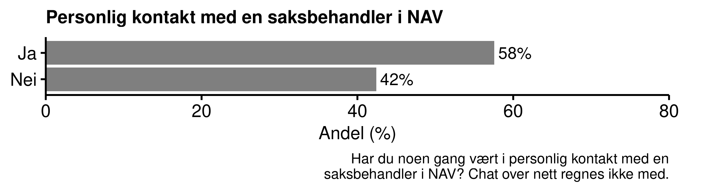
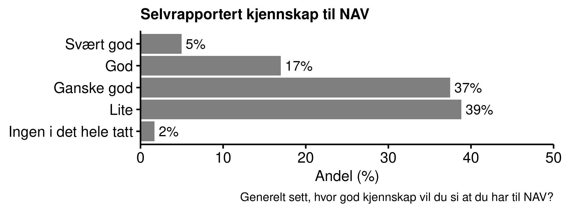
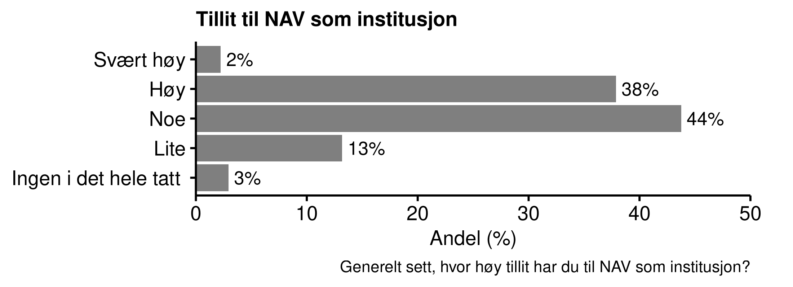
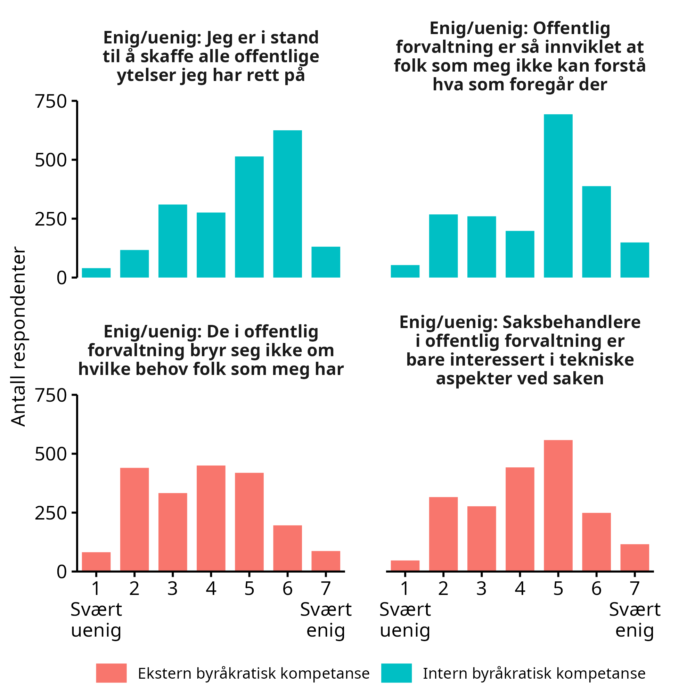
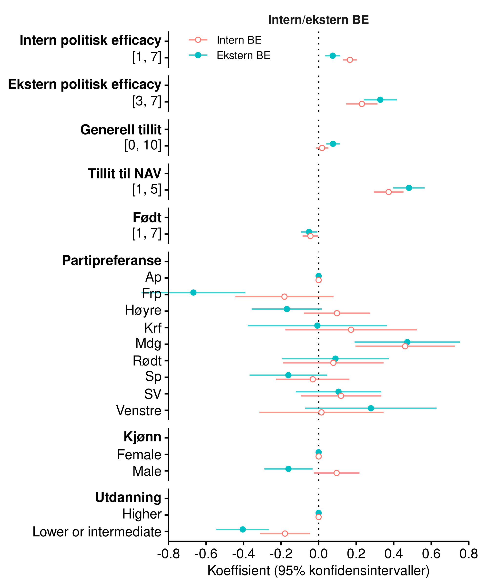
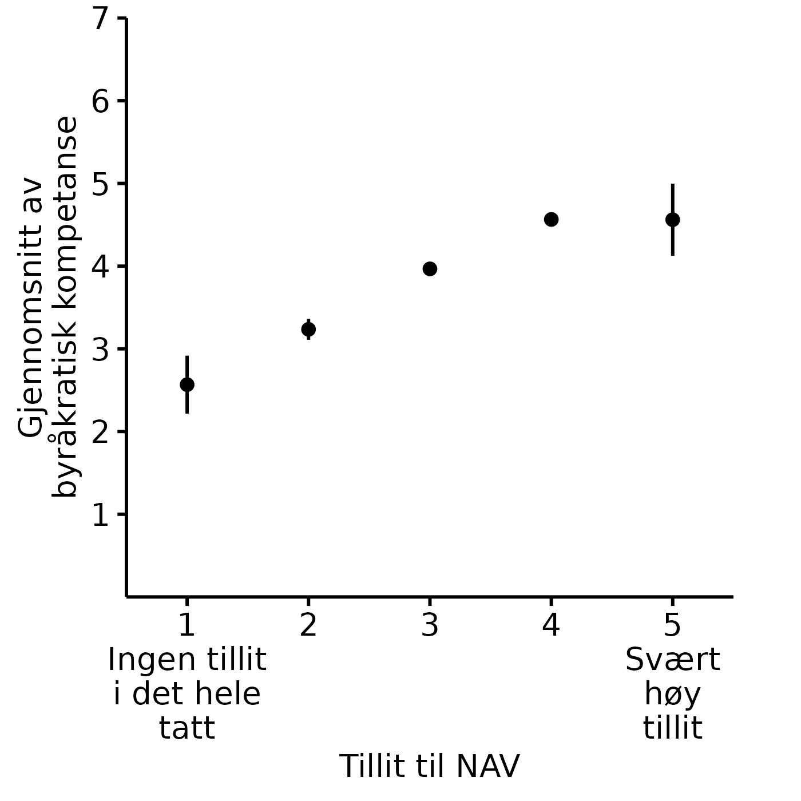
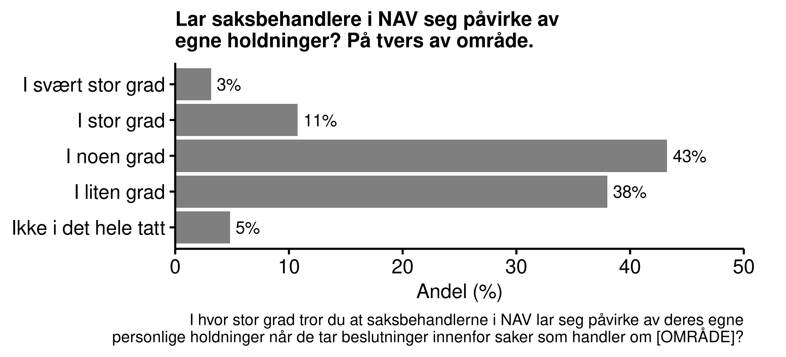
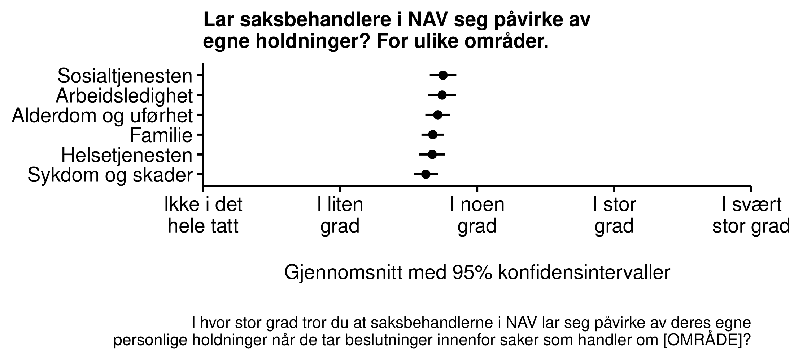
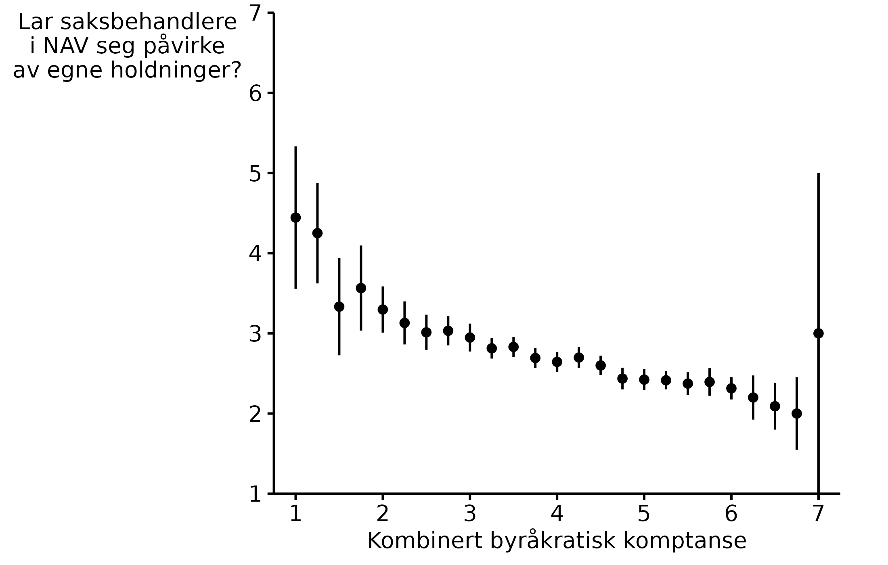
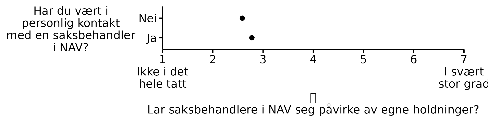

# Oppfatninger om NAV

I dette kapitlet ser vi nærmere på relasjonen mellom NAV og innbyggerne i Norge.
Kapitlet danner grunnlaget for å forstå konteksten når vi senere fokuserer mer spesifikt på maskinlæring og kunstig intelligens i organisasjone. 
Vi måler folks tillit til NAV, samt deres erfaring med og kjennskap til NAV.
Vi måler også i hvilken grad innbyggerne opplever at de forstår hvordan organisasjonen fungerer, og i hvilken grad de opplever at deres interesser blir ivaretatt i systemet.

Vi finner at 

- over halvparten av innbyggerne har vært i personlig kontakt med saksbehandler i NAV, men mange oppgir likevel at de har liten kjennskap til NAV.

- innbyggerne har middels til høy tillit til NAV. Det er få som oppgir å ha svært høy tillit eller ingen tillit i det hele tatt.

- flertallet av innbyggerne opplever at de er i stand til å få de tjenestene de har krav på fra det offentlige. Dette på tross av at mange opplever forvaltningen som krevende å forstå.

- innbyggerne i liten til noen grad mener at saksbehandlere i NAV lar seg påvirke av egne holdninger. Det skiller lite mellom hvilke områder av NAVs ansvarsområde man spør etter.

## Erfaring med og kjennskap til NAV

Et flertall av innbyggerne i Norge har hatt befatning med NAV i en eller annen form. 
Noen kontakter er lite personlige, som for eksempel når man mottar barnetrygd.
Andre krever mer kontakt med NAV, og gjerne personlig kontakt med en saksbehandler.
I vårt utvalg har godt over halvparten minst en gang vært i personlig kontakt med NAV.

Fire av ti innbyggere i Norge har liten eller ingen kjennskap til NAV, mens seks av ti har ganske god, god, eller svært god kjennskapt til institusjonen.

## Tillit
Norge er kjent som et land der myndighetene nyter høy tillit i befolkningen.
Dette bekreftes også i vår undersøkelse for NAV sin del.
Fire av ti innbyggere i Norge har høy eller svært høy tillit til NAV, mens bare en av seks har liten eller ingen tillit.
På en skala fra 1 til 5 der 1 er lavest og 5 er høyest, er gjennomsnittsverdien på **xx**.

Tillit er noe som tar lang til å bygge opp, men som fort kan rives ned.
Det er et godt utgangspunkt at NAV nyter tillit i befolkningen, og ikke desto viktigere at denne relasjonen ivaretaes parallelt med at organisasjonen endrer seg og utvikler morgendagens forvaltning.

1. SAMMENLIKNE MED TILLIT TIL ANDRE ORGANISASJONER
2. TILLIT BRUTT NED PÅ ERFARING MED OG KJENNSKAP TIL NAV

## Byråkratisk kompetanse

I statsvitenskapen opererer man med et begrep som på engelsk heter *political efficacy*.
Vi kan gjerne oversette begrepet på norsk til *politisk kompetanse*.
Politisk kompetanse viser til en persons selvopplevde evne til å forstå politikk (*internal political efficacy*), og personens opplevelse av å kunne påvirke politiske prosesser (*external political efficacy*).
Vi ser at intern og ekstern politisk kompetanse henger sammen med politisk deltakelse, med tilfredshet med demokratiet, tillit til institusjoner, blant annet.

På samme måte som at innbyggerne har ulike evner til å forstå politikk og påvirke politiske prosesser, har de også ulike evner til å forstå forvaltningen.
I motsetning til i politisk arbeid er det ikke et mål at innbyggerne nødvendigvis skal kunne påvirke en byråkratisk prosess, men det er likefullt en kjennsgjerning at noen personer er flinkere til å følge opp saker på vegne av seg selv eller pårørende, og slik sett er bedre i stand til å ivareta sine interesser i saker som angår dem.

For å avdekke hvordan disse ferdighetene fordeler seg i befolkningen har vi spurt respondentene om det vil benevner deres *byråkratiske kompetanse* - intern og ekstern.
Intern byråkratisk kompetanse måler vi ved hjelp av to påstander som de skal si seg enig eller uenig i:

1. 	Jeg er i stand til å skaffe alle offentlige ytelser, tjenester, og tillatelser som jeg har rett på.

2. 	Den offentlige forvaltningen er så innviklet at folk som meg ikke kan forstå hva som foregår innad i ulike etater, direktorat, kommuner, og så videre.

Ekstern byråkratisk kompetanse måler vi ved hjelp av to nye påstander:

1. De som jobber i den offentlige forvaltningen bryr seg ikke om hvilke behov folk som meg har.

2. Saksbehandlere i den offentlige forvaltningen er bare interessert i tekniske aspekter ved saken, ikke hva de det berører faktisk ønsker.

Figurene viser at det er ganske stor spredning i svarene.
Flertallet av innbyggerne er enige i påstanden at de får alle ytelser som de har rett på. 
Et flertall svarer samtidig at de opplever byråkratiet som vanskelig å forstå.
Flertallet er uenige i at de som jobber i offentlig forvaltning ikke bryr seg om folks behov, men det er også et stort mindretall som er enige i denne påstanden.
Et lite flertall mener at saksbehandlere bare er interessert i tekniske aspekter ved saken.

Dette er befolkningen i sin helhet.
Når vi bryter svarene ned på sosiopolitiske undergrupper ser vi at dem som har lav byråkratisk kompetanse også har lav politisk kompetanse (efficacy).
Det vil si at de som har tillit til NAV er de som opplever at de får ytelsene de har rett på, som føler at de forstår de byråkratiske prosessene, som tenker at de som jobber i offentlig sektor bryr seg om folks behov, og som ikke bare forholder seg til tekniske aspekter i saksbehandlingen.

Byråkratisk kompetanse varierer også til dels mye mellom folk når vi deler dem inn i hvilket parti de ville ha stemt på dersom det var stortingsvalg i morgen.
Figuren under viser at det er størst forskjell på de som stemmer Fremskrittspartiet og de som stemmer Miljøpartiet de grønne, spesielt når det gjelder ekstern byråkratisk kompetanse.

Menn scorer noe lavere enn kvinner på ekstern byråkratisk kompetanse, og det samme gjør personer uten høyere utdanning sammenliknet med personer med høyere utdanning. 
De scorer også noe lavere på intern byråkratisk kompetanse, men her er forskjellen mindre (men fortsatt statistisk signifikant).

Tillit til NAV samvarierer også sterkt med byråkratisk kompetanse.
Figuren under viser mer dette mer detaljert.
Vi observerer en lineær sammenheng mellom de to variablene, som flater ut først blant de som har svært høy tillit til NAV.

## Tiltro til likebehandling i NAV

Et styrende prinsipp i norsk forvaltning er nøytralitet:
Saksbehandlere skal utøve sitt mandat uten å la egne holdninger komme i veien og påvirke beslutningsprosessen.
Slik uhildet behandling av innbyggerne står også sentralt i forskning på hvilke egenskaper ved byråkratiet som underbygger legitimitet og rettferdighetsoppfatninger.
Når vi spør innbyggerne i Norge hvordan de oppfatter at saksbehandlerne i NAV lar seg påvirke av egne holdninger, finner vi at de tror det forekommer i noen grad.
Det er liten forskjell på de ulike områdene innenfor NAV.

Figuren under viser også at byråkratisk kompetanse samvarierer med oppfatningen om at saksbehandlere lar seg påvirke av egne holdninger:
Jo høyere byråkratisk kompetanse en innbygger har, desto mindre mener man at saksbehandlerne lar seg påvirke av egne holdninger.

I utvalget mener de som har vært i personlig kontakt med en saksbehandler i NAV i litt større grad at saksbehandlerne lar seg påvirke av egne holdninger. 
Forskjellen er imidlertid ikke stor.

