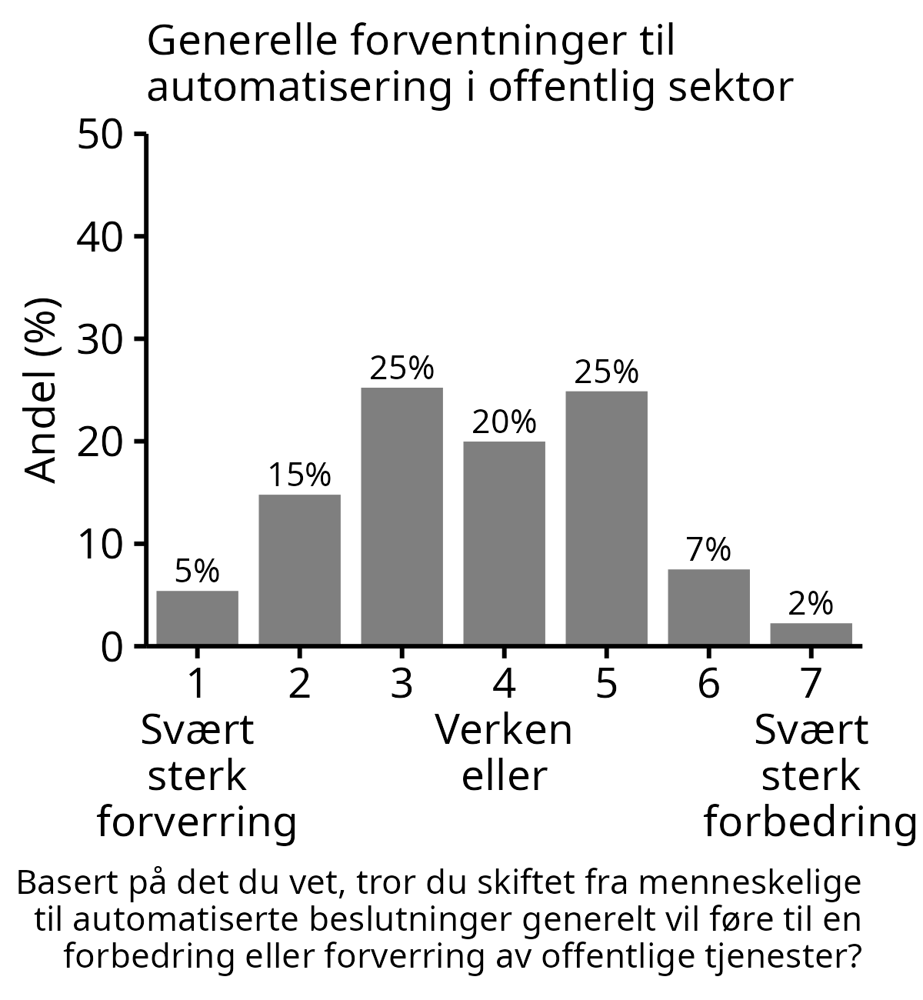
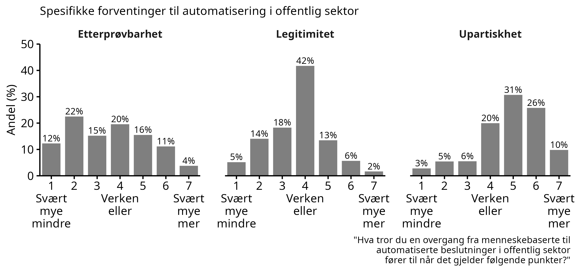
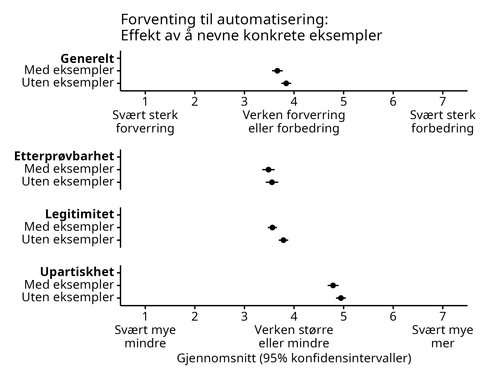

# Kunstig intelligens i forvaltningen: Kunnskap og forventinger {#ki}

I dette kapitlet viser vi at

- Mer enn seks av ti innbyggerne i Norge har liten eller ingen kjennskap til maskinlæring og kunstig intelligens

- Innbyggerne er delt i oppfatningen om bruken av maskinlæring og kunstig intelligens i forvaltningen er noe å bekymre seg over

- De som oppfatter at de har god kunnskap om maskinlæring er mer positive til bruk av kunstig intelligens i forvaltningen

- Det er en omvendt U-formet sammenheng mellom selvplassering på politisk høyre/venstre-skala og oppslutning om bruk av kunstig intelligens: 
Innbyggere som plasserer seg mot midten av det politiske spekteret er mer positive enn de som plasserer seg mot en av endene på skalaen.

## Kunnskap om maskinlæring og kunstig intelligens

Maskinlæring som databehandlingsmetode er relativt fersk.
Med økt datakraft og økt tilgang på data, har bruk av maskinlæring bredt om seg innenfor datavitenskapelige miljøer.
I befolkningen for øvrig er det lite kjennskap til maskinlæring og kunstig intelligens.
Bare en av syv innbyggere oppgir at de har god eller svært god kjennskap til maskinlæring og kunstig intelligens, mens nesten to tredjeler sier at de har liten eller ingen kjennskap til det i det hele tatt.

<!-- I forkant av spørsmålene får derfor alle en liten introduksjon til hva det er. -->
<!-- De blir opplyst at å bruke maskinlæring innebærer å få datamaskiner til å lære seg å løse oppgaver basert på et datamateriale. -->
<!-- Ofte kan datamaskinen bli ekstremt treffsikker, men det krever typisk veldig mye datamateriale. -->
<!-- Maskinlæring er i dag grunnlaget for alt fra automatisk stemmegjenkjenning til førerløse biler. -->
<!-- Den offentlige forvaltningen, inkludert NAV, bruker i enkelte tilfeller maskinlæring for å hjelpe med å ta beslutninger i saker de har ansvar for. -->
<!-- Formålet er å redusere kostnader og behandlingstid, og å gjøre beslutninger bedre og mer treffsikre. -->
<!-- Et eksempel kan være å lære en datamaskin å forutsi omtrent hvor lenge en person vil være sykmeldt, basert på informasjon om sykdommen og personen. -->
<!-- Det kan en saksbehandler da bruke for å velge passende tiltak. -->
<!-- Etter denne korte introduksjonen kartla vi deres kjennskap og holdninger rundt bruk av maskinlæring i den offentlige forvaltningen. -->

```{r, out.width = "80%", fig.align = "center", fig.cap= "Selvrapportert kunnskap om maskinlæring og kunstig intelligens"}
knitr::include_graphics("figs/png/fig_ml_knowledge.png")
```

Innbyggerne er delt i synet på grad av bekymring knyttet til bruk av maskinlæring og kunstig intelligens i den offentlige forvaltningen. 

```{r, out.width = "80%", fig.align = "center", fig.cap= "Bekymring for maskinlæring"}
knitr::include_graphics("figs/png/fig_ml_worried.png")
```

1. ÅPENT TEKSTSVAR MED BEGRUNNELSE FOR SVAR OM BEKYMRING

2. ER DET MANGEL PÅ KUNNSKAP SOM LEDER TIL BEKYMRING?

### Interesser ivaretatt med maskinlæring?

Det er naturlig å se maskinlæring og kunstig intelligens i NAV i sammenheng med spørsmål som ligger nær opptil byråkratisk kompetanse.
Vil folk oppleve at det er lettere eller vanskeligere å forstå hvordan byråkratiet fungerer?
Vil deres interesser ivaretas bedre eller dårligere når maskinlæring brukes i NAV?

```{r, out.width = "80%", fig.align = "center", fig.cap= "Forventinger om maskinlæring i NAV"}
knitr::include_graphics("figs/png/fig_nav_ml_helps_interest.png")
```

Det mest vanlige svaret var midtkategorien 'verken bedre eller dårligere'.
For øvrig fordelte svarene seg normalt rundt denne midtkategorien.
I spørreundersøkelser kan midtkategorier i slike bipolare skalaer ofte skjule at respondentene ikke har noen mening om spørsmålet.

1. VI DELER DERFOR OPP SVARENE SLIK AT VI KAN UNDERSØKE OM SVARENE TIL RESPONDENTENE VARIERER ETTER HVOR GOD KJENNSKAP DE HAR TIL MASKINLÆRING.

## Befolkningens forventinger til automatisering i offentlig sektor

Disse resultatene er fra runde 13.
- Beskrive runden
- Beskrive spørsmålet
- Beskrive eksperiment

Resultat: Folk har forventinger, og gjennomsnittet ligger like under 4.

```{r, out.width = "45%", fig.align = "center", fig.cap= "Generelle forventinger til automatisering i offentlig sektor"}

```


Resultater: Gjennomsnittet ligger på under verken/eller for etterprovbarhet og legitimitet og over for upartiskhet. Rundt 42% tror ikke det vil påvirke legitimiteten.


```{r, out.width = "100%", fig.align = "center", fig.cap= "Spesifikke forventinger til automatisering i offentlig sektor"}

```

Generelt så forverres forventinger når man får vite et par konkrete eksempler. Effekten på generelt og legitimitet er statistisk signifikant. 

```{r, out.width = "80%", fig.align = "center", fig.cap= "Effekt av å få vite konkrete eksempler på forventinger til automatisering i offentlig sektor"}

```


<!-- {width='40%'} -->

<!-- {width='100%'} -->

<!-- {width='80%'} -->

