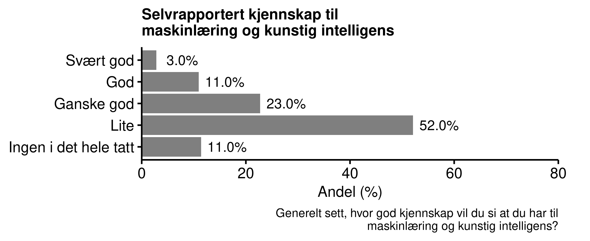

\newpage
# Innbyggernes oppfatninger om maskinlæring og KI {#ki}

I dette kapitlet ser vi nærmere på hvilke forventinger innbyggerne i Norge har når det gjelder bruk av maskinlæring og kunstig intelligens generelt og i NAV. Respondentene ble først gitt enn introduksjon som kort forklarte maskinlæring og kunstig intelligens og spurte de hvor mye kjennskap de har til temaet. Deretter undersøkte vi deres generelle forventinger rundt dette. Vi finner at

- Mer enn seks av ti innbyggerne i Norge har liten eller ingen kjennskap til maskinlæring og kunstig intelligens
- Innbyggerne er delt i oppfatningen om bruken av maskinlæring og kunstig intelligens i forvaltningen er noe å bekymre seg over
- De som oppfatter at de har god kunnskap om maskinlæring er mer positive til bruk av kunstig intelligens i forvaltningen
- Det er en omvendt U-formet sammenheng mellom selvplassering på politisk høyre/venstre-skala og oppslutning om bruk av kunstig intelligens: 
Innbyggere som plasserer seg mot midten av det politiske spekteret er mer positive enn de som plasserer seg mot en av endene på skalaen.

## Kunnskap om maskinlæring og kunstig intelligens

<!-- Maskinlæring som databehandlingsmetode er relativt fersk. -->
<!-- Med økt datakraft og økt tilgang på data, har bruk av maskinlæring bredt om seg innenfor datavitenskapelige miljøer. -->
Kunnskap rundt maskinlæring, kunstig intelligens, algoritmer, etc., utgjør viktig brikke for å forstå hvordan befolkningen forholder seg til bruken av slike verktøy.
Maskinlæring og kunstig intelligens er avanserte tema som krever spesialkompetanse for å kunne implementere og bruke på en god måte. 
For å kunne grundig diskutere rammene for hva som utgjør rettferdig eller legitim bruk av slike verktøy må man ha en viss forståelse for hva de rammene er, noe som da krever en viss grunnkunnskap. 
I undersøkelsen så ga vi respondentene en kort forklaring av maskinlæring og spurte dem i hvor stor grad de har kjennskap til dette temaet. Vi ga dem følgende introduksjon til temaet:

> "*Nå ønsker vi å spørre om dine holdninger rundt bruk av maskinlæring i den offentlige forvaltningen. Maskinlæring blir også ofte omtalt som kunstig intelligens.*
>
 > *Å bruke maskinlæring innebærer å få datamaskiner til å lære seg å løse oppgaver basert på et datamateriale. Ofte kan datamaskinen bli ekstremt treffsikker, men det krever typisk veldig mye datamateriale. Maskinlæring er i dag grunnlaget for alt fra automatisk stemmegjenkjenning til førerløse biler.*
 >
> *Den offentlige forvaltningen, inkludert NAV, bruker i enkelte tilfeller maskinlæring for å hjelpe med å ta beslutninger i saker de har ansvar for. Formålet er å redusere kostnader og behandlingstid, og å gjøre beslutninger bedre og mer treffsikre. Et eksempel kan være å lære en datamaskin å forutsi omtrent hvor lenge en person vil være sykmeldt, basert på informasjon om sykdommen og personen. Det kan en saksbehandler da bruke for å velge passende tiltak.*"

Vi spurte deretter om hvor god kjennskap de har til maskinlæring og kunstig intelligens.
Figuren under viser hvordan respondentene fordelte seg på spørsmålet.
Det er kun én av syv innbyggere som oppgir at de har god eller svært god kjennskap, mens nesten to tredjeler sier at de har liten eller ingen kjennskap til det i det hele tatt.


```{r, out.width = "80%", fig.align = "center", fig.cap= "Selvrapportert kunnskap om maskinlæring og kunstig intelligens"}

```

## Bekymring

Vi spurte deretter om hvor bekyrmet de er for bruken av slike verktøy i den offentlig forvaltningen. Figurene under viser hvordan respondentene fordelte seg på spørsmålet. Den viser at innbyggerne er delt i synet på grad av bekymring knyttet til bruk av maskinlæring og kunstig intelligens i den offentlige forvaltningen, hvorav over halvparten er bekymret eller noe bekymret.
Samtidig er det kun fem prosent som oppgir at de er veldig bekymret.

```{r, out.width = "80%", fig.align = "center", fig.cap= "Bekymring for maskinlæring"}
knitr::include_graphics("figs/png/fig_ml_worried.png")
```

Den neste figuren viser hvordan gjennomsnitt av bekymring for ulike nivåer av kunnskap. Her ser vi at de med ingen kunnskap er mer bekymret enn de med god eller svært god kunnskap om maskinlæring.

```{r, out.width = "50%", fig.align = "center", fig.cap= "Bekymring for maskinlæring for ulike nivåer av selvrapportert kunnskap om maskinlæring"}
knitr::include_graphics("figs/png/fig_ml_worried_by_knowledge.png")
```

## Blir interesser bedre ivaretatt med maskinlæring?

Vil folk oppleve at det er lettere eller vanskeligere å forstå hvordan byråkratiet fungerer?
Vil deres interesser ivaretas bedre eller dårligere når maskinlæring brukes i NAV?
For å undersøke dette ba vi dem ta stilling til et noe mer konkret situasjon:

> La oss si at du var i en situasjon hvor du måtte søke NAV om økonomisk stønad. Tror du interessene dine hadde blitt bedre eller dårligere ivaretatt dersom saksbehandleren brukte maskinlæring og kunstig intelligens som hjelp til å fatte beslutningen om økonomisk stønad?

Figuren under viser fordelingen av svar.
Det mest vanlige svaret var midtkategorien"'verken bedre eller dårligere".
For øvrig fordelte svarene seg normalt rundt denne midtkategorien.
I spørreundersøkelser kan midtkategorier i slike bipolare skalaer ofte skjule at respondentene ikke har noen mening om spørsmålet.

```{r, out.width = "80%", fig.align = "center", fig.cap= "Forventninger om interesser ivaretas bedre med maskinlæring i NAV"}
knitr::include_graphics("figs/png/fig_nav_ml_helps_interest.png")
```

Den neste figuren viser hvordan dette varier etter nivå av selvrapportert kunnskap: De med mye kunnskap har større sannsynlighet for å tro at deres interesser blir bedre ivaretatt enn de med lite kunnskap.

```{r, out.width = "40%", fig.align = "center", fig.cap= "Forventninger om interesser ivaretas bedre med maskinlæring i NAV for ulike nivåer av selvrapportert kunnskap om maskinlæring"}
knitr::include_graphics("figs/png/fig_nav_ml_helps_interest_by_knowledge.png")
```


## Forventinger til automatisering i offentlig sektor

Vi har studert befolkningens forventinger til automatisering i offentlig sektor ved en tidligere spørreundersøkelse. 
Resultatene under er basert på spørsmål stilt i 2018 (runde 13) i Norsk Medborgerpanel.
Dette er ikke direkte relatert til bruk av ML/KI i NAV, siden det ble stilt spørsmål om offentlig sektor generelt -- ikke NAV spesifikt -- og siden det brukes eksempler på ML/KI som ikke nødvendigvis ligner på hvordan eventuell bruk av slike verktøy vil være i NAV.
Med det i mente, er disse resultatene fortsatt relevante og interessante siden det gir er mer overordnet perspektiv om hvilke forventinger befolkningen har til automatisering i offentlig sektor.

Vi spurte dem først om de tror skiftet fra menneskelige til automatiserte beslutninger generelt vil føre til en forbedring eller forverring av offentlig tjenester. 
Dette var et eksperiment hvor halvparten også fikk oppgitt en rekke konkrekte eksempler.
Detteretter ble de spurt om tror økende automatisering i offentlig sektor fører til mer eller mindre av henholdsvis etterprøvbarhet, legitimitet, og upartiskhet.
De to figurene under viser fordelingene for alle, altså for både de som fikk og ikke fikk oppgitt konkrekte eksempler. 
Her ser vi at respondentene hadde delvis ulike forventing for de ulike punktene. 
De er relativt jevnfordelt når det gjelder generelle forventinger om det vil fære til forbedring eller forverring av offentlig tjenester.
Samtidig tror majoriten av innbyggere at det vil føre til mindre etterprøvbarhet og legitimitet, men mer upartiskhet.


Resultat: Folk har forventinger, og gjennomsnittet ligger like under 4.

```{r, out.width = "45%", fig.align = "center", fig.cap= "Generelle forventinger til automatisering i offentlig sektor"}

```

```{r, out.width = "100%", fig.align = "center", fig.cap= "Spesifikke forventinger til automatisering i offentlig sektor"}
knitr::include_graphics("figs/png/fig_automat2_hist.png")
```

Figuren under viser gjennomsnittet delt opp etter hvorvidt de fikk oppgitt konkrete eksempler i spørsmålet om generelle forventinger. Halvparten fikk følgende ekstra tekst:

> Ett konkret eksempel fra Norge er Utlendingsdirektoratet (UDI), som i enkelte tilfeller lar roboten Ada bestemme om enkeltpersoner skal få opphold i Norge. Et par eksempler fra USA er algoritmer som produserer anbefalinger vedrørende hvor politiet bør patruljere for å øke sjansen for å ta kriminelle, samt hvilke bekymringsmeldinger barnevernet bør ta på alvor og hvilke de kan la passere.

Respondentene som fikk vist konkrete eksempler forventer i større grad at automatiseringen vil føre til forverring av offentlig tjenester, samt til mindre legitimitet, enn de som ikke fikk vist eksempler. 
Effekten er svak men statistisk signifikant.
Det er viktig å påpeke her at resultatene kunne endret seg hvis man hadde brukt andre eksempler, og at disse eksemplene ikke ligner på bruk av ML/KI som NAV har vurdert.
Det er likevel et viktig og interessant mønster at når man får oppgitt ekte eksempler på bruk av ML/KI i offentlig sektor, så ser befolkningen i snitt mer negativt på automatisering.
Det antyder at kontroversielle eksempler i fremtiden, uavhengig av om det er i NAV, kan være utslagsgivende for hvordan befolkningen forholder seg til bruk av ML/KI i NAV.

```{r, out.width = "80%", fig.align = "center", fig.cap= "Effekt av å få vite konkrete eksempler på forventinger til automatisering i offentlig sektor"}
knitr::include_graphics("figs/png/fig_automat_treat.png")
```

