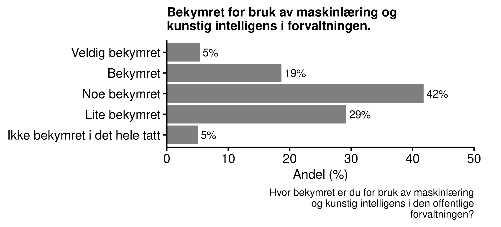
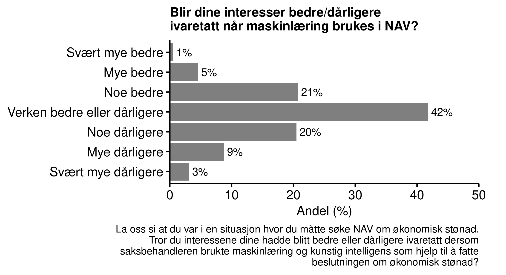
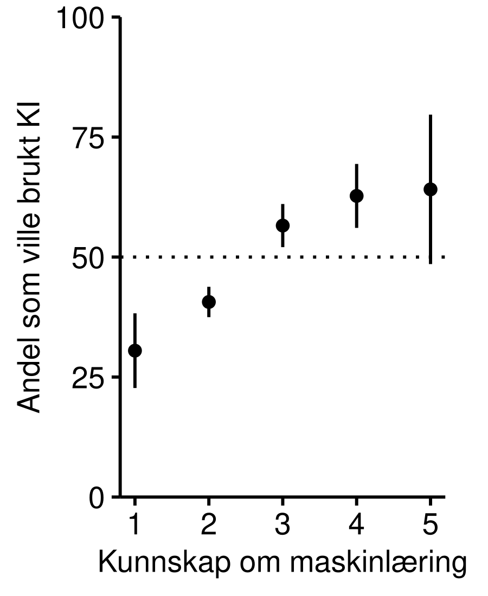
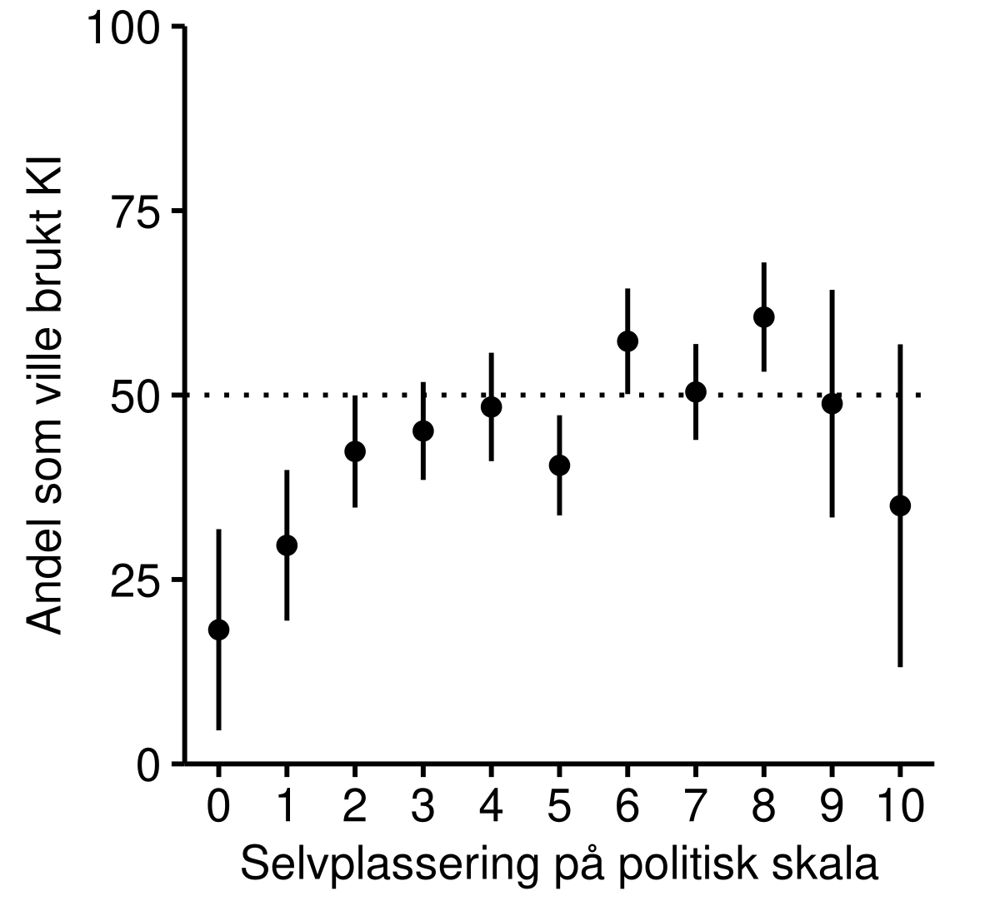

# Kunstig intelligens i forvaltningen

- Mer enn seks av ti innbyggerne i Norge har liten eller ingen kjennskap til maskinlæring og kunstig intelligens

- Innbyggerne er delt i oppfatningen om bruken av maskinlæring og kunstig intelligens i forvaltningen er noe å bekymre seg over

- De som oppfatter at de har god kunnskap om maskinlæring er mer positive til bruk av kunstig intelligens i forvaltningen

- Det er en omvendt U-formet sammenheng mellom selvplassering på politisk høyre/venstre-skala og oppslutning om bruk av kunstig intelligens: 
Innbyggere som plasserer seg mot midten av det politiske spekteret er mer positive enn de som plasserer seg mot en av endene på skalaen.

## Norske innbyggeres kjennskap og følelser knyttet til maskinlæring og kunstig intelligens

Maskinlæring som databehandlingsmetode er relativt fersk.
Med økt datakraft og økt tilgang på data, har bruk av maskinlæring bredt om seg innenfor datavitenskapelige miljøer.
I befolkningen for øvrig er det lite kjennskap til maskinlæring og kunstig intelligens.
Bare en av syv innbyggere oppgir at de har god eller svært god kjennskap til maskinlæring og kunstig intelligens, mens nesten to tredjeler sier at de har liten eller ingen kjennskap til det i det hele tatt.

<!-- I forkant av spørsmålene får derfor alle en liten introduksjon til hva det er. -->
<!-- De blir opplyst at å bruke maskinlæring innebærer å få datamaskiner til å lære seg å løse oppgaver basert på et datamateriale.  -->
<!-- Ofte kan datamaskinen bli ekstremt treffsikker, men det krever typisk veldig mye datamateriale.  -->
<!-- Maskinlæring er i dag grunnlaget for alt fra automatisk stemmegjenkjenning til førerløse biler. -->
<!-- Den offentlige forvaltningen, inkludert NAV, bruker i enkelte tilfeller maskinlæring for å hjelpe med å ta beslutninger i saker de har ansvar for.  -->
<!-- Formålet er å redusere kostnader og behandlingstid, og å gjøre beslutninger bedre og mer treffsikre.  -->
<!-- Et eksempel kan være å lære en datamaskin å forutsi omtrent hvor lenge en person vil være sykmeldt, basert på informasjon om sykdommen og personen.  -->
<!-- Det kan en saksbehandler da bruke for å velge passende tiltak. -->
<!-- Etter denne korte introduksjonen kartlegger vi deres kjennskap og holdninger rundt bruk av maskinlæring i den offentlige forvaltningen.  -->

Innbyggerne er delt i synet på grad av bekymring knyttet til bruk av maskinlæring og kunstig intelligens i den offentlige forvaltningen. 

1. ÅPENT TEKSTSVAR MED BEGRUNNELSE FOR SVAR OM BEKYMRING

2. ER DET MANGEL PÅ KUNNSKAP SOM LEDER TIL BEKYMRING?

I en tidligere runde av Norsk medborgerpanel i 2018 svarte XX prosent at de trodde beslutningene ble bedre med mer automatisert forvaltning, mens XX trodde de ville bli dårligere.
Respondentene ble bedt om å begrunne svarene.

|Bedre          |             Dårligere |
|---------------|-----------------------|
| Redusere forskjellsbehandling | Fremmedgjørende for brukere
| Mer effektivt | Klarer ikke utvise skjønn |

>Jeg tror kunstig intelligens, maskinlæring og annen bruk av teknologi vil gjøre det lettere å ta vanskeligere beslutninger på mange områder. 
Men det er ikke helt uten ulemper, for eksempel vil det kreve ekspertise hvis man vil undersøke hvilke parametre som ligger bak en beslutning.
Og det vil på sikt gi et mindre gjennomsiktig byråkrati.
Men totalt sett tror jeg de offentlige tjenestene vil forbedres.
  - Respondent i Norsk medborgerpanel 

og det som gikk igjen var at mange mangler troen på at algoritmer kan ta over beslutninger hvor det trengs å utvises skjønn.
### Interesser ivaretatt med maskinlæring?

Det er naturlig å se maskinlæring og kunstig intelligens i NAV i sammenheng med spørsmål som ligger nær opptil byråkratisk kompetanse.
Vil folk oppleve at det er lettere eller vanskeligere å forstå hvordan byråkratiet fungerer?
Vil deres interesser ivaretas bedre eller dårligere når maskinlæring brukes i NAV?

Det mest vanlige svaret var midtkategorien 'verken bedre eller dårligere'.
For øvrig fordelte svarene seg normalt rundt denne midtkategorien.
I spørreundersøkelser kan midtkategorier i slike bipolare skalaer (les: bedre vs. dårligere) ofte skjule at respondentene ikke har noen mening om spørsmålet.

1. VI DELER DERFOR OPP SVARENE SLIK AT VI KAN UNDERSØKE OM SVARENE TIL RESPONDENTENE VARIERER ETTER HVOR GOD KJENNSKAP DE HAR TIL MASKINLÆRING.

## Bruke kunstig intelligens?

I mange beslutninger i forvaltningen må det utvises skjønn basert på en samlet vurdering av den enkelte saken.
Om man tar i bruk kunstig intelligens, ved hjelp av maskinlæring, vil beslutningene antakelig bli mer treffsikker, og dermed øke andelen riktige beslutninger.
Samtidig kan heller ikke en datamaskin være helt treffsikker. 
Det er også grunn til å tro at den gjenværende andelen uriktige beslutninger går mer systematisk ut over noen grupper i samfunnet når man bruker maskinlæring og kunstig intelligens. 
Dette fordi det er stor variasjon mellom hvordan menneskelige saksbehandlere utviser skjønn, mens for en datamaskin er det ingen variasjon.

Med dette som bakgrunn spurte vi respondentene hva foretrekker i slike situasjoner: 
Enten 

1. Bruke kunstig intelligens, som fører til mange flere riktige beslutninger i bytte mot at det alltid er de samme som blir gjenstand for uriktige avgjørelser, eller 

2. ikke bruke kunstig intelligens, som fører til mange færre riktige beslutninger i bytte mot at det varierer hvem som blir gjenstand for uriktige avgjørelser.

Respondentene delte seg på midten i dette spørsmålet, hvor XX PROSENT FORETRAKK Å BRUKE KUNSTIG INTELLIGENS, MENS XX FORETRAKK Å IKKE BRUKE KUNSTIG INTELLIGENS.
Figuren under viser at de med lav kjennskap til maskinlæring og kunstig intelligens var mest skeptiske.
Det kan altså ha sammenheng med skepsis til det ukjente.

{width='70%'}

Spørsmålet har også en politisk-filosofisk dimensjon over seg.
Premisset som legges til grunn for spørsmålet er at man ved å innføre kunstig intelligens påvirker fordelingen av riktige beslutninger. 
(Man kan selvsagt diskutere om dette er en riktig virkelighetsbeskrivelse av en forvaltning som bruker kunstig intelligens versus en som ikke gjør det. 
Vi kommer i denne omgang ikke nærmere inn på dette.)
Det blir da et spørsmål om fordeling av goder, og om man er villig til å ofre et lite antall individer som systematisk forfordeles med uriktige beslutninger, mot at populasjonen som helhet nyter godt av en høyere andel riktige beslutninger.

Ut fra dette perspektivet gir det mening at de som plasserer seg lengst til venstre er minst villige til å bruke kunstig intelligens.
Vi noterer oss også at de som plasserer seg lengst til høyre også er mindre villige til å bruke kunstig intelligens når konsekvensene av bruken presenteres slik som den har blitt gjort i dette konkrete tilfellet.

{width='70%'}

Det er viktig å ha i mente at de to siste kulepunktene omhandler svar som blir gitt i en spesifikk "framing" av kunstig intelligens; nemlig en situasjon hvor bruken av kunstig intelligens påvirker beslutningene på en måte som gjør dem mer treffsikre, men samtidig mer systematisk feildiagnostiserer. 

Når vi fokuserte spesifikt på en endring av hvordan beslutninger fattes ved bruk av kunstig intelligens kontra uten. 
