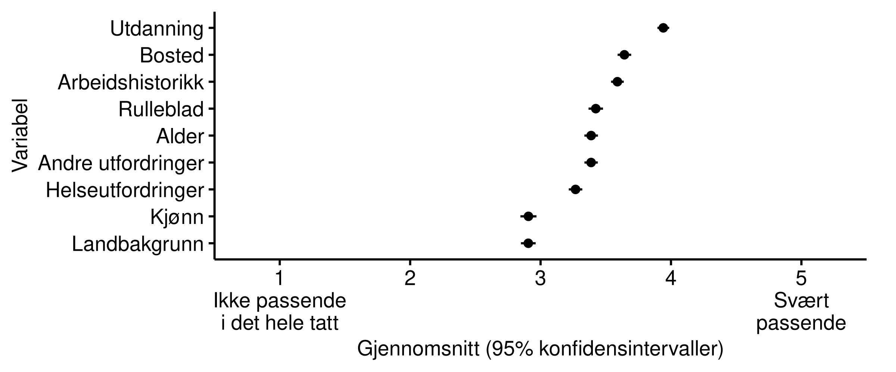
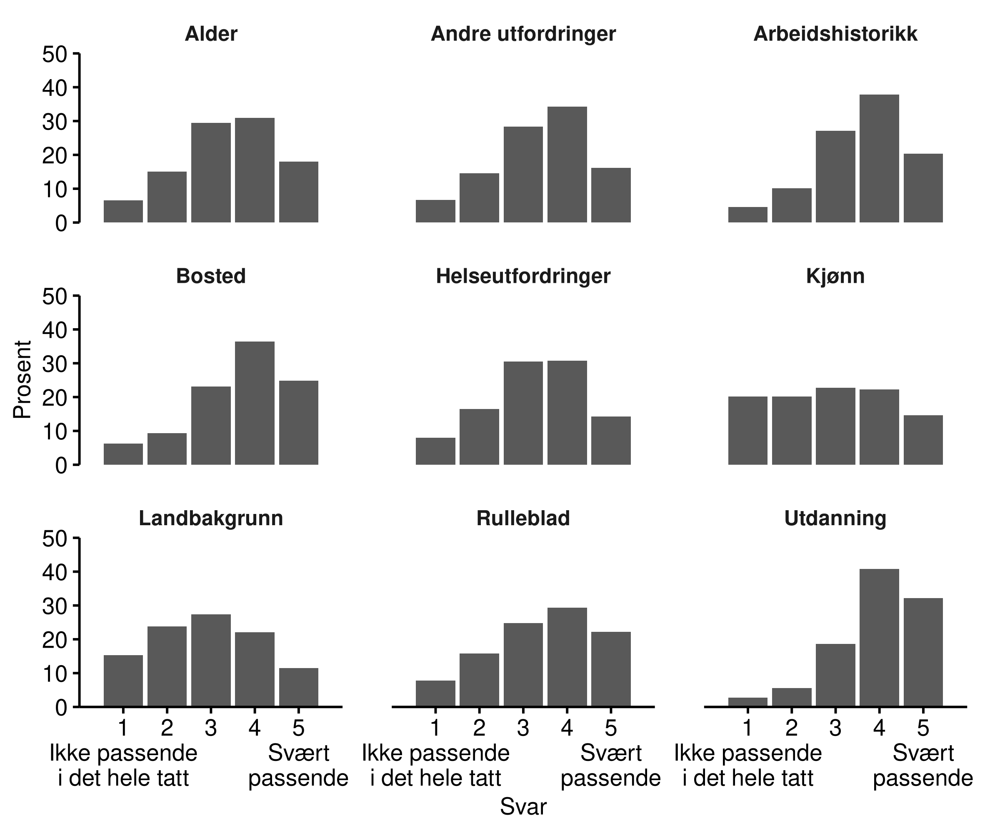
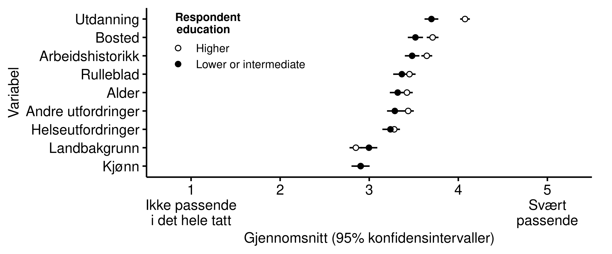
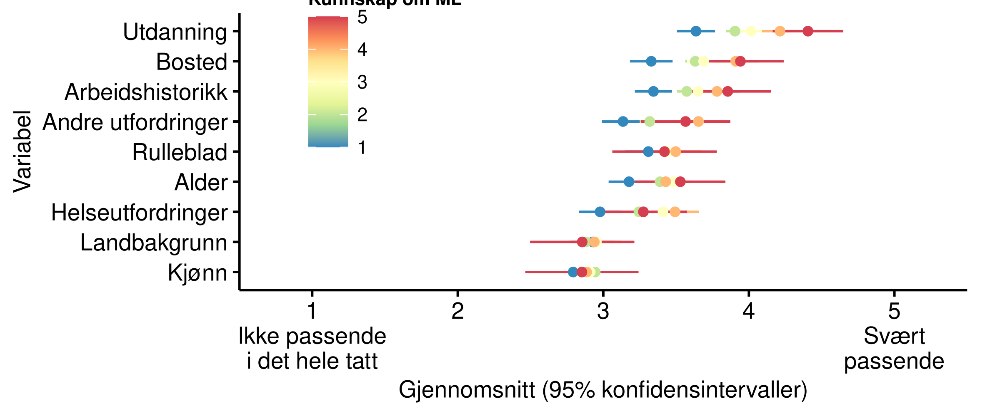
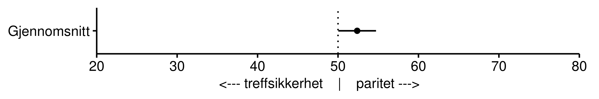
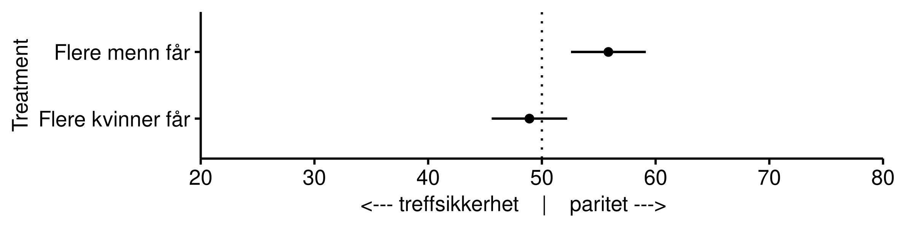
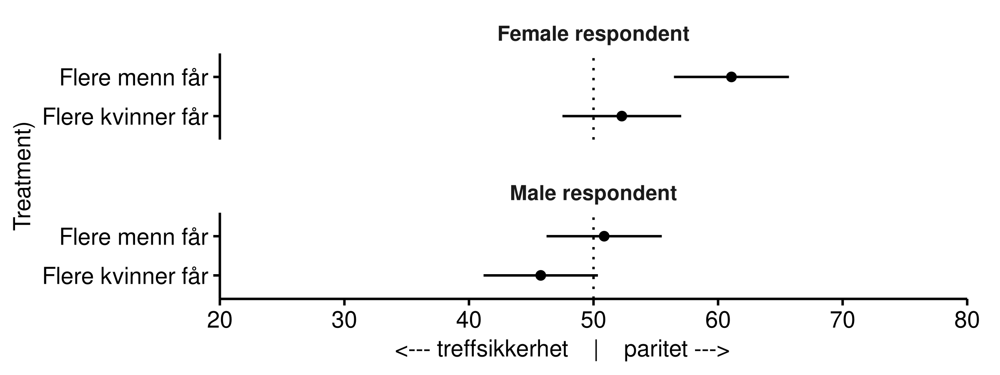
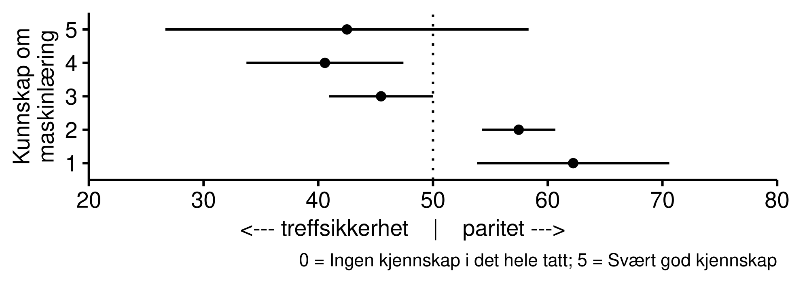
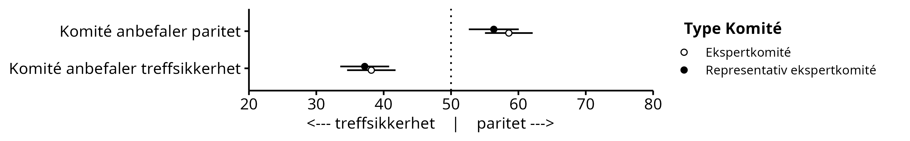

\newpage
# Rettferdighetsoppfatninger

## Når er det passende å bruke kunstig intelligens? {#relval}

<!-- Vi finner at -->

<!-- - Mer enn seks av ti innbyggerne i Norge har liten eller ingen kjennskap til maskinlæring og kunstig intelligens -->

<!-- - Innbyggerne er delt i oppfatningen om bruken av maskinlæring og kunstig intelligens i forvaltningen er noe å bekymre seg over -->

<!-- - De som oppfatter at de har god kunnskap om maskinlæring er mer positive til bruk av kunstig intelligens i forvaltningen -->

<!-- - Det er en omvendt U-formet sammenheng mellom selvplassering på politisk høyre/venstre-skala og oppslutning om bruk av kunstig intelligens:  -->
<!-- Innbyggere som plasserer seg mot midten av det politiske spekteret er mer positive enn de som plasserer seg mot en av endene på skalaen. -->

I mange beslutninger i forvaltningen må det utvises skjønn basert på en samlet vurdering av den enkelte saken.
Om man tar i bruk kunstig intelligens, ved hjelp av maskinlæring, vil beslutningene antakelig bli mer treffsikker, og dermed øke andelen riktige beslutninger.
Samtidig kan heller ikke en datamaskin være helt treffsikker. 
Det er også grunn til å tro at den gjenværende andelen uriktige beslutninger går mer systematisk ut over noen grupper i samfunnet når man bruker maskinlæring og kunstig intelligens. 
Dette fordi det er stor variasjon mellom hvordan menneskelige saksbehandlere utviser skjønn, mens for en datamaskin er det ingen variasjon.

Med dette som bakgrunn spurte vi respondentene hva foretrekker i slike situasjoner: 
Enten 1) Bruke kunstig intelligens, som fører til mange flere riktige beslutninger i bytte mot at det alltid er de samme som blir gjenstand for uriktige avgjørelser, eller 2) ikke bruke kunstig intelligens, som fører til mange færre riktige beslutninger i bytte mot at det varierer hvem som blir gjenstand for uriktige avgjørelser.
Fordelingen er vist i tabellen under. 
Respondentene delte seg på midten i dette spørsmålet, hvor rundt 47 prosent foretrakk å bruke kunstig intelligens, mens 53% foretrakk å ikke bruke kunstig intelligenst. 

Table: (\#tab:relval) Tradeoff mellom generell treffsikkerhet og spesfikke systematiske feil (bruke eller ikke bruke KI)

|Svar                |                                             |   Prosent|
|:-------------------|:--------------------------------------------|---------:|
|Bruke KI            |    | 47       |
|Ikke bruke KI       | | 53       |

Figuren under viser at de med lav kjennskap til maskinlæring og kunstig intelligens var mest skeptiske.
Det kan altså ha sammenheng med skepsis til det ukjente.

```{r, out.width = "50%", fig.align = "center", fig.cap= "Repiterbarhet etter selvrapportert kunnskap"}
knitr::include_graphics("figs/png/fig_relval_ml_know.png")
```

Spørsmålet har også en politisk-filosofisk dimensjon over seg.
Premisset som legges til grunn for spørsmålet er at man ved å innføre kunstig intelligens påvirker fordelingen av riktige beslutninger. 
Det blir da et spørsmål om fordeling av goder, og om man er villig til å ofre et lite antall individer som systematisk forfordeles med uriktige beslutninger, mot at populasjonen som helhet nyter godt av en høyere andel riktige beslutninger.

```{r, out.width = "60%", fig.align = "center", fig.cap= "Repiterbarhet etter selvplassering på politiske skala"}
knitr::include_graphics("figs/png/fig_relval_polscale.png")
```


Ut fra dette perspektivet gir det mening at de som plasserer seg lengst til venstre på den politiske høyre/venstre-skalaen er minst villige til å bruke kunstig intelligens, da man kan anta at borgere som plasserer seg lengst til venstre er mer egalitær enn de som plasserer seg på høyresiden.
Vi noterer oss imidlertid også at de som plasserer seg lengst til høyre også er mindre villige til å bruke kunstig intelligens når konsekvensene av bruken presenteres slik som den har blitt gjort i dette konkrete tilfellet.
Inntil videre må vi nøye oss med å konstatere at det er store forskjeller i svarene respondentene gir basert på deres politiske ståsted, og overlate til framtidig forskning å dykke dypere i hva denne forskjellen skyldes.

## Hvilken informasjon anses som passende? {#input}

Et annet viktig spørsmål knyttet til bruk av maskinlæring og kunstig intelligens er hvilke data det oppfattes som passende å bruke. 
I mange brukstilfeller vil det finnes et bredt spektrum av informasjon tilgjenglig, men det vil sannsynligvis variere hvor passende innbyggere faktisk mener det er bruke de ulike typene informasjon -- uavhengig av om de gjør prediksjonen mer treffsikker. 
Det er derfor nyttig å ha kunnskap om hvordan befolkning vurderer ulike typer informasjon. 

Et realistisk eksempel hvor maskinlæring kan brukes i forvaltninger er hvilke jobbrette tiltak NAV skal tilby en jobbbsøker. 
Tilgangen til jobbrettede tiltak er behovsbasert og jobbsøkeren har ikke anledning til fritt å velge hvilke tiltak hun eller han ønsker seg. 
Det er også et begrenset gode der NAV må prioritere. Godt over halvparten av alle jobbsøkere tilbys ingen eller liten bistand fra NAV. 
Saksbehandler vil på bakgrunn av en individuell vurdering av søkerens behov bestemme innsatsgruppe, og dermed også hvilke tiltak han/hun skal få tilbud om. 
Tidligere har denne vurderingen blitt gjort av saksbehandleren alene. I dag prøver NAV ut maskinlæring for å bistå saksbehandleren med forslag i denne vurdering. 

I prinsippet finnes det et enormt utvalg av mulige variabler som kan være relevant for en slik prediksjon -- i den forstand at de kan bidra med å gjøre en prediksjon mer nøyaktig. 
Disse variablene omhandler et stort og variert utvalg informasjon om den enkelte jobbsøker. 
Det er derfor et godt eksempel på en situasjon hvor det må gjøres en avveining om hvilke variabler man skal bruke, hvor det er sannsynlig at innbyggere vil oppfatte noen variabler som mer eller mindre passende enn andre. 
I verste fall kan enkelte variabler bli oppfattet som direkte urettferdige.

For å studere dette spurte vi respondentene hvor passende de synes det er å bruke hver av en liste variabler, med utgangspunkt i at de skal brukes for å foreslå jobbrettede tiltak. 
I spørsmålet satt vi premisset at hver variabel bidrar med å gjøre forslagene mer nøyaktige. 
Vi ba dem om å vurdere hver variabel på en fem-punkts skala, fra "Ikke passende i det hele tatt" (1) til "Svært passende" (5).
Vi spurte dem både om variabler som det har vært aktuelt for NAV å bruke ved en eventuell slik implementering og om variabler som det ikke har vært aktuelt å bruke: 

- Alder;
- Arbeidshistorikk: Hvorvidt den arbeidssøkende har hatt sammenhengende jobb i 6 av de siste 12 mnd;
- Bosted: Hvor i landet bor brukeren;
- Kjønn;
- Helse: Hvorvidt jobbsøkere opplyser at hen har helseutfordringer; 
- Landbakgrunn;
- Rulleblad: Har brukeren blitt dømt for kriminelle handlinger.
- Ufordringer: Hvorvidt jobbsøkere opplyser at hen har andre utfordringer som hindrer dem fra å jobbe; 
- Utdanning: Hvorvidt jobbsøkeren har fullført utdanning godkjent i Norge;

Resultatene fra spørsmålet vises i figurene under. 
Den første figurene viser snittet på skalaen for hver variabel, hvor variablene er rangert nedover etter hvor passende respondentene synes de var i snitt. Den andre figuren viser hele fordelingen for hver variabel. Samlet sett ser vi at ingen av variablene oppfattes som utvilsomt passende eller upassende. De fleste har et gjennomsnitt mellom 3 ("Noe passende") og 4 ("Passende"). Men noen skiller seg ut. På den ene siden skiller kjønn og landsbakgrunn seg spesielt ut ved å ha et gjennomsnitt under 3, substantielt under de andre; på den andre siden skiller utdanning seg ut ved å ha et gjennomsnitt over 4, substantielt over de andre. Hva variasjonen skyldes vet vi ikke med sikkerhet. At kjønn og landbakgrunn blir sett på som mindre passende er gjerne fordi de er mer direkte knyttet til spørsmål og bekymringer om diskriminering. Samlet sett er det tydelig forskjeller i hvor passende ulike typer informasjon ble oppfattet av respondentene.


```{r, out.width = "90%", fig.align = "center", fig.cap= "Gjennomsnitt av hvor passende det oppfattes å bruke variabelen"}

```


```{r, out.width = "90%", fig.align = "center", fig.cap= "Fordeling for hver variabel av hvor passende den oppfattes å bruke"}

```

De to figurene under sammenligner gjennomsnittet for ulike undergrupper. I den første er det differensiert mellom respondenter med og uten høyere utdanning. Vi ser her at respondenter med ulik utdanning har noe ulikt syn på ulike variablene, og da særskilt når det kommer til nettopp utdanning. De med høyere utdanning synes det er betydelig mer passende enn de uten høyere utdanning å bruke utdanning som variabel. De underliggende årsakene til disse forskjellene kan være mange, men resultatene peker på at grupper med ulik oppfatning, kunnskap, erfaring, etc, kan forholde seg substansielt forskjellig til samme type informasjon.

```{r, out.width = "90%", fig.align = "center", fig.cap= "Gjennomsnitt av hvor passende det oppfattes å bruke variabelen for ulike utdanningsnivå"}

```

I den neste figuren er det differensiert etter hvor mye selverklært kunnskap respondenene har om maskinlæring. Her ser vi også noen viktige forskjeller: De med mye selverklært kunnskap om maskinlæring synes at de fire variablene på toppen (som generelt blir sett på som mest passende) er substansielt mer passende enn de uten kunnskap. Dette kan være relatert til underliggende sosioøkonomiske forskjeller mellom de med høy og lav selverklært kunnskap, slik som utdanningsnivå, men det kan også være kunnskap i seg selv som endrer denne oppfatningen. En viktig alternativ mekanisme er at de med mye kunnskap om maskinlæring verdsetter økt nøyaktighet mer enn de uten slik kunnskap, som da endrer hvordan de balanserer ulike hensyn når de vurderer hvor passende variablene er. 

```{r, out.width = "90%", fig.align = "center", fig.cap= "Gjennomsnitt av hvor passende det oppfattes å bruke variabelen for ulike nivå av selvrapportert kjennskap til maskinlæring"}

```

Sett i helhet antyder resultatene at den generelle befolkning er uenig i hvor passende det er å bruke ulike typer informasjon. Samtidig er det tydelig forskjeller mellom variablene, hvor særskilt kjønn og landbakgrunn blir sett på mindre passende av mange. Resultatene viser også at det er viktige systematiske forskjeller mellom ulike grupper for hvordan de gjør denne vurderingen.

## Statistisk paritet {#paritet}

Det er viktig å studere rettferdighet fra et statsvitenskapelig perspektiv fordi oppfatninger av rettferdighet antas å påvirke institusjonell legitimitet [@tyler2003procedural]. 
Dette begrenser seg ikke bare til input-siden av det politiske systemet hvor politikk vedtas, men også output-siden i forvaltningen hvor politikk settes ut i live [@krislov2012representative; @rosanvallon2011democratic; @rothstein2009creating].

Flere definisjoner brukes om rettferdighet, og de fleste av dem er basert på forhold mellom sanne/falske positive og sanne/falske negativer [@verma2018fairness]. 
Alexandra Chouldechova [-@chouldechova2018case] viser teoretisk og empirisk hvordan to velbrukte definisjoner av rettferdighet umulig kan oppnås samtidig i visse tilfeller. 
Hvilke definisjoner bør prioriteres når man står overfor slike avveininger? 
Chouldechovas studie viser med tydelighet at det ikke er gjort i en håndvending å lage rettferdige prediksjonsmodeller. 
Tvert imot er det komplisert utfordring som krever oppmerksomhet om konkret kontekst.
Vi vet fortsatt lite om hvilke definisjoner som resonnerer blant innbyggerne, og i hvilken grad de modereres av kontekst eller innbyggernes sosiale bakgrunn eller politiske holdninger.
Vi vet fra samfunnsforskning at hva som oppfattes som rettferdig kan variere med sosial identitet og kultur, politiske holdninger, og personlige karaktertrekk, og det er derfor viktig å gjøre konkrete empiriske studier. 
I dette kapitlet tar vi derfor for oss et realistisk scenario for NAV hvor vi setter opp to motstridende rettferdighetshensyn knyttet til hvilke sykmeldte NAV skal tilby dialogmøte.

Et dialogmøte er en samtale mellom NAV og den sykmeldte som anses som positivt for den sykmeldtes muligheter for å komme tilbake i arbeid.
I prinsippet har alle rett på et dialogmøte, men i praksis foregår det en siling hvor det gjøres en vurdering av hvem som har mest nytte av et slikt møte.
Bruk av maskinlæring og kunstig intelligens kan i dette tilfellet bidra til bedre estimater for hvem som er i fare for å bli langtidssykemeldt, og derfor kan ha større nytte av et dialogmøte.
Derfor er NAV i innledende stadier på å utvikle maskinlæringsmodeller som predikerer sannsynlighet for at en sykemeldt fortsatt vil være sykemeldt 12 uker fram i tid.

Når man bestemmer innretningen på en modell må man foreta prioriteringer.
En prinsipielt viktig prioritering handler om man skal ta i bruk såkalt statistisk paritet som rettferdighetsprinsipp på utvalgte egenskaper ved individene det gjelder.
Kjønnsparitet er ett eksempel, men det kan også handle om statistisk paritet etter alder, etnisitet, geografi, med mer.
Et kjent eksempel innenfor litteraturen om rettferdig bruk av kunstig intelligens er studien som viser hvordan afro-amerikanske fengselsinnsatte sjeldnere blir tilbudt prøveløslatelse enn hva andelen deres skulle tilsi.
Dette skjer når avgjørelsen om prøveløslatelse baserer seg på prediksjonsmodeller om risikoen for at den innsatte blir tatt påny for en kriminell handling dersom hen slippes fri [@chouldechova2017fair].
Å anvende paritetsprinsippet her innebærer å sikre at andelen innsatte som tilbys prøveløslatelse samsvarer med andelen innsatte for hver av de etniske gruppene i fengselet.
Fordelen med å bruke statistisk paritet etter etnisitet er at prøveløslatelse blir likt fordelt blant de etniske gruppene, og slik sett kan oppleves som rettferdig fordelt.
Utfordringen ved å bruke dette prinsippet er at andre egenskaper ved de innsatte -- som for eksempel risikovurderinger om tilbakefall til kriminelle handlinger -- blir nedprioritert. 
Er etnisitet i dette tilfellet så viktig at man bør la det gå på bekostning av risikovurderinger knyttet til tilbakefall? 

NAVs tilfelle om dialogmøte er mindre dramatisk enn eksempelet om prøveløslatelse.
Samtidig er de prinsipielle problemstillingene de samme.
Statistisk paritet innebærer i tilfellet om dialogmøte at modellen sikrer at like mange menn og kvinner skal få tilbud om dialogmøte.
Denne prioriteringer vil i så fall gå delvis på bekostning av å prioritere treffsikkerhet med tanke på å invitere de som har størst nytte av et slikt møte.

For å studere respondentenes umiddelbare reaksjoner til et slik etisk dilemma knyttet til rettferdig bruk av kunstig intelligens ber vi respondentene se for seg et valg mellom to alternative maskinlæringsmodeller for å velge hvem som skal få tilbud om dialogmøte.

Ingen av modellene er perfekte, men de feiler på ulike måter.

Den første modellen er mest *treffsikker*.
Det vil si at det totalt sett er flere sykemeldte med behov for dialogmøte som får tilbudet enn tilfellet er for den andre modellen.
Samtidig har modellen en bias til fordel for menn, som gjør at det er flere kvinner med behov for dialogmøte som ikke får tilbudet.
Andelen som har behov for dialogmøte *uten å få tilbud* er altså større hos kvinner enn menn.

Den andre modellen sikrer statistisk paritet etter kjønn, nemlig at andelen av de sykmeldte som kalles inn til dialogmøte er like stor henholdsvis for kvinner som for menn.
Imidlertid er den mindre treffsikker totalt sett, slik at færre som har behov for dialogmøte blir innkalt. 
Dette gjelder både kvinner og menn.

Hvis det står mellom disse to modellene, hvilken modell synes respondentene virker mest rettferdig?
Figuren under viser at et knapt flertall foretrekker en modell som vektlegger statistisk paritet.
Det vil si at de ønsker å bruke en modell som sikrer likebehandling av kjønn, selv på bekostning av lavere treffsikkerhet totalt sett.


```{r, out.width = "90%", fig.align = "center", fig.cap= "Preferanse for statistisk paritet"}

```

I teksten over står det at den mest treffsikre modellen favoriserte menn.
For å undersøke om det har noen innvirkning på svarene hvilket kjønn modellen favoriserer veksler vi på denne beskrivelsen. 
Halvparten av respondentene får vite at modellen har en bias til fordel for menn, mens den andre halvparten av respondentene får vite at modellen favoriserer kvinner.
Spiller det noen rolle hvilket kjønn modellen favoriserer?
Resultatene viser at det gjør det.

I figuren under ser vi at det er i de tilfeller hvor menn blir fordelaktig behandlet ved bruk av den mest treffsikre modellen at flertallet ønsker å bruke en modell som sikrer likebehandling av kjønn.
Det er en signifikant større andel av respondentene som foretrekker paritetsprinsippet når menn har fordel av den treffsikre modellen enn når kvinner har det.

Hva dette skyldes vet vi ikke.
Man ser liknende kjønnseffekter i eksperimenter om politisk representasjon, hvor kvinnelige kandidater jevnt over foretrekkes i noe høyere grad enn mannlige kandidater gjør [@schwarz2018have].
I den litteraturen pekes det på forklaringer om at folk er motivert ut fra et ønske om å kompensere for historisk underrepresentasjon av kvinner i politiske stillinger.
Hvorvidt det ligger liknende strukturelle motivasjoner for våre resultater, psykologiske faktorer, eller andre forhold er et interessant forskningsspørsmål som vi ikke har data til å besvare, og som derfor bør studeres videre.

```{r, out.width = "90%", fig.align = "center", fig.cap= "Preferanse for statistisk paritet etter hvilken gruppe som får skjeivt utfall (treatment)"}

```

Det vi imidlertid ser, og til forskjell fra litteraturen om politisk representasjon, er at kvinner responderer noe mer på informasjon om hvilket kjønn som kommer best ut av en modell som prioriterer treffsikkerhet.
Både menn og kvinner foretrekker paritetsmodellen oftere i de tilfellene kvinnene kommer dårlig ut av treffsikkerhetsmodellen enn i de tilfellene hvor menn kommer dårlig ut av samme modell, men denne effekten er noe sterkere hos kvinner enn menn.

Det er også en generell forskjell blant respondentene i den forstand at kvinner i sterkere grad foretrekker paritetsmodellen enn menn gjør, uavhengig av om det er menn eller kvinner som kommer best ut av det.


```{r, out.width = "90%", fig.align = "center", fig.cap= "Preferanse for statistisk paritet etter hvilken gruppe som får skjeivt utfall (treatment) og respondentens kjønn"}

```
<!-- Vi observerer også en modererende effekt av kunnskap om maskinlæring: -->
<!-- Jevnt over ser vi at jo høyere kunnskap om maskinlæring, desto høyere andel modellen som prioriterer treffsikkerhet framfor statistisk paritet.  -->
<!-- Det her er igjen verdt å nevne at slike bivariate, statistiske sammehenger ikke sier noe om årsakssammenhenger. -->
<!-- SKAL VI TA MED DENNE FIGUREN? DEN PASSER IKKE SUPERGODT INN I NARRATIVET, OG ER VANSKELIG Å DISKUTERE. -->
<!--  -->

Et oppfølgingseksperiment viser hvordan innbyggerne responderer på signaler om hvordan modellene har blitt til. 
Mens de to modellene i utgangspunktet er tilnærmet like populære blant respondentene, endrer svarene seg markant når vi opplyser om at en ekspertkomité anbefaler den ene modellen framfor den andre.
Dette viser med tydelighet at innbyggerne bryr seg om ikke bare hvordan modellene virker, men også hvordan prosessen i forkant har vært.


```{r, out.width = "90%", fig.align = "center", fig.cap= "Preferanse for statistisk paritet etter hvilken gruppe som får skjeivt utfall (treatment) og respondentens kjønn"}

```

Eksperter har autoritet i kraft av sin kompetanse som gir legitimitet til bruken av modellene.
En ekspertkomité fungerer som et godkjentstempel -- en svanemerking om du vil -- på at modellene oppfyller grunnleggende etiske, administrative og politiske krav.
At folk responderer på signaler fra eliter er ikke uvanlig i studier av politisk atferd, og spesielt ikke i saker hvor innbyggerne mangler kunnskap eller ikke har sterke oppfatninger på forhånd.
Eksperter kan være så mangt, og for å følge opp studiet om byråkratisk representasjon (beskrevet i et annet kapittel) undersøker vi om det spiller noen rolle for innbyggerne at ekspertene gjenspeiler befolkningen, altså er deskriptivt representativ.
Denne ekstra informasjonen om ekspertkomiteen gir ingen statistisk signifikant utslag på oppslutningen om modellene.
Det betyr enten at innbyggerne ikke er opptatt av representativitet blant eksperter, eventuelt at dette er implisitt antatt slik at eksplisitt informasjon om at ekspertgruppen er representativ ikke tilfører respondentene noen ny informasjon.
