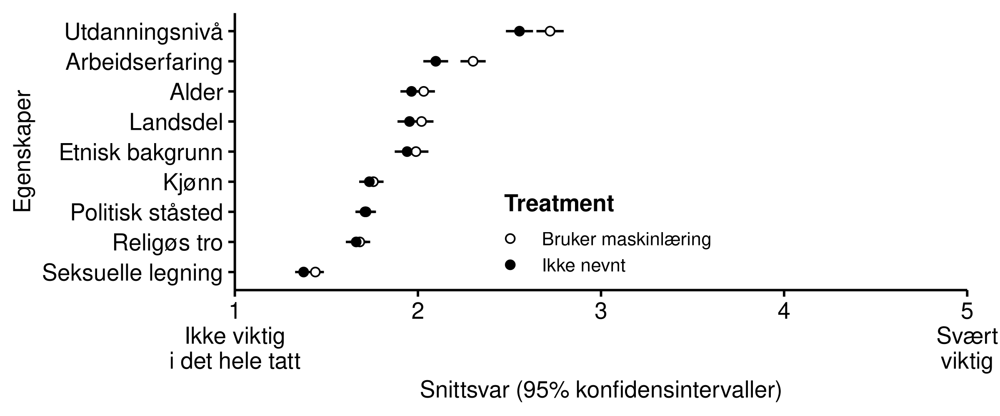

# Representativt byråkrati {#representasjon}

Den dominerende forståelsen av hva det norske politisk-administrative systemet skal være er den weberianske forestillingen om et byråkrati som ikke skal ha noen selvstendig innflytelse på politikken.
Innbyggernes demokratiske innflytelse skjer under utformingen av politikken, mens forvaltningen utfører den vedtatte politikken på en upartisk måte [@rothstein2009creating;@rosanvallon2011democratic].
Spørsmål knyttet til politisk representasjon har derfor i hovedsak fokusert på input-siden av det politiske systemet hvor politikk vedtas, heller enn på output-siden hvor politikk gjennomføres.

Et unntak er litteraturen om *representativt byråkrati* [@krislov2012representative; @lim2006representative], som vektlegger at menneskene som utgjør forvaltningen har en selvstendig påvirkning på hvilken politikk som blir gjennomført.
Alle mennesker har systematiske bias som i større eller mindre grad former deres holdninger og atferd.
Det er ikke realistisk å anta at saksbehandlere fullt og helt klarer å legge fra seg egne bias i sitt arbeid, selv ikke i profesjoner hvor objektivitet etterstrebes. 
En måte å utlikne bias er å sørge for at saksbehandlernes bakgrunn reflekterer befolkningen.
I det representative byråkratiet skal derfor forvaltningsstaben utgjøre et tverrsnitt av det folket den skal tjene [@laegreid1978byraakrati; @christensen2001profesjoner].

Vi har tidligere sett at mange innbyggere tror at saksbehandlere i NAV lar seg påvirke i noen grad av egne holdninger.
Med dette som bakteppe er det grunn til å anta at innbyggerne ønsker at saksbehandlerne deler erfaringsbakgrunn med dem selv, slik at de forstår deres situasjon kanskje bedre enn en saksbehandler som har en helt annen bakgrunn.
Vi undersøker dette med utgangspunkt i en et design hentet fra en studie om deskriptiv representasjon i politiske beslutningsprosesser [@arnesen2018legitimacy]. ^[Deskriptiv representasjon er et viktig konsept innenfor studiet av politisk representasjon, og en av fire former for representasjon slik det ble beskrevet i Hannah Pitkins klassiker *The Concept of Representation* [-@pitkin1967concept]
Deskriptiv representasjon omhandler det å bli representert av kandidater som deler deres sosiale bakgrunn, ikke minst fordi de antar at disse kandidatene deler deres politiske interesser og vil ivareta dem på en god måte. 
*Byråkratisk representasjon* og *deskriptiv representasjon* er konsepter som i stor grad overlapper hverandre, med unntak av at de har blitt utviklet i forskningstradisjoner som studerer henholdsvis input- og output-siden av det politiske systemet.
Vi sidestiller begrepene, og bruker dem om hverandre i denne rapporten].

Vi spør:
Hvilke egenskaper -- om noen -- ønsker innbyggerne at saksbehandlerne deler med dem?

Med vårt fokus på maskinlæring og kunstig intelligens ønsker vi å vite om behovet for representativt byråkrati påvirkes når forvaltningen tar i bruk dette verktøyet.
Det er ikke åpenbart på forhånd hvordan det vil slå ut.
På den ene siden kan behovet for at saksbehandlerne deler ens sosiale bakgrunn bli mindre viktig, ettersom alle beslutninger blir mer strømlinjeformede og dermed mindre påvirket av saksbehandlernes bakgrunn.
På den andre siden kan innbyggerne oppleve at man med denne strømlinjeformingen går glipp av viktige nyanser i hver enkelt avgjørelse, og at det er nettopp i slike situasjoner at man er avhengive av saksbehandlere som har forståelse for innbyggernes situasjon og kan gå inn og korrigere i enkelttilfeller.

Det er gjort lite forskning akkurat på hvordan maskinlæring og kunstig intelligens påvirker innbyggeres preferanser for representativt byråkrati.
Ett unntak er en studie av hvite og svarte innbyggere i USA, og deres preferanser for enten videoovervåkning av lyskryss eller å ha politibetjenter til å overvåke lyskrysset for å fange opp bilister som kjører på rødt lys [@miller2021representative].
I deres tilfelle fant man at svarte innbyggere i vesentlig høyere grad foretrakk den automatiserte løsningen med kameraovervåkning heller enn politibetjenter, men kun i de tilfellene hvor politibetjentene var hvite.
Denne inngruppeeffekten viser hvordan tillit til myndighetene kan påvirkes av hvilken bakgrunn myndighetspersonene innbyggerne møter har.

I vår studie spør vi altså respondentene rett fram hvor viktig det er for dem med representativt byråkrati, brutt ned på ulike dimensjoner som kan være relevante.
Spørsmålsformuleringen er som følger:

>La oss si at du var i en situasjon hvor du måtte søke NAV om økonomisk stønad. Dersom du kunne velge en saksbehandler som skulle ivareta dine interesser hos NAV, hvor viktig tror du at egenskapene under ville vært for denne personen? 

Eksperimentdelen av studien innebærer at vi legger til en ekstra setning til halve utvalget hvor vi opplyser om at maskinlæring brukes i saksbehandlingen:

>Som støtte i beslutningsprosessen bruker saksbehandleren kunstig intelligens, basert på maskinlæring, som anbefaler hvem som skal få støtte.

Resultatene fra eksperimentet viser at folk jevnt over blir mer opptatt av representativt byråkrati når forvaltningen benytter seg av maskinlæring og kunstig intelligens som beslutningsstøtte.
Spesielt arbeidserfaring og utdanningsnivå blir viktigere for respondentene.
Relevant i denne sammenhengen er et spørsmål vi stilte tilbake i 2018 i Norsk medborgerpanel om man trodde økt grad av automatisering ville gjøre forvaltningen verre eller bedre.
Respondente ble bedt om å begrunne svaret i en åpen tekstboks.
De som mente det ville lede til dårligere forvaltning trakk typisk fram at beslutningsprosessen ville virke fremmedgjørende på innbyggerne, og at mulighetene for å utvise skjønn ble redusert.
En respondent ordla seg slik:

>Jeg tror kunstig intelligens, maskinlæring og annen bruk av teknologi vil gjøre det lettere å ta vanskeligere beslutninger på mange områder. 
Men det er ikke helt uten ulemper, for eksempel vil det kreve ekspertise hvis man vil undersøke hvilke parametre som ligger bak en beslutning.
Og det vil på sikt gi et mindre gjennomsiktig byråkrati.
Men totalt sett tror jeg de offentlige tjenestene vil forbedres.som igjen presser fram et følt behov for å ha noen beslutningstakere som kjenner deres situasjon og kan ivareta deres rettigheter og interesser i denne prosessen.

Videre forskning bør fokusere på å forstå mekanismene som gjør at representativt byråkrati blir viktigere for innbyggerne når maskinlæring og kunstig intelligens taes i bruk i forvaltningen, og i hvilke situasjoner innbyggerne er mest opptatt av dette.
En hypotese som bør forfølges er da at kunstig intelligens fører til fremmedgjøring av beslutningsprosesser i forvaltningen, som i sin tur øker behovet for saksbehandlere som deler ens bakgrunn og kan sikre at deres rettigheter ivaretaes på en god måte.

