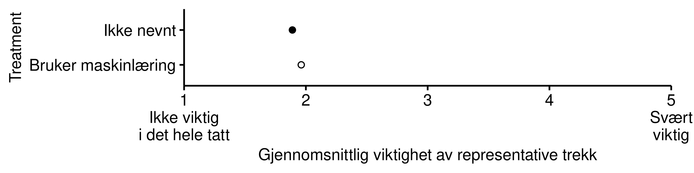

# Representativt byråkrati {#representasjon}

Deskriptiv representasjon er et viktig konsept innenfor studiet av politisk representasjon (Pitkin 1967).
Velgere ønsker å bli representert av kandidater som deler deres sosiale bakgrunn, ikke minst fordi de antar at disse kandidatene deler deres politiske interesser og vil ivareta dem på en god måte (Arnesen, Duell, Johannesson 2019). 

Mens spørsmål om representasjon er en naturlig del av studier knyttet til input-siden av det politiske systemet (Easton xxxx), er det mindre brukt for å studere output-siden, altså i forvaltningen, hvor politikk skal gjennomføres.
Grunnen til dette er tanken om at det er tilstrekkelig med demokratisk innflytelse i utformingen av politikken, så lenge forvaltningen utfører den vedtatte politikken på en upartisk måte (Rothstein 2011, Rosanvallon 2011).
Denne weberianske forestillingen om et byråkrati som ikke skal ha noen selvstendig innflytelse på politikken har vært hovedskildringen av hvordan den norske politisk-administrative systemet skal være og er.

Samtidig er forskning innen psykologi tydelig på at alle mennesker har systematiske bias som i større eller mindre grad former deres holdninger og atferd.
Det er ikke realistisk å anta at saksbehandlere fullt og helt klarer å legge fra seg egne bias i sitt arbeid, selv ikke i profesjoner hvor objektivitet etterstrebes. 
En måte å utlikne bias er å sørge for at saksbehandlernes bakgrunn reflekterer befolkningen.
I det representative byråkratiet skal forvaltningsstaben utgjøre et tverrsnitt av det folket den skal tjene (Lægreid og Olsen 1978; Christensen, Lægreid og Zuna 2001). 
Utgangspunktet er at den sosiale bakgrunnen til den enkelte tjenestemannen har gjennomslagskraft overfor hens tenkemåte og handlemåte. 

Vi har tidligere sett at mange innbyggere tror at saksbehandlere i NAV lar seg påvirke i noen grad av egne holdninger.
Med dette som bakteppe er det grunn til å anta at innbyggerne ønsker at saksbehandlerne deler erfaringsbakgrunn med dem selv, slik at de forstår deres situasjon kanskje bedre enn en saksbehandler som har en helt annen bakgrunn.

Vi undersøker dette med utgangspunkt i en et design hentet fra en studie om deskriptiv representasjon i politiske beslutningsprosesser.
Hvilke egenskaper -- om noen -- ønsker innbyggerneat saksbehandlerne deler med dem?
Figuen under viser at deskriptiv representasjon generelt er lite viktig for innbyggerne.
Minst viktig er seksuell legning, mens arbeidserfaring og utdanningsnivå troner øverst.

Med vårt fokus på maskinlæring og kunstig intelligens ønsker vi å vite om behovet for deskriptiv representasjon i byråkratiet påvirkes når forvaltningen i tar i bruk dette verktøyet.
Det er ikke åpenbart på forhånd hvordan denne utviklkningen vil slå ut.
På den ene siden kan behovet for at saksbehandlerne deler ens sosiale bakgrunn bli mindre viktig, ettersom alle beslutninger blir mer strømlinjeformede og dermed mindre påvirket av saksbehandlernes bakgrunn.

På den andre siden kan innbyggerne oppleve at man med denne strømlinjeformingen går glipp av viktige nyanser i hver enkelt avgjørelse, og at det er nettopp i slike situasjoner at man er avhengive av saksbehandlere som har forståelse for innbyggernes situasjon og kan gå inn og korrigere i enkelttilfeller.

Resultatene fra eksperimentet viser at folk jevnt over blir mer opptatt av deskriptiv representasjon når forvaltningen benytter seg av maskinlæring og kunstig intelligens som beslutningsstøtte.
Vi velger å tolke dette som at kunstig intelligens fører til ytterligere fremmedgjøring av beslutningsprosesser i forvaltningen, som igjen presser fram et følt behov for å ha noen beslutningstakere som kjenner deres situasjon og kan ivarete deres rettigheter og interesser i denne prosessen.

Som det framgår av figuren under er endringene i retning av at deskriptiv representasjon blir viktigere med innføring av maskinlæring likevel små.
Deskriptiv representasjon i forvaltninge er lite viktig for folk flest, og blir bare litt viktigere ved innføring av maskinlæring og kunstig intelligens.

