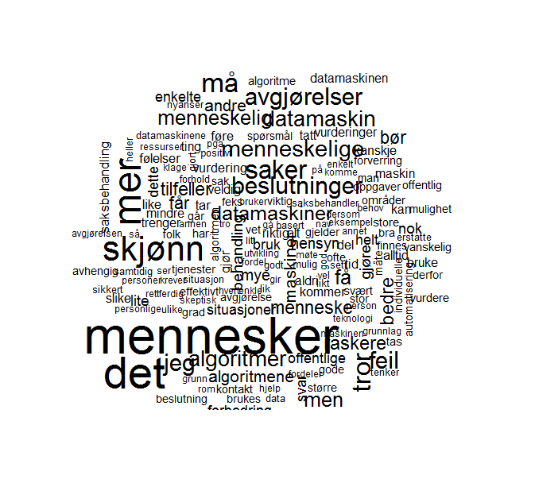

# Om rapporten {#om}

<!--  -->
<!-- ## Kort sammendrag -->
<!-- Den pågående automatiseringen av beslutningsprosesser i offentlig forvaltning representerer en omveltning innenfor byråkratisk myndighetsutøvelse. -->
<!-- Tilgang på store mengder relevant digital data og økende muligheter for å behandle informasjonen gjør at oppgaver som tidligere måtte behandles manuelt kan overlates til hel- eller halvautomatiserte prosesser med vesentlig redusert menneskelig inngripen. -->
<!-- På den ene siden gir denne utviklingen store effektiviseringsmuligheter og potensial for offentlige besparelser. -->
<!-- På den andre siden er ivaretakelsen av forvaltningens legitimitet i befolkningen et risikoaspekt i denne utviklingen. -->
<!-- Det overordnede målet med denne rapporten er å studere ut fra et demokratiperspektiv om, og i så fall hvordan, oppfattelsen av NAV som institusjon blant innbyggere i Norge påvirkes av en overgang til økt grad av automatisert saksbehandling. -->

## Forfattere

**Sveinung Arnesen** er Forsker I og faglig leder for Demokrati og innovasjon ved [NORCE](https://www.norceresearch.no/personer/sveinung-arnesen), og førsteamanuensis II ved [Institutt for administrasjons- og organisasjonsvitenskap](https://www.uib.no/personer/Sveinung.Arnesen), UiB. 
PhD-graden ble avlagt ved [Institutt for sammenliknende politikk, UiB](https://www.uib.no/sampol). 
Arnesen er Norges nasjonale koordinator for [Den europeiske samfunnsundersøkelsen (ESS)](europeansocialsurvey.org). [ORCID](https://orcid.org/0000-0002-2825-0664). [Github](https://github.com/SveinungA/). [Google Scholar](https://scholar.google.com/citations?user=xz8JwjAAAAAJ&hl=no&oi=ao).

**Mikael P. Johannesson** er forsker III ved [NORCE](https://www.norceresearch.no/personer/sveinung-arnesen) og PhD-kandidat ved [Institutt for Sammenliknende Politikk, UiB](https://www.uib.no/sampol).
Han har bred erfaring med eksperimentelle metoder, maskinlæring (inkludert deep learning), og surveyforskning.
Johannesson har utviklerkompetanse i statistikkprogrammet R, samt erfaring med Python (inkludert TensorFlow og Keras). [Github](https://github.com/mikajoh). [Google Scholar](https://scholar.google.com/citations?user=wG8CyVUAAAAJ&hl=no&oi=ao).

## Referansegruppe 

**Anne Lise Fimreite** er professor ved [Institutt for administrasjons- og organisasjonsvitenskap](https://www.uib.no/personer/Anne.Lise.Fimreite), UiB.
Hun har tidligere ledet den forskningsrådsfinansierte evaluering av NAV-reformen og har arbeidet mye med styringsutfordringer i flernivåsystem. 
Hun har også nylig vært medlem av det offentlige utvalget som i 2019 leverte forslag til ny forvaltningslov (NOU 2019:5) og har egen erfaring fra offentlig forvaltning som prorektor ved UiB i fire år fra 2013 til 2017. 

**Jacob Aars** er professor ved [Institutt for administrasjons- og organisasjonsvitenskap, UiB](https://www.uib.no/personer/Jacob.Aars), og har ledet den NFR-finansierte evalueringen av NAV-reformen (tok over da Fimreite gikk inn i rektoratet ved UiB). 
Han har blant annet forsket på lokaldemokrati og tilfredshet med offentlige tjenester.

## Finansiering
Forskningsrapporten er finansiert av [NAV Forskning og Utvikling](https://www.nav.no/no/nav-og-samfunn/kunnskap/fou-midler/pagaende-fou-prosjekter2/navs-tiltak-og-virkemidler).
Finansieringen er bidragsfinansiert.

## Sitering

Ved referering til rapporten, vennligst bruk følgende sitering:
Arnesen, Sveinung, Mikael P. Johannesson (2022): Demokratiske algoritmer. Norce-rapport #..., Bergen, mars 2022. Url: https://bookdown.org/sveinungarnesen78/NAV/.
