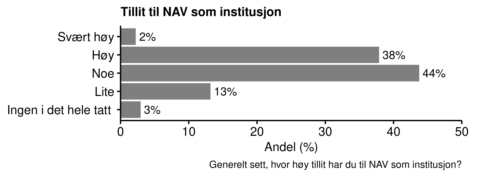
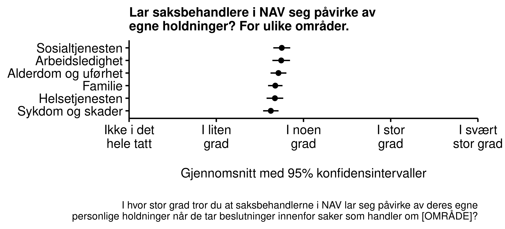
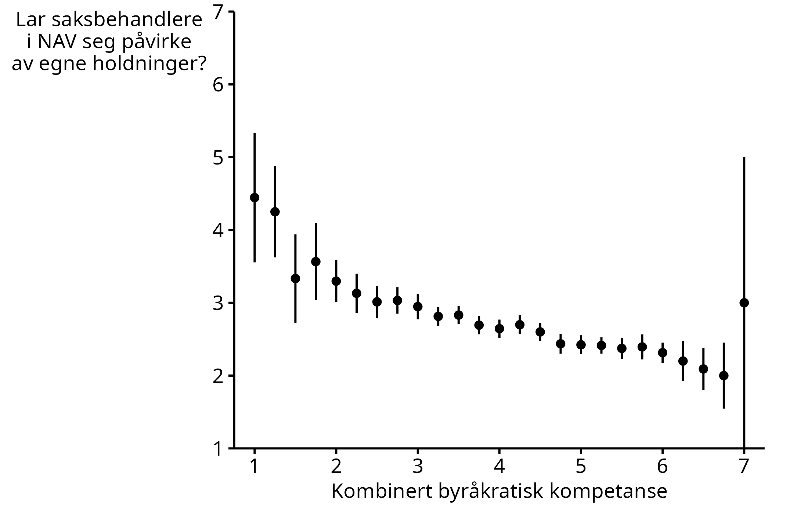
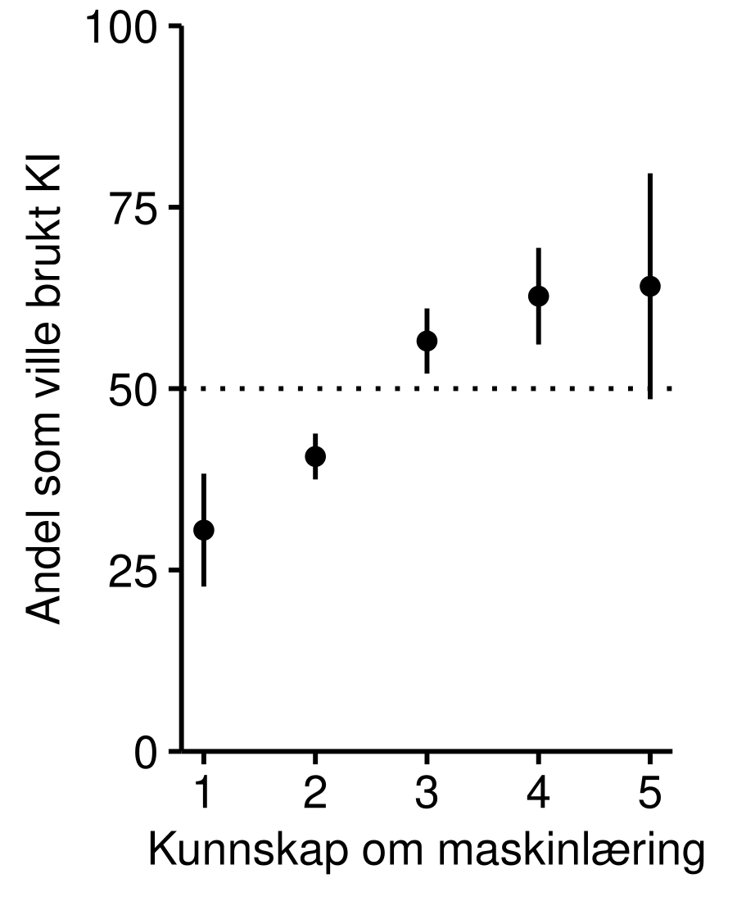
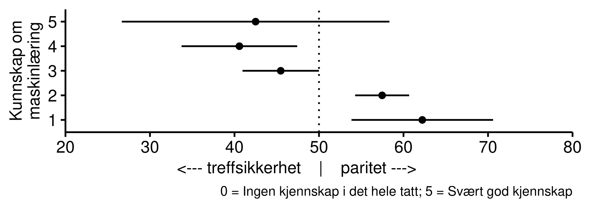
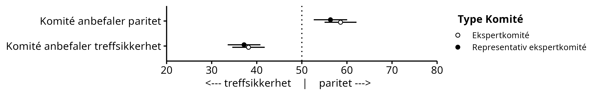

--- 
title: |
  {width=1in}   
  \bigskip  
  Demokratiske algoritmer  
  \bigskip   
  \large
  *Legitimitet, rettferdighet, og representasjon: Fremtidsutsikter til automatiserte beslutningsprosesser i offentlig forvaltning i befolkningens øyne*
author: "Sveinung Arnesen og Mikael Poul Johannesson"
date: |
  Sluttrapport skrevet for NAV FOU.   
  Denne versjonen: 9 Mars, 2022
site: bookdown::bookdown_site
cover-image: figs/png/nav_ordsky.png
documentclass: article
classoption: a4paper, 12pt
bibliography: [book.bib, packages.bib]
biblio-style: apalike
link-citations: yes
description: "Demokratiske algoritmer: Legitimitet og rettferdighet i automatiserte beslutningsprosesser i offentlig forvaltning"
fontsize: 12pt
abstract: "{width=6in,align=center} "
toc: false
output:
  pdf_document:
    toc: false
    includes:
      in_header: preamble.tex
---
```{r setup, include=FALSE}
knitr::opts_chunk$set(echo = FALSE, knitr.kable.NA = " ", cache = FALSE, warning = FALSE)


## if(!require("ggdag")){install.packages("ggdag");  library(ggdag)}
## if(!require("haven")){install.packages("haven");  library(haven)}
## if(!require("here")){install.packages("here");  library(here)}
## if(!require("kableExtra")){install.packages("kableExtra");  library(kableExtra)}
## if(!require("patchwork")){install.packages("patchwork");  library(patchwork)}
## if(!require("readxl")){install.packages("readxl");  library(readxl)}
## if(!require("rio")){install.packages("rio");  library(rio)}
## if(!require("tidyverse")){install.packages("tidyverse");  library(tidyverse)}
```

<!--  -->


\newpage
\tableofcontents 

\newpage
<!-- \listoftables -->
\listoffigures


\newpage
# Om rapporten {-}

<!--  -->
<!-- ## Kort sammendrag -->

<!-- Den pågående automatiseringen av beslutningsprosesser i offentlig forvaltning representerer en omveltning innenfor byråkratisk myndighetsutøvelse. -->
<!-- Tilgang på store mengder relevant digital data og økende muligheter for å behandle informasjonen gjør at oppgaver som tidligere måtte behandles manuelt kan overlates til hel- eller halvautomatiserte prosesser med vesentlig redusert menneskelig inngripen. -->
<!-- På den ene siden gir denne utviklingen store effektiviseringsmuligheter og potensial for offentlige besparelser. -->
<!-- På den andre siden er ivaretakelsen av forvaltningens legitimitet i befolkningen et risikoaspekt i denne utviklingen. -->
<!-- Det overordnede målet med denne rapporten er å studere ut fra et demokratiperspektiv om, og i så fall hvordan, oppfattelsen av NAV som institusjon blant innbyggere i Norge påvirkes av en overgang til økt grad av automatisert saksbehandling. -->

## Forfattere {-}


**Sveinung Arnesen** er Forsker I og faglig leder for Demokrati og innovasjon ved [NORCE](https://www.norceresearch.no/personer/sveinung-arnesen), og førsteamanuensis II ved [Institutt for administrasjons- og organisasjonsvitenskap](https://www.uib.no/personer/Sveinung.Arnesen), UiB. 
PhD-graden ble avlagt ved [Institutt for sammenliknende politikk, UiB](https://www.uib.no/sampol). 
Arnesen er Norges nasjonale koordinator for [Den europeiske samfunnsundersøkelsen (ESS)](europeansocialsurvey.org). [ORCID](https://orcid.org/0000-0002-2825-0664). [Github](https://github.com/SveinungA/). [Google Scholar](https://scholar.google.com/citations?user=xz8JwjAAAAAJ&hl=no&oi=ao).

**Mikael P. Johannesson** er forsker III ved [NORCE](https://www.norceresearch.no/personer/sveinung-arnesen) og PhD-kandidat ved [Institutt for Sammenliknende Politikk, UiB](https://www.uib.no/sampol).
Han har bred erfaring med eksperimentelle metoder, maskinlæring (inkludert deep learning), og surveyforskning.
Johannesson har utviklerkompetanse i statistikkprogrammet R, samt erfaring med Python (inkludert TensorFlow og Keras). [Github](https://github.com/mikajoh). [Google Scholar](https://scholar.google.com/citations?user=wG8CyVUAAAAJ&hl=no&oi=ao).

## Referansegruppe  {-}

**Anne Lise Fimreite** er professor ved [Institutt for administrasjons- og organisasjonsvitenskap](https://www.uib.no/personer/Anne.Lise.Fimreite), UiB.
Hun har tidligere ledet den forskningsrådsfinansierte evaluering av NAV-reformen og har arbeidet mye med styringsutfordringer i flernivåsystem. 
Hun har også nylig vært medlem av det offentlige utvalget som i 2019 leverte forslag til ny forvaltningslov (NOU 2019:5) og har egen erfaring fra offentlig forvaltning som prorektor ved UiB i fire år fra 2013 til 2017. 

**Jacob Aars** er professor ved [Institutt for administrasjons- og organisasjonsvitenskap, UiB](https://www.uib.no/personer/Jacob.Aars), og har ledet den NFR-finansierte evalueringen av NAV-reformen (tok over da Fimreite gikk inn i rektoratet ved UiB). 
Han har blant annet forsket på lokaldemokrati og tilfredshet med offentlige tjenester.

## Finansiering {-}
Forskningsrapporten er finansiert av [NAV Forskning og Utvikling](https://www.nav.no/no/nav-og-samfunn/kunnskap/fou-midler/pagaende-fou-prosjekter2/navs-tiltak-og-virkemidler).
Finansieringen er bidragsfinansiert.

## Sitering {-}

Ved referering til rapporten, vennligst bruk følgende sitering:
Arnesen, Sveinung, Mikael P. Johannesson (2022): Demokratiske algoritmer. Norce-rapport #..., Bergen, mars 2022. Url: https://bookdown.org/sveinungarnesen78/NAV/.


```{r}
## ncp21_raw <- import('C:/Users/svein/OneDrive - NORCE/Infrastruktur/Digsscore/Medborgerpanelet/2021-2/Norsk medborgerpanel - runde 21 - v-100-O.sav')
## ncp22_raw <- import('C:/Users/svein/OneDrive - NORCE/Infrastruktur/Digsscore/Medborgerpanelet/2021-3/Norsk medborgerpanel - runde 22 - v-100-O.sav')

## d <- ncp21_raw %>% select(
##   be_internal1 = r21padkom13_1,
##   be_internal2 = r21padkom13_2,
##   be_external1 = r21padkom14_1,
##   be_external2 = r21padkom14_2,
##   nav_trust = r21padkom15,
##   nav_knowledge = r21padkom16,
##   r21padkom17_1_1,
##   r21padkom17_1_2,
##   r21padkom17_1_3,
##   r21padkom17_2_1,
##   r21padkom17_2_2,
##   r21padkom17_2_3,
##   r21padkom17_3_1,
##   r21padkom17_3_2,
##   r21padkom17_4_1,
##   r21padkom17_4_2,
##   r21padkom17_4_3,
##   r21padkom17_5_1,
##   r21padkom17_5_2,
##   r21padkom17_5_3,
##   r21padkom17_6_1,
##   r21padkom17_6_2,
##   r21padkom17_6_3,
##   r21padkom17_7_1,
##   r21padkom17_7_2,
##   r21padkom17_7_3,
##   nav_kontakt = r21padkom18,
##   r21padkom19_ran,
##   caseworker_bias = r21padkom19,
##   ml_knowledge = r21padkom20,
##   ml_interests = r21padkom21,
##   job_prep = r21padkom24,
##   input_health = r21padkom25_1,
##   input_challenges = r21padkom25_2,
##   input_edu = r21padkom25_3,
##   input_work = r21padkom25_4,
##   input_age = r21padkom25_5,
##   input_gender = r21padkom25_6,
##   input_country = r21padkom25_7,
##   input_geo = r21padkom25_8,
##   input_crime = r21padkom25_9,
##   r21padkom29_ran,
##   same_edu = r21padkom29_1,
##   same_geo = r21padkom29_2,
##   same_gender = r21padkom29_3,
##   same_faith = r21padkom29_4,
##   same_age = r21padkom29_5,
##   same_ethnicity = r21padkom29_6,
##   same_polviews = r21padkom29_7,
##   same_workexp = r21padkom29_8,
##   same_sexualorient = r21padkom29_9,
##   ml_worry = r21padkom22,
##   #opentext variable r21padkom23
##   r21padkom26_ran,
##   r21padkom26_ran_contra,
##   parity_post = r21padkom26,
##   parity_reasoning = r21padkom27,
##   systematic_bias = r21padkom28
## )
```


```{r include=FALSE}
# automatically create a bib database for R packages
knitr::write_bib(c(
  .packages(), 'bookdown', 'knitr', 'rmarkdown'
), 'packages.bib')
```

<!--chapter:end:index.Rmd-->

\newpage\singlespacing
# Utvidet sammendrag {-}

Den pågående automatiseringen av beslutningsprosesser i offentlig forvaltning representerer en omveltning innenfor byråkratisk myndighetsutøvelse. 
Tilgang på store mengder relevant digital data og økende muligheter for å behandle informasjonen gjør at oppgaver som tidligere måtte behandles manuelt kan overlates til hel- eller halvautomatiserte prosesser med vesentlig redusert menneskelig inngripen. 
På den ene siden gir denne utviklingen store effektiviseringsmuligheter og potensial for offentlige besparelser. 
På den andre siden er ivaretakelsen av forvaltningens legitimitet i befolkningen et risikoaspekt i denne utviklingen.

NAV er ledende i utviklingen av digitale tjenester og verktøy, og utvikler systemer som kan nyttiggjøre seg framskritt som gjøres innenfor databehandling og analyse. 
Beslutningsprosesser som benytter seg av maskinlæring og kunstig intelligens vil være en del av løsningen for at NAV skal oppnå samfunnsoppdraget sitt om å bidra til at flere kommer i arbeid og færre på stønad, og samtidig sørge for at de som trenger det, får rett ytelse til rett tid gjennom en pålitelig og effektiv forvaltning. 
Kunstig intelligens kan brukes både i automatiserte beslutningsprosesser, og som beslutningsstøtte for saksbehandlere. 
Et sentralt kjennetegn ved kunstig intelligens er at slike systemer etterligner, erstatter og utvider menneskelig intelligent handling, og menneskelig beslutningstaking og vurdering.
Mulige områder hvor maskinlæring og kunstig intelligens kan benyttes i NAV er blant annet for å beregne sannsynlighet for at den arbeidsledige trenger bistand fra NAV; til å bestemme om en person i sykefravær skal kalles inn til oppfølgingsmøte fra NAV; og til å anbefale arbeidsrettede tiltak.

På veien mot bedre tjenester er det viktig at man har med seg brukerne – det vil si innbyggerne i Norge – og lager ansvarlige systemer som gir lik og rettferdig behandling uavhengig av sosial status.
Det er viktig å studere rettferdighet fra et statsvitenskapelig perspektiv fordi oppfatninger av rettferdighet antas å påvirke institusjonell legitimitet. 
Det overordnede målet med denne rapporten er derfor å belyse ut fra et demokratiperspektiv om, og i så fall hvordan, oppfattelsen av NAV som institusjon blant innbyggere i Norge påvirkes av en overgang til økt bruk av maskinlæring og kunstig intelligens i saksbehandlingen.
Datagrunnlaget for denne rapporten er samlet inn i Norsk medborgerpanels i 2021, med et representativt utvalg av innbyggerne i Norge på 2000 respondenter.
Vi presenterer også noen resultater fra relevante spørsmål som vi stilte i 2018, i medborgerpanelets runde 13.

For å kartlegge konteksten denne studien gjøres i, inkluderer undersøkelsen noen generelle spørsmål om innbyggernes forhold til NAV.
Vi finner at over halvparten av innbyggerne har vært i personlig kontakt med saksbehandler i NAV, men mange oppgir likevel at de har liten kjennskap til organisasjonen.
Flertallet av innbyggerne opplever at de er i stand til å få de tjenestene de har krav på fra det offentlige. 
Dette på tross av at mange opplever forvaltningen som krevende å forstå.

Innbyggerne har rimelig høy tillit til NAV.
Tilliten er høyere blant de som opplever at de får ytelsene de har rett på; som føler at de forstår de byråkratiske prosessene; som tenker at de som jobber i offentlig sektor bryr seg om folks behov; og som oppfatter at saksbehandlerne ikke bare forholder seg til tekniske aspekter i saksbehandlingen.
Motsvarende er tilliten lavere blant de som har et annet syn på forvaltningen.
Den samme forskjellen observerer vi når spørsmålet dreier seg om hvorvidt saksbehandlerne oppfattes som upartiske i sin myndighetsutøvelse.
Innbyggerne mener i liten til noen grad  at saksbehandlere i NAV lar seg påvirke av egne holdninger, men denne oppfattelsen varierer sterkt etter hvilken oppfatning de har om forvaltningen og tilliten de har til NAV. 

Vi finner videre økt støtte for *representativt byråkrati* når forvaltningen tar i bruk maskinlæring og kunstig intelligens.
Begrepet representativt byråkrati springer ut fra tanken om at forvaltningen skal gjenspeile befolkningen og slik hindre at sosiale grupper blir forskjellsbehandlet.
Eventuelle bias saksbehandlere måtte ha vil i så fall utjevnes ved at deres bakgrunn er variert og representativ for befolkningen samlet sett.
Innbyggerne blir mer opptatt av at saksbehandlerne deler deres sosiale bakgrunn når slike kunstig intelligens brukes i saksbehandlingen, og dette gjelder spesielt når det kommer til utdanningsnivå og arbeidserfaring.
En hypotese er at bruk av maskinlæring og kunstig intelligens leder til økt fremmedgjøring, og at behovet øker for saksbehandlere som forstår den enkeltes situasjon og kan gripe inn i tilfeller hvor den maskinelle vurderingen ikke tar tilstrekkelig hensyn til kontekst.
Det er i alle fall klart at maskinlæring og kunstig intelligens er fremmed for et flertall av innbyggerne i Norge: 
Mer enn seks av ti innbyggerne i Norge har liten eller ingen kjennskap til temaet.

Innbyggerne er delt i oppfatningen om bruken av maskinlæring og kunstig intelligens i forvaltningen fobedrer tjenestene, og om bruken er noe å bekymre seg over.
De som oppfatter at de har god kunnskap om tematikken er mer positive til at det brukes i forvaltningen.
Innbyggere som plasserer seg mot midten av det politiske spekteret er mer positive enn de som plasserer seg til mot endene.

Et viktig spørsmål knyttet til bruk av maskinlæring og kunstig intelligens er hvordan modellene kan ivareta oppfattelsen av at beslutninger som tas er rettferdige.
Det finnes imidlertid ulike definisjoner av hva rettferdighet er, og det er vanskelig -- for ikke å si umulig -- å oppfylle alle definisjonene på samme tid.
Vi har derfor i undersøkelsen tatt for oss et konkret tilfelle som er relevant for NAVs tjenester, hvor vi måler innbyggernes støtte til det som kalles *statistisk paritet*. 
Denne rettferdighetsdefinisjonen innebærer at man sikrer lik fordeling av et gode blant bestemtee undergrupper i samfunnet, ofte valgt ut basert på sosial eller etnisk tilhøriget.
Den konkrete saken gjelder bruk av maskinlæring og kunstig intelligens for å understøtte en beslutning om hvilke personer blant de sykmeldte som skal få tilbud om dialogmøte med NAV.
I vårt tilfelle har vi spurt hvilken modell man foretrekker av en som er mer treffsikker totalt sett, men skeivfordeler på kjønn, eller en som er mindre treffsikker totalt sett, men sikrer at like mange sykmeldte fra hvert kjønn får tilbud om dialogmøte.
Vi finner at befolkningen er delt omtrent på midten, med en liten overvekt av støtte til å bruke statistisk paritet.
Kvinner støtter statistisk paritet noe mer enn menn i dette konkrete tilfellet.
Både menn og kvinner støtter statistisk paritet i sterkere grad dersom det er kvinner som blir forfordelt, dog er denne effekten er sterkest blant kvinner.
Befolkningen er med andre ord ikke samstemt om hvilket rettferdighetskriterie som skal gjelde i dette tilfellet, noe som samsvarer med andre studier som viser at hva som er rettferdig er avhengig både av kontekst og av øyet som ser.

Et annet viktig spørsmål knyttet til bruk av maskinlæring og kunstig intelligens er hvilke data det oppfattes som passende å bruke. 
I mange brukstilfeller vil det finnes et bredt spektrum av informasjon tilgjenglig, men det vil sannsynligvis variere hvor passende innbyggere faktisk mener det er bruke de ulike typene informasjon -- uavhengig av om de gjør prediksjonen mer treffsikker. 
Vi har derfor spurt innbyggere hvor passende de synes en rekke variabler er i et konkret eksempel.
Eksempelet vi trekker fram gjelder å bruke maskinlæring og kunstig intelligens for å foreslå hvilke arbeidsrettede tiltak en jobbsøker skal få tilgang til. 
Vi finner at ingen variabler blir sett på som utvilsomt passende eller upassende, men samtidig at det er tydelige forskjeller mellom variabler.
For eksempel så blir informasjon om kjønn og landbakgrunn sett på mindre passende enn andre variabler, og utdanning sett på som mer passende enn andre variabler.
Samtidig finner vi også viktige systematiske forskjeller mellom ulike undergrupper i befolkningen for hvordan de gjør denne vurderingen.

Mye forskning gjenstår for å kunne trekke vidtrekkende konklusjoner om hvordan tillit og legitimitet best kan bevares i overgangen til økt bruk av maskinlæring og kunstig intelligens.
Vi er fortsatt i en tidlig fase, hvor de fleste innbyggerne har liten kjennskap til tematikken, og hvor svært få har personlige erfaringer med saksbehandling hvor dette benyttes.
Problemstillingene kan være komplekse, og av og til kan det være vanskelig for den jevne innbygger å ta stilling til spørsmål som de ikke har tenkt mye over.
Samtidig er det nyttig å allerede nå merke seg at befolkningen er delte i mange av spørsmålene om maskinlæring og kunstig intelligens i forvaltningen, både når det gjelder bekymring for bruk og hva som er rettferdig framgangsmåte.
Innbyggerne er mer følsomme for spørsmål om bruk av maskinlæring og kunstig intelligens under omstendigheter hvor bruken knyttes opp mot sosiale bakgrunnsvariabler som ellers i samfunnet er politisk ladete.
Også internasjonalt ser vi at bruk av maskinlæring og kunstig intelligens når offentlighetens søkelys i de tilfellene hvor marginaliserte grupper opplever at de blir forskjellsbehandlet.

Det er viktig å ta hensyn til de politiske dimensjonene knyttet til bruk av maskinlæring og kunstig intelligens i forvaltningen.
Representasjon av interessegrupper, medvirkning i utformingen av modellene, og politisk ansvarliggjøring er demokratiske verktøy som virker konfliktdempende i andre sammenhenger, og som det er grunn til å anta vil virke også i en overgang til mer automatisert forvaltning.
I eksperimentet med statistisk paritet så vi at det hadde en positiv effekt å opplyse respondentene om at modellene som ble brukt hadde blitt anbefalt av en komite som på forhånd hadde vurdert modellene.
Allerede i dag jobber NAV på en måte som åpner for innspill fra flere hold når maskinlæringsmodellene utvikles, og det er grunn til å anta at dette styrker legitimiteten til bruken av dem.
Vi anbefaler å videreutvikle innspillsprosessen slik at innbyggere og berørte parter blir involvert allerede i designfasen og slik på et tidlig stadium kan medvirke til å identifisere etiske dilemma, interessekonflikter, og andre potensielle konfliktsaker som kan oppstå senere.


\doublespacing

<!--chapter:end:01-sammendrag.Rmd-->

\newpage\doublespacing
# Bakgrunn og motivasjon {#bakgrunn}

## Byråkratisk omveltning
Den pågående automatiseringen av beslutningsprosesser i offentlig forvaltning representerer en omveltning innenfor byråkratisk myndighetsutøvelse. 
Tilgang på store mengder relevant digital data og økende muligheter for å behandle informasjonen gjør at oppgaver som tidligere måtte behandles manuelt kan overlates til hel- eller halvautomatiserte prosesser med vesentlig redusert menneskelig inngripen [@zarsky2016trouble]. 
På den ene siden gir denne utviklingen store effektiviseringsmuligheter og potensial for offentlige besparelser [@duwe2017effects].
Den representerer også en mulighet for å utvikle bedre, evidensbaserte beslutninger, som i sin tur kan bidra til å bevare tilliten og legitimiteten til offentlig forvaltning. 
På den andre siden er nettopp ivaretakelsen av forvaltningens legitimitet i befolkningen også et risikoaspekt i denne utviklingen. 
En frykt er at feil bruk kan lede til utfall som negativt forskjellsbehandler svakerestilte grupper i samfunnet, som igjen underminerer systemtilliten.

En arbeidsgruppe oppnevnt av den tidligere amerikanske president Barack Obama publiserte rapporter hvor de uttrykte bekymring for “kode-diskriminering» i automatiserte beslutninger, hvor diskriminering av sosiale grupper oppsto som en utilsiktet følge av måten stordatateknologi er strukturert og brukes. 
Dystopiske skildringer av “svart boks”-samfunn maler et skremmende bilde av et framtidssamfunn der innbyggernes skjebner blir bestemt av skjulte, upresise, og diskriminerende automatiske beslutningsprosesser [@barocas2016big; @pasquale2015black].
I de tilfeller oppmerksomheten når ut til allmennheten, har fokus tendert å handle om hvordan beslutningene slår ulikt ut sosiale grupper. 
Det amerikanske nyhetsmagasinet ProPublica viste hvordan prediksjonsmodeller som brukes til å forutsi gjentakelsesfare for lovbrudd blant fengselsinnsatte systematisk kategoriserte svarte insatte oftere enn hvite feilaktig som personer med høy risiko for å begå en ny forbrytelse når de løslates fra fengselet [@angwin2016machine].

Opplevd diskriminering fra myndighetenes side mot sosiale grupperinger er ikke noe nytt, og spesielt ikke i USA hvor automatiserte beslutninger har fått mest oppmerksomhet til nå. 
I Norge har vi mindre forskjeller mellom folk, både økonomisk, politisk og sosialt. 
Norge har også en høyt kompetent og effektiv offentlig forvaltning som jevnt over nyter høy tillit i befolkningen.
I overgangen til økt automatisering i forvaltningen er det viktig at tilliten og legitimiteten til offentlig forvaltning opprettholdes.

NAV er ledende i utviklingen av digitale tjenester og verktøy[@hansen2018digitalization], og utvikler systemer som kan nyttiggjøre seg framskritt som gjøres innenfor databehandling og analyse. 
Beslutningsprosesser som benytter seg av maskinlæring og kunstig intelligens vil være en del av løsningen for at NAV skal oppnå samfunnsoppdraget sitt om å bidra til at flere kommer i arbeid og færre på stønad, og samtidig sørge for at de som trenger det, får rett ytelse til rett tid gjennom en pålitelig og effektiv forvaltning. 
Maskinlæring og kunstig intelligens kan brukes både i helautomatiserte beslutningsprosesser, og som beslutningsstøtte for saksbehandlere. 
Et sentralt kjennetegn er at slike verktøy etterligner, erstatter og utvider menneskelig intelligent handling, og menneskelig beslutningstaking og vurdering.
Mulige områder hvor maskinlæring og kunstig intelligens kan benyttes i NAV er blant annet for å beregne sannsynlighet for at den arbeidsledige trenger bistand fra NAV; til å bestemme om en person i sykefravær skal kalles inn til oppfølgingsmøte fra NAV; og til å anbefale arbeidsrettede tiltak.
På veien mot bedre tjenester er det viktig at man har med seg brukerne –- det vil si innbyggerne i Norge -– og lager ansvarlige systemer som gir lik og rettferdig behandling uavhengig av sosial status.

## Beslutningsprosesser, rettferdighet og legitimitet
En massiv litteratur på prosedyrerettferdighet med utspring fra sosialpsykologi [@lind1988social] har hatt stor innvirkning på hvordan vi forstår relasjonene mellom innbyggere og myndighetene, og hvordan myndighetene bør forholde seg i møte med innbyggerne.
Når beslutningsprosessene dreier i retning av mer bruk av maskinlæring og kunstig intelligens, fungerer denne litteraturen som et velegnet rammeverk for å undersøke empirisk om, og i så fall hvordan, relasjonene mellom innbyggerne og myndighetene vil påvirkes av denne utviklingen.
Det vi vet fra eksperimentell forskning på politisk atferd er at både aspekter ved prosessen og utfallet i seg selv påvirker rettferdighetsoppfatningen av beslutningen og i sin tur villigheten til å akseptere beslutningen (se figur under). 
På kort sikt handler det om å skaffe aksept for enkeltbeslutninger. 
I et mer overordnet perspektiv dreier det seg om systemstøtte; om å sikre tillit og legitimitet til styresmaktene, og opprettholde tilfredsheten med demokratiet som styresett. 
Legitimitet forstår vi her som makten til å få noen til villig å føye seg etter en beslutning [@weber2009theory], som i sin tur gir myndighetene den autoriteten de trenger for å styre effektivt uten bruk av sanksjoner [@tyler2021people]. 
Demokratisk legitimitet viser til den legitimiteten som vinnes ved at beslutningene utgår fra folkeviljen [@rosanvallon2011democratic].
Både tillit og legitimitet omhandler relasjonen mellom innbyggere og myndighetene, og faller under det bredere konseptet om politisk støtte [@easton1965systems].

Prosessrelaterte spørsmål som har blitt studert er blant annet om rettferdighetsoppfatningen og aksepten av beslutningen påvirkes av forhold som er sentrale i demokratiske systemer.
Slike forhold kan for eksempel være grad av åpenhet rundt beslutningsprosessen [@de2014does], mulighet for direkte påvirkning på en avgjørelse [@EJPR:EJPR2052; @arnesen2017legitimacy; @christensen2020matter], hvem beslutningstakerne er, og hvor godt disse beslutningstakerne gjenspeiler befolkningen med tanke på sosial bakgrunn [@arnesen2018legitimacy; @clayton2019all]. 
Videre er et gjennomgående funn at dersom utfallet går imot ens egne ønsker, blir prosessen diskreditert [@esaiasson2016reconsidering].


```{r, out.width = "100%", fig.align = "center", fig.cap= "Antatt årsakssammenheng"}
knitr::include_graphics("figs/png/dag-1.png")
```

Demokrati- og opinionsforskere har i liten grad studert hvordan overgangen til økt bruk av maskinlæring og kunstig intelligens i forvaltningens beslutningsprosesser kan påvirke systemtillit og legitimitet. 
Unntak er De Fine Licht & De Fine Licht [-@de2020artificial] som studerer rollen som åpenhet når det gjelder hvordan allmennheten oppfatter kunstig intelligens-beslutninger som legitim, og Binns et al [-@binns2018s] som foretar eksperimentelle studier som undersøker folks oppfatning av rettferdighet i algoritmiske beslutninger.
Vår kunnskap om hvordan overgangen vil påvirke innbyggernes oppfatninger av forvaltningen er imidlertid fortsatt begrenset, og behovet for befolkningsrepresentative studier med et demokratiperspektiv er stort.
Det er motivasjonen for å lage denne rapporten.

Rapporten presenterer resultatene fra en spørreundersøkelse gjennomført på et befolkningsrepresentativt utvalg av innbyggere i Norge.
Undersøkelsen tar for seg generelle holdninger til og kunnskap om maskinlæring og kunstig intelligens i befolkningen. 
Å bruke maskinlæring innebærer å få datamaskiner til å lære seg å løse oppgaver basert på et datamateriale. 
Ofte kan datamaskinen bli ekstremt treffsikker, men det krever typisk veldig mye datamateriale. 
Maskinlæring er i dag grunnlaget for alt fra automatisk stemmegjenkjenning til førerløse biler.
I den internasjonale litteraturen om prosesseringen av data med formål å forbedre og effektivisere beslutninger i forvaltningen brukes flere begreper om hverandre, så som "automatiserte beslutninger", "bruk av maskinlæring og kunstig intelligens i forvaltningen", og "algoritmestyrt forvaltning".
Vi bruker også begrepene til en viss grad om hverandre i denne rapporten, avhengig av hvilke tidligere studier vi forholder oss til og hvilke spørsmålsformuleringer som har blitt brukt i undersøkelsene vi viser til.

Bredere spørsmål knyttet til relasjonen mellom NAV og innbyggerne -- uavhengig av tematikken om maskinlæring og kunstig intelligens -- blir også analysert for å kontekstualisere de mer spesifikke spørsmålene og eksperimentene knyttet til bruk av maskinlæring og kunstig intelligens i NAV.
Deretter fokuserer vi på holdninger som har relevans for en framtid hvor maskinlæring og kunstig intelligens vil spille en sentral rolle.
Dette gjelder problemstillinger knyttet til konkrete, aktuelle situasjoner i NAV, såvel som mer overordnete spørsmål om maskinlæring og kunstig intelligens i forvaltningen.

<!-- ## Data -->

<!-- Datagrunnlaget for denne rapporten er samlet inn i Norsk medborgerpanels runde 22 og 23. -->
<!-- Norsk medborgerpanel er en internettbasert undersøkelse om nordmenns holdninger til viktige samfunnstema. -->
<!-- Panelet drives av samfunnsforskere ved Universitetet i Bergen og NORCE, og er et non-profit prosjekt utelukkende benyttet til forskningsformål.  -->
<!-- Deltakerne representerer et tverrsnitt av den norske befolkningen, som noen ganger i året inviteres til å si sin mening i viktige spørsmål om norsk samfunn og politikk. -->

<!-- Panelet blir driftet av [Digital samfunnsvitenskapelig kjernefasilitet (DIGSSCORE)](www.digsscore.uib.no), som er samarbeidspartner i prosjektet. -->

<!-- Samlet antall respondenter som svarte på deler av denne undersøkelsen var 3971. -->
<!-- Typisk antall respondenter for hvert spørsmål er om lag 2000. -->

<!-- [Metoderapport for data kan lastes ned her.](https://www.uib.no/en/digsscore/122162/methodology-and-field-periods) -->
<!-- Data er åpent tilgjengelig for forskere, og kan lastes ned ved å kontakte [Sikt – Kunnskapssektorens tjenesteleverandør (tidligere kjent som NSD)](https://sikt.no/). -->

<!--chapter:end:02-bakgrunn.Rmd-->

\newpage
# Data og metode {#metode}

Denne rapporten er basert på spørreundersøkelse på et befolkningsrepresentativt utvalg av innbyggere i Norge. 
Undersøkelsen var delt i tre hoveddeler. 
Den første delen tar for seg spørsmål knyttet til relasjonen mellom innbyggerne og NAV. 
Den andre delen tar for seg mer generelle holdninger og kunnskap til maskinlæring og kunstig intelligens. 
I den tredje delen av undersøkelsen bruker eksperimentscenarier som er eller kan bli realistiske i NAV-sammenheng, hvor respondent må gjøre spesifikke avveinger rundt om og hvordan maskinlæring brukes eller implementeres. 

Ved flere deler av undersøkelsen benytter vi eksperiment. 
Eksperiment som metode i samfunnsforskningen defineres av to nøkkelelementer. 
For det første må det være en datainnsamlingsprosess som samfunnsforskeren setter i gang for å søke svar på et forskningsspørsmål. 
Eksperimentdata kan ikke være observasjonsdata, altså data som allerede eksisterer i «den virkelige verden» og har skjedd – og ville ha skjedd – uten forskerens innblanding. 
Et eksperiment må også ha en kontrollgruppe som viser hvordan verdiene på den avhengige variabelen framstår når de ikke er påvirket av den eller de faktorene som undersøkes. 
Når stimulusgruppene blir introdusert for påvirkning, måler vi nivåene på disse gruppene opp mot kontrollgruppen for å se om det er noen forskjell. 
Eksperimenter i samfunnsforskningen kan gjennomføres som felteksperimenter, som lab-eksperimenter og som surveyeksperimenter. 
Sistnevnte har vært mest brukt innenfor studier av demokratiske beslutningsprosesser og er også det vi benytter oss av i denne rapporten. 

## Norsk medborgerpanel
Data for denne rapporten er samlet inn i Norsk medborgerpanels 22 og 23.
Samlet antall respondenter som svarte på deler av denne undersøkelsen var 3971. 
Typisk antall respondenter for hvert spørsmål er om lag 2000. 
Vi presenterer også noen resultater samlet inn i 2018 (runde 13).

Norsk medborgerpanel er en internettbasert undersøkelse om nordmenns holdninger til viktige samfunnstema.
Panelet drives av samfunnsforskere ved Universitetet i Bergen og NORCE, og er et non-profit prosjekt utelukkende benyttet til forskningsformål. 
Deltakerne representerer et tverrsnitt av den norske befolkningen, som noen ganger i året inviteres til å si sin mening i viktige spørsmål om norsk samfunn og politikk.
Panelet blir driftet av [Digital samfunnsvitenskapelig kjernefasilitet (DIGSSCORE)](www.digsscore.uib.no), som er samarbeidspartner i prosjektet. 

[Metoderapport og kodefor data kan lastes ned her.](https://www.uib.no/en/digsscore/122162/methodology-and-field-periods)
[Kodebøker kan lastes ned her.](https://www.uib.no/medborger/76892/data-og-dokumentasjon)
Data er åpent tilgjengelig for forskere, og kan lastes ned ved å kontakte [Sikt – Kunnskapssektorens tjenesteleverandør (tidligere kjent som NSD)](https://sikt.no/).

<!--chapter:end:02-zmetode.Rmd-->

\newpage
# Innbyggernes relasjon til NAV {#nav}

I dette kapitlet ser vi nærmere på relasjonen mellom NAV og innbyggerne i Norge.
Kapitlet danner grunnlaget for å forstå konteksten når vi senere fokuserer mer spesifikt på maskinlæring og kunstig intelligens i organisasjon. 
Vi måler folks tillit til NAV, samt deres erfaring med og kjennskap til NAV.
Vi måler også i hvilken grad innbyggerne opplever at de forstår hvordan organisasjonen fungerer, og i hvilken grad de opplever at deres interesser blir ivaretatt i systemet.

Vi finner at 

- over halvparten av innbyggerne har vært i personlig kontakt med saksbehandler i NAV, men mange oppgir likevel at de har liten kjennskap til NAV.
- innbyggerne har middels til høy tillit til NAV. Det er få som oppgir å ha svært høy tillit eller ingen tillit i det hele tatt.
- flertallet av innbyggerne opplever at de er i stand til å få de tjenestene de har krav på fra det offentlige. Dette på tross av at mange opplever forvaltningen som krevende å forstå.
- innbyggerne i liten til noen grad mener at saksbehandlere i NAV lar seg påvirke av egne holdninger. Det skiller lite mellom hvilke områder av NAVs ansvarsområde man spør etter.


## Erfaring med og kjennskap til NAV

Et flertall av innbyggerne i Norge har hatt befatning med NAV i en eller annen form. 
Noen kontakter er lite personlige, som for eksempel når man mottar barnetrygd.
Andre krever mer kontakt med NAV, og gjerne personlig kontakt med en saksbehandler.
I vårt utvalg har godt over halvparten minst en gang vært i personlig kontakt med NAV.

```{r, out.width = "80%", fig.align = "center", fig.cap= "Personlig kontakt med NAV"}
knitr::include_graphics("figs/png/fig_nav_personal_contact.png")
```

Fire av ti innbyggere i Norge har liten eller ingen kjennskap til NAV, mens seks av ti har ganske god, god, eller svært god kjennskapt til institusjonen.


```{r, out.width = "80%", fig.align = "center", fig.cap= "Selvrapportert kunnskap om NAV"}
knitr::include_graphics("figs/png/fig_nav_knowledge.png")
```


## Tillit
Tillit er noe som tar lang til å bygge opp, men som fort kan rives ned.
Norge er kjent som et land der myndighetene nyter høy tillit i befolkningen.
Dette bekreftes også i vår undersøkelse for NAV sin del.
Fire av ti innbyggere i Norge har høy eller svært høy tillit til NAV, mens bare en av seks har liten eller ingen tillit.
Det er et godt utgangspunkt at NAV nyter tillit i befolkningen, og ikke desto viktigere at denne relasjonen ivaretaes parallelt med at organisasjonen endrer seg og utvikler morgendagens forvaltning.
Hvordan NAV ligger i forhold til andre forvaltningsorganer har vi ikke data på.

```{r, out.width = "80%", fig.align = "center", fig.cap= "Tillit til NAV"}

```

Om vi bryter ned tillit etter kjennskap til NAV, ser vi at det ikke er noen tydelig sammenheng mellom selvrapportert kjennskap og tillit, men at de som har hatt personlig kontkat med en saksbehandler i snitt er har noe lavere tillit. Forskjeller er relativt liten men statistisk signifikant.


```{r, out.width = "60%", fig.align = "center", fig.cap= "Tillit til NAV for ulike nivåer av selvrapportert kjennskap"}

```

```{r, out.width = "100%", fig.align = "center", fig.cap= "Tillit til NAV for for de som har eller ikke har hatt personlig kontakt med NAV"}

```


## Byråkratisk kompetanse

I statsvitenskapen opererer man med et begrep som på engelsk heter *political efficacy*.
Vi kan gjerne oversette begrepet på norsk til *politisk kompetanse*.
Politisk kompetanse viser til en persons selvopplevde evne til å forstå politikk (*internal political efficacy*), og personens opplevelse av å kunne påvirke politiske prosesser (*external political efficacy*).
Vi ser at intern og ekstern politisk kompetanse henger sammen med politisk deltakelse, med tilfredshet med demokratiet, tillit til institusjoner, blant annet.

På samme måte som at innbyggerne har ulike evner til å forstå politikk og påvirke politiske prosesser, har de også ulike evner til å forstå forvaltningen.
I motsetning til i politisk arbeid er det ikke et mål at innbyggerne nødvendigvis skal kunne påvirke en byråkratisk prosess, men det er likefullt en kjennsgjerning at noen personer er flinkere til å følge opp saker på vegne av seg selv eller pårørende, og slik sett er bedre i stand til å ivareta sine interesser i saker som angår dem.

For å avdekke hvordan disse ferdighetene fordeler seg i befolkningen har vi spurt respondentene om det vi benevner deres *byråkratiske kompetanse* - intern og ekstern.
Intern byråkratisk kompetanse måler vi ved hjelp av to påstander som de skal si seg enig eller uenig i:

1. 	Jeg er i stand til å skaffe alle offentlige ytelser, tjenester, og tillatelser som jeg har rett på.

2. 	Den offentlige forvaltningen er så innviklet at folk som meg ikke kan forstå hva som foregår innad i ulike etater, direktorat, kommuner, og så videre.

Ekstern byråkratisk kompetanse måler vi ved hjelp av to nye påstander:

1. De som jobber i den offentlige forvaltningen bryr seg ikke om hvilke behov folk som meg har.

2. Saksbehandlere i den offentlige forvaltningen er bare interessert i tekniske aspekter ved saken, ikke hva de det berører faktisk ønsker.


```{r, out.width = "80%", fig.align = "center", fig.cap= "Byråkratisk kompetanse"}
knitr::include_graphics("figs/png/fig_be_hist.png")
```

Figurene viser at det er ganske stor spredning i svarene.
Flertallet av innbyggerne er enige i påstanden at de får alle ytelser som de har rett på. 
Et flertall svarer samtidig at de opplever byråkratiet som vanskelig å forstå.
Flertallet er uenige i at de som jobber i offentlig forvaltning ikke bryr seg om folks behov, men det er også et stort mindretall som er enige i denne påstanden.
Et lite flertall mener at saksbehandlere bare er interessert i tekniske aspekter ved saken.

Dette er befolkningen i sin helhet.
Når vi bryter svarene ned på sosiopolitiske undergrupper ser vi at dem som har lav byråkratisk kompetanse også har lav politisk kompetanse (efficacy).
Det vil si at de som har tillit til NAV er de som opplever at de får ytelsene de har rett på, som føler at de forstår de byråkratiske prosessene, som tenker at de som jobber i offentlig sektor bryr seg om folks behov, og som ikke bare forholder seg til tekniske aspekter i saksbehandlingen.

```{r, out.width = "80%", fig.align = "center", fig.cap= "Byråkratisk kompetanse covariater"}
knitr::include_graphics("figs/png/fig_be_coefs_by_type.png")
```

Byråkratisk kompetanse varierer også til dels mye mellom folk når vi deler dem inn i hvilket parti de ville ha stemt på dersom det var stortingsvalg i morgen.
Figuren under viser at det er størst forskjell på de som stemmer Fremskrittspartiet og de som stemmer Miljøpartiet de grønne, spesielt når det gjelder ekstern byråkratisk kompetanse.

Menn scorer noe lavere enn kvinner på ekstern byråkratisk kompetanse, og det samme gjør personer uten høyere utdanning sammenliknet med personer med høyere utdanning. 
De scorer også noe lavere på intern byråkratisk kompetanse, men her er forskjellen mindre (men fortsatt statistisk signifikant).

Tillit til NAV samvarierer også sterkt med byråkratisk kompetanse.
Figuren under viser mer dette mer detaljert.
Vi observerer en lineær sammenheng mellom de to variablene, som flater ut først blant de som har svært høy tillit til NAV.

```{r, out.width = "60%", fig.align = "center", fig.cap= "Byråkratisk kompetanse for ulike nivåer av tillit til NAV"}
knitr::include_graphics("figs/png/fig_be_by_navtrust.png")
```


## Tiltro til likebehandling i NAV

Et styrende prinsipp i norsk forvaltning er nøytralitet:
Saksbehandlere skal utøve sitt mandat uten å la egne holdninger komme i veien og påvirke beslutningsprosessen.
Slik upartisk behandling av innbyggerne står også sentralt i forskning på hvilke egenskaper ved byråkratiet som underbygger legitimitet og rettferdighetsoppfatninger.
Når vi spør innbyggerne i Norge hvordan de oppfatter at saksbehandlerne i NAV lar seg påvirke av egne holdninger, finner vi at de tror det forekommer i noen grad.
Det er liten forskjell på de ulike områdene innenfor NAV.

```{r, out.width = "80%", fig.align = "center", fig.cap= "Fordeling av tilltro til likebehandling i NAV på tvers av saksområder"}
knitr::include_graphics("figs/png/fig_nav_exp_attinfluence_all.png")
```


```{r, out.width = "80%", fig.align = "center", fig.cap= "Gjennomsnitt av tilltro til likebehandling for ulike saksområder"}

```

Figuren under viser også at byråkratisk kompetanse samvarierer med oppfatningen om at saksbehandlere lar seg påvirke av egne holdninger:
Jo høyere byråkratisk kompetanse en innbygger har, desto mindre mener man at saksbehandlerne lar seg påvirke av egne holdninger.

```{r, out.width = "60%", fig.align = "center", fig.cap= "Tilltro til likebehandling i NAV for ulike nivåer av byråkratisk kompetanse"}

```

I utvalget mener de som har vært i personlig kontakt med en saksbehandler i NAV i litt større grad at saksbehandlerne lar seg påvirke av egne holdninger. 
Forskjellen er imidlertid ikke stor.


<!--chapter:end:03-tillit.Rmd-->

\newpage
# Innbyggernes oppfatninger om maskinlæring og KI {#ki}

I dette kapitlet ser vi nærmere på hvilke forventinger innbyggerne i Norge har når det gjelder bruk av maskinlæring og kunstig intelligens generelt og i NAV. Respondentene ble først gitt enn introduksjon som kort forklarte maskinlæring og kunstig intelligens og spurte de hvor mye kjennskap de har til temaet. Deretter undersøkte vi deres generelle forventinger rundt dette. Vi finner at

- Mer enn seks av ti innbyggerne i Norge har liten eller ingen kjennskap til maskinlæring og kunstig intelligens
- Innbyggerne er delt i oppfatningen om bruken av maskinlæring og kunstig intelligens i forvaltningen er noe å bekymre seg over
- De som oppfatter at de har god kunnskap om maskinlæring er mer positive til bruk av kunstig intelligens i forvaltningen
- Det er en omvendt U-formet sammenheng mellom selvplassering på politisk høyre/venstre-skala og oppslutning om bruk av kunstig intelligens: 
Innbyggere som plasserer seg mot midten av det politiske spekteret er mer positive enn de som plasserer seg mot en av endene på skalaen.

## Kunnskap om maskinlæring og kunstig intelligens

<!-- Maskinlæring som databehandlingsmetode er relativt fersk. -->
<!-- Med økt datakraft og økt tilgang på data, har bruk av maskinlæring bredt om seg innenfor datavitenskapelige miljøer. -->
Kunnskap rundt maskinlæring, kunstig intelligens, algoritmer, etc., utgjør viktig brikke for å forstå hvordan befolkningen forholder seg til bruken av slike verktøy.
Maskinlæring og kunstig intelligens er avanserte tema som krever spesialkompetanse for å kunne implementere og bruke på en god måte. 
For å kunne grundig diskutere rammene for hva som utgjør rettferdig eller legitim bruk av slike verktøy må man ha en viss forståelse for hva de rammene er, noe som da krever en viss grunnkunnskap. 
I undersøkelsen så ga vi respondentene en kort forklaring av maskinlæring og spurte dem i hvor stor grad de har kjennskap til dette temaet. Vi ga dem følgende introduksjon til temaet:

> "*Nå ønsker vi å spørre om dine holdninger rundt bruk av maskinlæring i den offentlige forvaltningen. Maskinlæring blir også ofte omtalt som kunstig intelligens.*
>
 > *Å bruke maskinlæring innebærer å få datamaskiner til å lære seg å løse oppgaver basert på et datamateriale. Ofte kan datamaskinen bli ekstremt treffsikker, men det krever typisk veldig mye datamateriale. Maskinlæring er i dag grunnlaget for alt fra automatisk stemmegjenkjenning til førerløse biler.*
 >
> *Den offentlige forvaltningen, inkludert NAV, bruker i enkelte tilfeller maskinlæring for å hjelpe med å ta beslutninger i saker de har ansvar for. Formålet er å redusere kostnader og behandlingstid, og å gjøre beslutninger bedre og mer treffsikre. Et eksempel kan være å lære en datamaskin å forutsi omtrent hvor lenge en person vil være sykmeldt, basert på informasjon om sykdommen og personen. Det kan en saksbehandler da bruke for å velge passende tiltak.*"

Vi spurte derreter om hvor god kjennskap de har til maskinlæring og kunstig intelligens.
Figuren under viser hvordan respondentene fordelte seg på spørsmålet.
Det er kun én av syv innbyggere som oppgir at de har god eller svært god kjennskap, mens nesten to tredjeler sier at de har liten eller ingen kjennskap til det i det hele tatt.


```{r, out.width = "80%", fig.align = "center", fig.cap= "Selvrapportert kunnskap om maskinlæring og kunstig intelligens"}
knitr::include_graphics("figs/png/fig_ml_knowledge.png")
```

## Bekymring

Vi spurte deretter om hvor bekyrmet de er for bruken av slike verktøy i den offentlig forvaltningen. Figurene under viser hvordan respondentene fordelte seg på spørsmålet. Den viser at innbyggerne er delt i synet på grad av bekymring knyttet til bruk av maskinlæring og kunstig intelligens i den offentlige forvaltningen, hvorav over halvparten er bekymret eller noe bekymret.
Samtidig er det kun fem prosent som oppgir at de er veldig bekymret.

```{r, out.width = "80%", fig.align = "center", fig.cap= "Bekymring for maskinlæring"}
knitr::include_graphics("figs/png/fig_ml_worried.png")
```

Den neste figuren viser hvordan gjennomsnitt av bekymring for ulike nivåer av kunnskap. Her ser vi at de med ingen kunnskap er mer bekymret enn de med god eller svært god kunnskap om maskinlæring.

```{r, out.width = "50%", fig.align = "center", fig.cap= "Bekymring for maskinlæring for ulike nivåer av selvrapportert kunnskap om maskinlæring"}
knitr::include_graphics("figs/png/fig_ml_worried_by_knowledge.png")
```

## Blir interesser bedre ivaretatt med maskinlæring?

Vil folk oppleve at det er lettere eller vanskeligere å forstå hvordan byråkratiet fungerer?
Vil deres interesser ivaretas bedre eller dårligere når maskinlæring brukes i NAV?
For å undersøke dette ba vi dem ta stilling til et noe mer konkret situasjon:

> La oss si at du var i en situasjon hvor du måtte søke NAV om økonomisk stønad. Tror du interessene dine hadde blitt bedre eller dårligere ivaretatt dersom saksbehandleren brukte maskinlæring og kunstig intelligens som hjelp til å fatte beslutningen om økonomisk stønad?

Figuren under viser fordelingen av svar.
Det mest vanlige svaret var midtkategorien"'verken bedre eller dårligere".
For øvrig fordelte svarene seg normalt rundt denne midtkategorien.
I spørreundersøkelser kan midtkategorier i slike bipolare skalaer ofte skjule at respondentene ikke har noen mening om spørsmålet.

```{r, out.width = "80%", fig.align = "center", fig.cap= "Forventninger om interesser ivaretas bedre med maskinlæring i NAV"}
knitr::include_graphics("figs/png/fig_nav_ml_helps_interest.png")
```

Den neste figuren viser hvordan dette varier etter nivå av selvrapportert kunnskap: De med mye kunnskap har større sannsynlighet for å tro at deres interesser blir bedre ivaretatt enn de med lite kunnskap.

```{r, out.width = "40%", fig.align = "center", fig.cap= "Forventninger om interesser ivaretas bedre med maskinlæring i NAV for ulike nivåer av selvrapportert kunnskap om maskinlæring"}
knitr::include_graphics("figs/png/fig_nav_ml_helps_interest_by_knowledge.png")
```


## Forventinger til automatisering i offentlig sektor

Vi har studert befolkningens forventinger til automatisering i offentlig sektor ved en tidligere spørreundersøkelse. 
Resultatene under er basert på spørsmål stilt i 2018 (runde 13) i Norsk Medborgerpanel.
Vi spurte dem først om de tror skiftet fra menneskelige til automatiserte beslutninger generelt vil føre til en forbedring eller forverring av offentlig tjenester. 
Dette var et eksperiment hvor halvparten også fikk oppgitt en rekke konkrekte eksempler.
Detteretter ble de spurt om tror økende automatisering i offentlig sektor fører til mer eller mindre av henholdsvis etterprøvbarhet, legitimitet, og upartiskhet.
De to figurene under viser fordelingene for alle, altså for både de som fikk og ikke fikk oppgitt konkrekte eksempler. 
Her ser vi at respondentene hadde delvis ulike forventing for de ulike punktene. 
De er relativt jevnfordelt når det gjelder generelle forventinger om det vil fære til forbedring eller forverring av offentlig tjenester.
Samtidig tror majoriten av innbyggere at det vil føre til mindre etterprøvbarhet og legitimitet, men mer upartiskhet.


Resultat: Folk har forventinger, og gjennomsnittet ligger like under 4.

```{r, out.width = "45%", fig.align = "center", fig.cap= "Generelle forventinger til automatisering i offentlig sektor"}
knitr::include_graphics("figs/png/fig_automat_hist.png")
```

```{r, out.width = "100%", fig.align = "center", fig.cap= "Spesifikke forventinger til automatisering i offentlig sektor"}
knitr::include_graphics("figs/png/fig_automat2_hist.png")
```

Figuren under viser gjennomsnittet delt opp etter hvorvidt de fikk oppgitt konkrete eksempler i spørsmålet om generelle forventinger. Halvparten fikk følgende ekstra tekst:

> Ett konkret eksempel fra Norge er Utlendingsdirektoratet (UDI), som i enkelte tilfeller lar roboten Ada bestemme om enkeltpersoner skal få opphold i Norge. Et par eksempler fra USA er algoritmer som produserer anbefalinger vedrørende hvor politiet bør patruljere for å øke sjansen for å ta kriminelle, samt hvilke bekymringsmeldinger barnevernet bør ta på alvor og hvilke de kan la passere.

Respondentene som fikk vist konkrete eksempler forventer i større grad at automatiseringen vil føre til forverring av offentlig tjenester, samt til mindre legitimitet, enn de som ikke fikk vist eksempler. Effekten er svak men statistisk signifikant.

```{r, out.width = "80%", fig.align = "center", fig.cap= "Effekt av å få vite konkrete eksempler på forventinger til automatisering i offentlig sektor"}
knitr::include_graphics("figs/png/fig_automat_treat.png")
```


<!--chapter:end:04-01-KI.Rmd-->

\newpage
# Rettferdighetsoppfatninger

## Når er det passende å bruke kunstig intelligens? {#relval}

<!-- Vi finner at -->

<!-- - Mer enn seks av ti innbyggerne i Norge har liten eller ingen kjennskap til maskinlæring og kunstig intelligens -->

<!-- - Innbyggerne er delt i oppfatningen om bruken av maskinlæring og kunstig intelligens i forvaltningen er noe å bekymre seg over -->

<!-- - De som oppfatter at de har god kunnskap om maskinlæring er mer positive til bruk av kunstig intelligens i forvaltningen -->

<!-- - Det er en omvendt U-formet sammenheng mellom selvplassering på politisk høyre/venstre-skala og oppslutning om bruk av kunstig intelligens:  -->
<!-- Innbyggere som plasserer seg mot midten av det politiske spekteret er mer positive enn de som plasserer seg mot en av endene på skalaen. -->

I mange beslutninger i forvaltningen må det utvises skjønn basert på en samlet vurdering av den enkelte saken.
Om man tar i bruk kunstig intelligens, ved hjelp av maskinlæring, vil beslutningene antakelig bli mer treffsikker, og dermed øke andelen riktige beslutninger.
Samtidig kan heller ikke en datamaskin være helt treffsikker. 
Det er også grunn til å tro at den gjenværende andelen uriktige beslutninger går mer systematisk ut over noen grupper i samfunnet når man bruker maskinlæring og kunstig intelligens. 
Dette fordi det er stor variasjon mellom hvordan menneskelige saksbehandlere utviser skjønn, mens for en datamaskin er det ingen variasjon.

Med dette som bakgrunn spurte vi respondentene hva foretrekker i slike situasjoner: 
Enten 1) Bruke kunstig intelligens, som fører til mange flere riktige beslutninger i bytte mot at det alltid er de samme som blir gjenstand for uriktige avgjørelser, eller 2) ikke bruke kunstig intelligens, som fører til mange færre riktige beslutninger i bytte mot at det varierer hvem som blir gjenstand for uriktige avgjørelser.
Fordelingen er vist i tabellen under. 
Respondentene delte seg på midten i dette spørsmålet, hvor rundt 47 prosent foretrakk å bruke kunstig intelligens, mens 53% foretrakk å ikke bruke kunstig intelligenst. 

Table: (\#tab:relval) Tradeoff mellom generell treffsikkerhet og spesfikke systematiske feil (bruke eller ikke bruke KI)

|Svar                |                                             |   Prosent|
|:-------------------|:--------------------------------------------|---------:|
|Bruke KI            |    | 47       |
|Ikke bruke KI       | | 53       |

Figuren under viser at de med lav kjennskap til maskinlæring og kunstig intelligens var mest skeptiske.
Det kan altså ha sammenheng med skepsis til det ukjente.

```{r, out.width = "50%", fig.align = "center", fig.cap= "Repiterbarhet etter selvrapportert kunnskap"}

```

Spørsmålet har også en politisk-filosofisk dimensjon over seg.
Premisset som legges til grunn for spørsmålet er at man ved å innføre kunstig intelligens påvirker fordelingen av riktige beslutninger. 
Det blir da et spørsmål om fordeling av goder, og om man er villig til å ofre et lite antall individer som systematisk forfordeles med uriktige beslutninger, mot at populasjonen som helhet nyter godt av en høyere andel riktige beslutninger.

```{r, out.width = "60%", fig.align = "center", fig.cap= "Repiterbarhet etter selvplassering på politiske skala"}
knitr::include_graphics("figs/png/fig_relval_polscale.png")
```


Ut fra dette perspektivet gir det mening at de som plasserer seg lengst til venstre på den politiske høyre/venstre-skalaen er minst villige til å bruke kunstig intelligens, da man kan anta at borgere som plasserer seg lengst til venstre er mer egalitær enn de som plasserer seg på høyresiden.
Vi noterer oss imidlertid også at de som plasserer seg lengst til høyre også er mindre villige til å bruke kunstig intelligens når konsekvensene av bruken presenteres slik som den har blitt gjort i dette konkrete tilfellet.
Inntil videre må vi nøye oss med å konstatere at det er store forskjeller i svarene respondentene gir basert på deres politiske ståsted, og overlate til framtidig forskning å dykke dypere i hva denne forskjellen skyldes.

## Hvilken informasjon anses som passende? {#input}

Et annet viktig spørsmål knyttet til bruk av maskinlæring og kunstig intelligens er hvilke data det oppfattes som passende å bruke. 
I mange brukstilfeller vil det finnes et bredt spektrum av informasjon tilgjenglig, men det vil sannsynligvis variere hvor passende innbyggere faktisk mener det er bruke de ulike typene informasjon -- uavhengig av om de gjør prediksjonen mer treffsikker. 
Det er derfor nyttig å ha kunnskap om hvordan befolkning vurderer ulike typer informasjon. 

Et realistisk eksempel hvor maskinlæring kan brukes i forvaltninger er hvilke jobbrette tiltak NAV skal tilby en jobbbsøker. Tilgangen til jobbrettede tiltak er behovsbasert og jobbsøkeren har ikke anledning til fritt å velge hvilke tiltak hun eller han ønsker seg. Godt over halvparten av alle jobbsøkere tilbys ingen eller liten bistand fra NAV. Saksbehandler vil på bakgrunn av en individuell vurdering av søkerens behov bestemme innsatsgruppe, og dermed også hvilke tiltak han/hun skal få tilbud om. Tidligere har denne vurderingen blitt gjort av saksbehandleren alene. I dag prøver NAV ut maskinlæring for å bistå saksbehandleren med forslag i denne vurdering. 

I prinsippet finnes det et enormt utvalg av mulige variabler som kan være relevant for en slik prediksjon -- i den forstand at de kan bidra med å gjøre en prediksjon mer nøyaktig. Disse variablene omhandler et stort og variert utvalg informasjon om den enkelte jobbsøker. Det er derfor et godt eksempel på en situasjon hvor det må gjøres en avveining om hvilke variabler man skal bruke, hvor det er sannsynlig at innbyggere vil oppfatte noen variabler som mer eller mindre passende enn andre. I verste fall kan enkelte variabler bli oppfattet som direkte urettferdig.

For å studere dette spurte vi respondentene hvor passende de synes det er å bruke hver av en liste variabler, med utgangspunkt i at de skal brukes for å foreslå jobbrettede tiltak. I spørsmålet satt vi premisset at hver variabel bidrar med å gjøre forslagene mer nøyaktige. Vi ba dem om å vurdere hver variabel på en fem-punkts skala, fra "Ikke passende i det hele tatt" (1) til "Svært passende" (5). Vi spurte dem både om variabler som det har vært aktuelt for NAV å bruke ved en eventuell slik implementering og om variabler som det ikke har vært aktuelt å bruke: 

- Alder;
- Arbeidshistorikk: Hvorvidt den arbeidssøkende har hatt sammenhengende jobb i 6 av de siste 12 mnd;
- Bosted: Hvor i landet bor brukeren;
- Kjønn;
- Helse: Hvorvidt jobbsøkere opplyser at hen har helseutfordringer; 
- Landbakgrunn;
- Rulleblad: Har brukeren blitt dømt for kriminelle handlinger.
- Ufordringer: Hvorvidt jobbsøkere opplyser at hen har andre utfordringer som hindrer dem fra å jobbe; 
- Utdanning: Hvorvidt jobbsøkeren har fullført utdanning godkjent i Norge;

Resultatene fra spørsmålet vises i figurene under. 
Den første figurene viser snittet på skalaen for hver variabel, hvor variablene er rangert nedover etter hvor passende respondentene synes de var i snitt. Den andre figuren viser hele fordelingen for hver variabel. Samlet sett ser vi at ingen av variablene oppfattes som utvilsomt passende eller upassende. De fleste har et gjennomsnitt mellom 3 ("Noe passende") og 4 ("Passende"). Men noen skiller seg ut. På den ene siden skiller kjønn og landsbakgrunn seg spesielt ut ved å ha et gjennomsnitt under 3, substantielt under de andre; på den andre siden skiller utdanning seg ut ved å ha et gjennomsnitt over 4, substantielt over de andre. Hva variasjonen skyldes vet vi ikke med sikkerhet. At kjønn og landbakgrunn blir sett på som mindre passende er gjerne fordi de er mer direkte knyttet til spørsmål og bekymringer om diskriminering. Samlet sett er det tydelig forskjeller i hvor passende ulike typer informasjon ble oppfattet av respondentene.


```{r, out.width = "90%", fig.align = "center", fig.cap= "Gjennomsnitt av hvor passende det oppfattes å bruke variabelen"}
knitr::include_graphics("figs/png/fig_vars_avg.png")
```


```{r, out.width = "90%", fig.align = "center", fig.cap= "Fordeling for hver variabel av hvor passende den oppfattes å bruke"}
knitr::include_graphics("figs/png/fig_vars_hist.png")
```

De to figurene under sammenligner gjennomsnittet for ulike undergrupper. I den første er det differensiert mellom respondenter med og uten høyere utdanning. Vi ser her at respondenter med ulik utdanning har noe ulikt syn på ulike variablene, og da særskilt når det kommer til nettopp utdanning. De med høyere utdanning synes det er betydelig mer passende enn de uten høyere utdanning å bruke utdanning som variabel. De underliggende årsaken til disse forskjellene kan være mange, men resultatene peker på at grupper med ulik oppfatning, kunnskap, erfaring, etc, kan forholde seg substansielt forskjellig til samme type informasjon.

```{r, out.width = "90%", fig.align = "center", fig.cap= "Gjennomsnitt av hvor passende det oppfattes å bruke variabelen for ulike utdanningsnivå"}
knitr::include_graphics("figs/png/fig_vars_avg_utd.png")
```

I den neste figuren er det differensiert etter hvor mye selverklært kunnskap respondenene har om maskinlæring. Her ser vi også noen viktige forskjeller: De med mye selverklært kunnskap om maskinlæring synes at de fire variablene på toppen (som generelt blir sett på som mest passende) er substansielt mer passende enn de uten kunnskap. Dette kan være relatert til underliggende sosioøkonomiske forskjeller mellom de med høy og lav selverklært kunnskap, slik som utdanningsnivå, men det kan også være kunnskap i seg selv som endrer denne oppfatningen. En viktig alternativ mekanisme er at de med mye kunnskap om maskinlæring verdsetter økt nøyaktighet mer enn de uten slik kunnskap, som da endrer hvordan de balanserer ulike hensyn når de vurderer hvor passende variablene er. 

```{r, out.width = "90%", fig.align = "center", fig.cap= "Gjennomsnitt av hvor passende det oppfattes å bruke variabelen for ulike nivå av selvrapportert kjennskap til maskinlæring"}
knitr::include_graphics("figs/png/fig_vars_avg_ml_know.png")
```

Sett i helhet antyder resultatene at den generelle befolkning er uenig i hvor passende det er å bruke ulike typer informasjon. Samtidig er det tydelig forskjeller mellom variablene, hvor særskilt kjønn og landbakgrunn blir sett på mindre passende av mange. Resultatene viser også at det er viktige systematiske forskjeller mellom ulike grupper for hvordan de gjør denne vurderingen.

## Statistisk paritet {#paritet}

Det er viktig å studere rettferdighet fra et statsvitenskapelig perspektiv fordi oppfatninger av rettferdighet antas å påvirke institusjonell legitimitet [@tyler2003procedural]. 
Dette begrenser seg ikke bare til input-siden av det politiske systemet hvor politikk vedtas, men også output-siden i forvaltningen hvor politikk settes ut i live [@krislov2012representative; @rosanvallon2011democratic; @rothstein2009creating].

Flere definisjoner brukes om rettferdighet, og de fleste av dem er basert på forhold mellom sanne/falske positive og sanne/falske negativer [@verma2018fairness]. 
Alexandra Chouldechova [-@chouldechova2018case] viser teoretisk og empirisk hvordan to velbrukte definisjoner av rettferdighet umulig kan oppnås samtidig i visse tilfeller. 
Hvilke definisjoner bør prioriteres når man står overfor slike avveininger? 
Chouldechovas studie viser med tydelighet at det ikke er gjort i en håndvending å lage rettferdige prediksjonsmodeller. 
Tvert imot er det komplisert utfordring som krever oppmerksomhet om konkret kontekst.
Vi vet fortsatt lite om hvilke definisjoner som resonnerer blant innbyggerne, og i hvilken grad de modereres av kontekst eller innbyggernes sosiale bakgrunn eller politiske holdninger.
Vi vet fra samfunnsforskning at hva som oppfattes som rettferdig kan variere med sosial identitet og kultur, politiske holdninger, og personlige karaktertrekk, og det er derfor viktig å gjøre konkrete empiriske studier. 
I dette kapitlet tar vi derfor for oss et realistisk scenario for NAV hvor vi setter opp to motstridende rettferdighetshensyn knyttet til hvilke sykmeldte NAV skal tilby dialogmøte.

Et dialogmøte er en samtale mellom NAV og den sykmeldte som anses som positivt for den sykmeldtes muligheter for å komme tilbake i arbeid.
I prinsippet har alle rett på et dialogmøte, men i praksis foregår det en siling hvor det gjøres en vurdering av hvem som har mest nytte av et slikt møte.
Bruk av maskinlæring og kunstig intelligens kan i dette tilfellet bidra til bedre estimater for hvem som er i fare for å bli langtidssykemeldt, og derfor kan ha større nytte av et dialogmøte.
Derfor er NAV i innledende stadier på å utvikle maskinlæringsmodeller som predikerer sannsynlighet for at en sykemeldt fortsatt vil være sykemeldt 12 uker fram i tid.

Når man bestemmer innretningen på en modell må man foreta prioriteringer.
En prinsipielt viktig prioritering handler om man skal ta i bruk såkalt statistisk paritet som rettferdighetsprinsipp på utvalgte egenskaper ved individene det gjelder.
Kjønnsparitet er ett eksempel, men det kan også handle om statistisk paritet etter alder, etnisitet, geografi, med mer.
Et kjent eksempel innenfor litteraturen om rettferdig bruk av kunstig intelligens er studien som viser hvordan afro-amerikanske fengselsinnsatte sjeldnere blir tilbudt prøveløslatelse enn hva andelen deres skulle tilsi.
Dette skjer når avgjørelsen om prøveløslatelse baserer seg på prediksjonsmodeller om risikoen for at den innsatte blir tatt påny for en kriminell handling dersom hen slippes fri [@chouldechova2017fair].
Å anvende paritetsprinsippet her innebærer å sikre at andelen innsatte som tilbys prøveløslatelse samsvarer med andelen innsatte for hver av de etniske gruppene i fengselet.
Fordelen med å bruke statistisk paritet etter etnisitet er at prøveløslatelse blir likt fordelt blant de etniske gruppene, og slik sett kan oppleves som rettferdig fordelt.
Utfordringen ved å bruke dette prinsippet er at andre egenskaper ved de innsatte -- som for eksempel risikovurderinger om tilbakefall til kriminelle handlinger -- blir nedprioritert. 
Er etnisitet i dette tilfellet så viktig at man bør la det gå på bekostning av risikovurderinger knyttet til tilbakefall? 

NAVs tilfelle om dialogmøte er mindre dramatisk enn eksempelet om prøveløslatelse.
Samtidig er de prinsipielle problemstillingene de samme.
Statistisk paritet innebærer i tilfellet om dialogmøte at modellen sikrer at like mange menn og kvinner skal få tilbud om dialogmøte.
Denne prioriteringer vil i så fall gå delvis på bekostning av å prioritere treffsikkerhet med tanke på å invitere de som har størst nytte av et slikt møte.   

For å studere respondentenes umiddelbare reaksjoner til et slik etisk dilemma knyttet til rettferdig bruk av kunstig intelligens ber vi respondentene se for seg et valg mellom to alternative maskinlæringsmodeller for å velge hvem som skal få tilbud om dialogmøte.

Ingen av modellene er perfekte, men de feiler på ulike måter.

Den første modellen er mest *treffsikker*.
Det vil si at det totalt sett er flere sykemeldte med behov for dialogmøte som får tilbudet enn tilfellet er for den andre modellen.
Samtidig har modellen en bias til fordel for menn, som gjør at det er flere kvinner med behov for dialogmøte som ikke får tilbudet.
Andelen som har behov for dialogmøte *uten å få tilbud* er altså større hos kvinner enn menn.

Den andre modellen sikrer statistisk paritet etter kjønn, nemlig at andelen av de sykmeldte som kalles inn til dialogmøte er like stor henholdsvis for kvinner som for menn.
Imidlertid er den mindre treffsikker totalt sett, slik at færre som har behov for dialogmøte blir innkalt. 
Dette gjelder både kvinner og menn.

Hvis det står mellom disse to modellene, hvilken modell synes respondentene virker mest rettferdig?
Figuren under viser at et knapt flertall foretrekker en modell som vektlegger statistisk paritet.
Det vil si at de ønsker å bruke en modell som sikrer likebehandling av kjønn, selv på bekostning av lavere treffsikkerhet totalt sett.


```{r, out.width = "90%", fig.align = "center", fig.cap= "Preferanse for statistisk paritet"}
knitr::include_graphics("figs/png/fig_parity_avg.png")
```

I teksten over står det at den mest treffsikre modellen favoriserte menn.
For å undersøke om det har noen innvirkning på svarene hvilket kjønn modellen favoriserer veksler vi på denne beskrivelsen. 
Halvparten av respondentene får vite at modellen har en bias til fordel for menn, mens den andre halvparten av respondentene får vite at modellen favoriserer kvinner.
Spiller det noen rolle hvilket kjønn modellen favoriserer?
Resultatene viser at det gjør det.

I figuren under ser vi at det er i de tilfeller hvor menn blir fordelaktig behandlet ved bruk av den mest treffsikre modellen at flertallet ønsker å bruke en modell som sikrer likebehandling av kjønn.
Det er en signifikant større andel av respondentene som foretrekker paritetsprinsippet når menn har fordel av den treffsikre modellen enn når kvinner har det.

Hva dette skyldes vet vi ikke.
Man ser liknende kjønnseffekter i eksperimenter om politisk representasjon, hvor kvinnelige kandidater jevnt over foretrekkes i noe høyere grad enn mannlige kandidater gjør [@schwarz2018have].
I den litteraturen pekes det på forklaringer om at folk er motivert ut fra et ønske om å kompensere for historisk underrepresentasjon av kvinner i politiske stillinger.
Hvorvidt det ligger liknende strukturelle motivasjoner for våre resultater, psykologiske faktorer, eller andre forhold er et interessant forskningsspørsmål som vi ikke har data til å besvare, og som derfor bør studeres videre.

```{r, out.width = "90%", fig.align = "center", fig.cap= "Preferanse for statistisk paritet etter hvilken gruppe som får skjeivt utfall (treatment)"}
knitr::include_graphics("figs/png/fig_parity_treat_avg.png")
```

Det vi imidlertid ser, og til forskjell fra litteraturen om politisk representasjon, er at kvinner responderer noe mer på informasjon om hvilket kjønn som kommer best ut av en modell som prioriterer treffsikkerhet.
Både menn og kvinner foretrekker paritetsmodellen oftere i de tilfellene kvinnene kommer dårlig ut av treffsikkerhetsmodellen enn i de tilfellene hvor menn kommer dårlig ut av samme modell, men denne effekten er noe sterkere hos kvinner enn menn.

Det er også en generell forskjell blant respondentene i den forstand at kvinner i sterkere grad foretrekker paritetsmodellen enn menn gjør, uavhengig av om det er menn eller kvinner som kommer best ut av det.


```{r, out.width = "90%", fig.align = "center", fig.cap= "Preferanse for statistisk paritet etter hvilken gruppe som får skjeivt utfall (treatment) og respondentens kjønn"}
knitr::include_graphics("figs/png/fig_parity_treat_avg_by_gender.png")
```
<!-- Vi observerer også en modererende effekt av kunnskap om maskinlæring: -->
<!-- Jevnt over ser vi at jo høyere kunnskap om maskinlæring, desto høyere andel modellen som prioriterer treffsikkerhet framfor statistisk paritet.  -->
<!-- Det her er igjen verdt å nevne at slike bivariate, statistiske sammehenger ikke sier noe om årsakssammenhenger. -->
<!-- SKAL VI TA MED DENNE FIGUREN? DEN PASSER IKKE SUPERGODT INN I NARRATIVET, OG ER VANSKELIG Å DISKUTERE. -->
<!--  -->

Et oppfølgingseksperiment viser hvordan innbyggerne responderer på signaler om hvordan modellene har blitt til. 
Mens de to modellene i utgangspunktet er tilnærmet like populære blant respondentene, endrer svarene seg markant når vi opplyser om at en ekspertkomité anbefaler den ene modellen framfor den andre.
Dette viser med tydelighet at innbyggerne bryr seg om ikke bare hvordan modellene virker, men også hvordan prosessen i forkant har vært.


```{r, out.width = "90%", fig.align = "center", fig.cap= "Preferanse for statistisk paritet etter hvilken gruppe som får skjeivt utfall (treatment) og respondentens kjønn"}

```

Eksperter har autoritet i kraft av sin kompetanse som gir legitimitet til bruken av modellene.
En ekspertkomité fungerer som et godkjentstempel -- en svanemerking om du vil -- på at modellene oppfyller grunnleggende etiske, administrative og politiske krav.
At folk responderer på signaler fra eliter er ikke uvanlig i studier av politisk atferd, og spesielt ikke i saker hvor innbyggerne mangler kunnskap eller ikke har sterke oppfatninger på forhånd.
Eksperter kan være så mangt, og for å følge opp studiet om byråkratisk representasjon (beskrevet i et annet kapittel) undersøker vi om det spiller noen rolle for innbyggerne at ekspertene gjenspeiler befolkningen, altså er deskriptivt representativ.
Denne ekstra informasjonen om ekspertkomiteen gir ingen statistisk signifikant utslag på oppslutningen om modellene.
Det betyr enten at innbyggerne ikke er opptatt av representativitet blant eksperter, eventuelt at dette er implisitt antatt slik at eksplisitt informasjon om at ekspertgruppen er representativ ikke tilfører respondentene noen ny informasjon.

<!--chapter:end:05-rettferdighetsoppfatninger.Rmd-->

\newpage
# Representativt byråkrati {#representasjon}

Den dominerende forståelsen av hva det norske politisk-administrative systemet skal være er den weberianske forestillingen om et byråkrati som ikke skal ha noen selvstendig innflytelse på politikken.
Innbyggernes demokratiske innflytelse skjer under utformingen av politikken, mens forvaltningen utfører den vedtatte politikken på en upartisk måte [@rothstein2009creating;@rosanvallon2011democratic].
Spørsmål knyttet til politisk representasjon har derfor i hovedsak fokusert på input-siden av det politiske systemet hvor politikk vedtas, heller enn på output-siden hvor politikk gjennomføres.

Et unntak er litteraturen om *representativt byråkrati* [@krislov2012representative; @lim2006representative], som vektlegger at menneskene som utgjør forvaltningen har en selvstendig påvirkning på hvilken politikk som blir gjennomført.
Alle mennesker har systematiske bias som i større eller mindre grad former deres holdninger og atferd.
Det er ikke realistisk å anta at saksbehandlere fullt og helt klarer å legge fra seg egne bias i sitt arbeid, selv ikke i profesjoner hvor objektivitet etterstrebes. 
En måte å utlikne bias er å sørge for at saksbehandlernes bakgrunn reflekterer befolkningen.
I det representative byråkratiet skal derfor forvaltningsstaben utgjøre et tverrsnitt av det folket den skal tjene [@laegreid1978byraakrati; @christensen2001profesjoner].

Vi har tidligere sett at mange innbyggere tror at saksbehandlere i NAV lar seg påvirke i noen grad av egne holdninger.
Med dette som bakteppe er det grunn til å anta at innbyggerne ønsker at saksbehandlerne deler erfaringsbakgrunn med dem selv, slik at de forstår deres situasjon kanskje bedre enn en saksbehandler som har en helt annen bakgrunn.
Vi undersøker dette med utgangspunkt i en et design hentet fra en studie om deskriptiv representasjon i politiske beslutningsprosesser [@arnesen2018legitimacy]. ^[Deskriptiv representasjon er et viktig konsept innenfor studiet av politisk representasjon, og en av fire former for representasjon slik det ble beskrevet i Hannah Pitkins klassiker *The Concept of Representation* [-@pitkin1967concept]
Deskriptiv representasjon omhandler det å bli representert av kandidater som deler deres sosiale bakgrunn, ikke minst fordi de antar at disse kandidatene deler deres politiske interesser og vil ivareta dem på en god måte. 
*Byråkratisk representasjon* og *deskriptiv representasjon* er konsepter som i stor grad overlapper hverandre, med unntak av at de har blitt utviklet i forskningstradisjoner som studerer henholdsvis input- og output-siden av det politiske systemet.
Vi sidestiller begrepene, og bruker dem om hverandre i denne rapporten].

Vi spør:
Hvilke egenskaper -- om noen -- ønsker innbyggerne at saksbehandlerne deler med dem?


Med vårt fokus på maskinlæring og kunstig intelligens ønsker vi å vite om behovet for representativt byråkrati påvirkes når forvaltningen tar i bruk dette verktøyet.
Det er ikke åpenbart på forhånd hvordan det vil slå ut.
På den ene siden kan behovet for at saksbehandlerne deler ens sosiale bakgrunn bli mindre viktig, ettersom alle beslutninger blir mer strømlinjeformede og dermed mindre påvirket av saksbehandlernes bakgrunn.
På den andre siden kan innbyggerne oppleve at man med denne strømlinjeformingen går glipp av viktige nyanser i hver enkelt avgjørelse, og at det er nettopp i slike situasjoner at man er avhengive av saksbehandlere som har forståelse for innbyggernes situasjon og kan gå inn og korrigere i enkelttilfeller.

Det er gjort lite forskning akkurat på hvordan maskinlæring og kunstig intelligens påvirker innbyggeres preferanser for representativt byråkrati.
Ett unntak er en studie av hvite og svarte innbyggere i USA, og deres preferanser for enten videoovervåkning av lyskryss eller å ha politibetjenter til å overvåke lyskrysset for å fange opp bilister som kjører på rødt lys [@miller2021representative].
I deres tilfelle fant man at svarte innbyggere i vesentlig høyere grad foretrakk den automatiserte løsningen med kameraovervåkning heller enn politibetjenter, men kun i de tilfellene hvor politibetjentene var hvite.
Denne inngruppeeffekten viser hvordan tillit til myndighetene kan påvirkes av hvilken bakgrunn myndighetspersonene innbyggerne møter har.

I vår studie spør vi altså respondentene rett fram hvor viktig det er for dem med representativt byråkrati, brutt ned på ulike dimensjoner som kan være relevante.
Spørsmålsformuleringen er som følger:

>La oss si at du var i en situasjon hvor du måtte søke NAV om økonomisk stønad. Dersom du kunne velge en saksbehandler som skulle ivareta dine interesser hos NAV, hvor viktig tror du at egenskapene under ville vært for denne personen? 

Eksperimentdelen av studien innebærer at vi legger til en ekstra setning til halve utvalget hvor vi opplyser om at maskinlæring brukes i saksbehandlingen:

>Som støtte i beslutningsprosessen bruker saksbehandleren kunstig intelligens, basert på maskinlæring, som anbefaler hvem som skal få støtte.

```{r, out.width = "90%", fig.align = "center", fig.cap= "Representajon: Gjennomsnitt av hvor viktig det oppfattes at saksbehandler har samme [egenskap] for å ivareta interesser, delt opp etter hvorvidt saksbehandleren bruker maskinlæring"}
knitr::include_graphics("figs/png/fig_exp_repr_each.png")
```

Resultatene fra eksperimentet viser at folk jevnt over blir mer opptatt av representativt byråkrati når forvaltningen benytter seg av maskinlæring og kunstig intelligens som beslutningsstøtte.
Spesielt arbeidserfaring og utdanningsnivå blir viktigere for respondentene.
Relevant i denne sammenhengen er et spørsmål vi stilte tilbake i 2018 om man trodde økt grad av automatisering ville gjøre forvaltningen verre eller bedre.
Respondente ble bedt om å begrunne svaret i en åpen tekstboks.
De som mente det ville lede til dårligere forvaltning trakk typisk fram at beslutningsprosessen ville virke fremmedgjørende på innbyggerne, og at mulighetene for å utvise skjønn ble redusert.
En respondent ordla seg slik:

>Jeg tror kunstig intelligens, maskinlæring og annen bruk av teknologi vil gjøre det lettere å ta vanskeligere beslutninger på mange områder. 
Men det er ikke helt uten ulemper, for eksempel vil det kreve ekspertise hvis man vil undersøke hvilke parametre som ligger bak en beslutning.
Og det vil på sikt gi et mindre gjennomsiktig byråkrati.
Men totalt sett tror jeg de offentlige tjenestene vil forbedres.som igjen presser fram et følt behov for å ha noen beslutningstakere som kjenner deres situasjon og kan ivareta deres rettigheter og interesser i denne prosessen.

Videre forskning bør fokusere på å forstå mekanismene som gjør at representativt byråkrati blir viktigere for innbyggerne når maskinlæring og kunstig intelligens taes i bruk i forvaltningen, og i hvilke situasjoner innbyggerne er mest opptatt av dette.
En hypotese som bør forfølges er da at kunstig intelligens fører til fremmedgjøring av beslutningsprosesser i forvaltningen, som i sin tur øker behovet for saksbehandlere som deler ens bakgrunn og kan sikre at deres rettigheter ivaretaes på en god måte.


<!--chapter:end:08-Representasjon.Rmd-->

\newpage
# Diskusjon og videre forskning

Bruk av maskinlæring og kunstig intelligens i forvaltningen er per i dag ikke høyt på agendaen hos innbyggere i Norge.
Det er mange som oppgir at de har lite kunnskap om temaet, og innbyggerne er delt med tanke på om de er bekymret for utviklingen og om de ser på det som en forbedring eller forverring av forvaltningen.
Vi ser også i konkrete norske eksempler at innbyggere har ulike oppfatninger om hvilke som er rettferdig bruk av modeller, noe som peker i samme retning.
Erfaringer internasjonalt viser at det ligger konfliktpotensiale ved en rekke aspekter av denne utviklingen, og som det er viktig å være føre var på.
Vi finner også i vår studie at innbyggerne oppfatter beslutninger som mindre legitime når man blir konkret på tilfellene hvor maskinlæring og kunstig intelligens har blitt benyttet blant annet i USA.
Dette viser at det er grunn til å utvise forsiktighet når det gjelder hvilke områder man benytter seg av modeller basert på maskinlæring og kunstig intelligens. 
Når det er sagt, er det mange innbyggere som anerkjenner fordelene på et mer generelt plan:
Økt automatisering gjør byråkratiet mer effektivt, noe som sparer både tid og penger for samfunnet og enkeltpersoner som er i kontakt med forvaltningen.
Dessuten blir det nevnt av flere respondenter at det kan lede til mer likebehandling av beslutninger, siden prosesseringen av data er standardisert og man blir mindre avhengig av den enkelte saksbehandlers bias.
Et flertall mener at automatisering gjør saksbehandlingen mer upartisk. 
Det framstår i denne sammenhengen da kanskje som et paradoks at innbyggerne blir mer opptatt av byråkratisk representasjon i tilfeller hvor maskinlæring og kunstig intelligens blir brukt som beslutningsstøtte for utbetaling av økonomisk stønad.
Kanskje handler dette om en oppfattelse av det blir viktigere at saksbehandlerne har tilstrekkelig kjennskap til den enkeltes situasjon, og slik besitter kompetanse til å evaluere og eventuelt overprøve modellene som benyttes i gitte tilfeller.

Gjennom dialog med sentrale aktører i NAV har vi inntrykk av at det er grundige prosesser på plass for å validering og kvalitetssikring av modeller før de taes i bruk.
For å ytterligere styrke legitimiteten til denne prosessen mener vi det er viktig å også ta med på råd de som til syvende og sist påvirkes av beslutningene.
Det kan bety å invitere relevante interessegrupper inn på et tidlig stadium for å hjelpe med å identifisere potensielle konfliktpunkter.
Det kan også bety å gi befolkningen medvirkning og invitere til en bred diskusjon om etiske og politiske aspekter knyttet til bruk av maskinlæring og kunstig intelligens.
Denne rapporten presenterer etter det vi kjenner den første studien i norsk sammenheng som involverer den generelle befolkningen i en slik dialog.
Den representerer imidlertid bare starten, og må følges opp av videre studier både med tanke på hvilke spørsmål som taes opp og med tanke på innretningen av en slik dialog. 
Under presenterer vi to tilnærminger til videre opinionsforskning.

## Deliberativ meningsmåling

Spørreundersøkelser har mange fordeler, ikke minst det at man når et representativt og relativt stort antall innbyggere på kort tid.
Samtidig er det behov for å gå mer i dybden, hvor innbyggerne får anledning til å sette seg grundigere inn i det som ofte er komplekse spørsmål.
De involverte forskerne i denne rapporten skal derfor gjennomføre en såkalt deliberativ meningsmåling sommeren 2022, hvor et representativt utvalg av innbyggerne i Norge gjennom en hel dag skal diskutere og uttrykke sine meninger om tematikken.
Deliberativ meningsmåling viser til en bestemt prosedyre for å invitere innbyggere til diskusjon og meningsutveksling om forhåndsbestemte politiske spørsmål.
I korte trekk går prosessen ut på at man inviterer et representativt utvalg typisk på hundre eller flere innbyggere til å sette av en dag for å diskutere politikk med sine medborgere. 
De tar stilling til forslag, blir presentert for for- og motargumenter, og diskuterer sakene i mindre grupper.
Etter diskusjonen får de i en plenumssesjon anledning til å stille spørsmål til fageksperter, før de mot slutten av arrangementet svarer de på en spørreundersøkelse om deres holdninger til de politiske temaene som var på agendaen. 
Denne typen forskning komplementerer standard spørreundersøkelser ved at man får vite hva folk mener etter de har fått tid til å tenke seg om.
Noen av temaene i denne NAV-rapporten vil bli del av den deliberative meningsmålingen.

## Saksbehandlernes rolle

Et viktig funn i denne rapporten er at de med mye (selverklært) kunnskap om maskinlæring tenderer til å ha andre oppfattinger enn de uten mye kunnskap.
Slike forskjeller i oppfatning fører til at borgere har ulik oppfatning av byråkratiske prosesser, men gjelder dette også for saksbehandlerne i NAV?

Saksbehandlere – og byråkrater generelt – har spesiell kunnskap, erfaring, og ekspertise som skiller dem fra den generelle befolkningen. 
Denne ekspertisen gjør at saksbehandlere har bedre forutsetninger enn befolkningen generelt til å fatte NAV-relaterte beslutninger, men også at de sannsynligvis vektlegger andre hensyn i utredninger og vurdering enn hva personer uten slik ekspertise ville gjort.
Det kan gi utslag når det kommer til hvilke kriterier de legger til grunn for å oppfatte implementering og bruk av maskinlæring og kunstig intelligens i deres daglige virke som legitimt og rettferdig. 
Det kan handle både om når det burde brukes og hvor mye man burde vektlegge maskinanbefalinger der hvor det er tilgjengelig. 
Selv om man kan forvente at saksbehandlere i stor grad følger samme holdningsmønster, er det sannsynlig at det finnes spesifikke tilfeller hvor det ikke er samsvar i holdninger. 
Dette kalles for kongruens [@golder2010ideological], og mer spesifikt prosedyrekongruens for samsvar i holdninger knyttet til beslutningsprosesser [@BroderstadTroySaghaug2022DR:T].
Hvis det finnes tilfeller av inkongruens på tvers av saksområder, kan det påvirke tilliten til NAV og forvaltning som helhet negativt. 
Eventuelle systematiske forskjeller vil belyse fallgruver hvor implementering eller bruk som  oppfattes som legitim av forvaltningen vil oppfattes som illegitim av den generelle befolkningen, og som derfor utilsiktet kan føre til redusert systemtillit og tillit til NAV.
Framtidig forskning bør derfor søke å identifisere likheter og forskjeller i holdninger til maskinlæring og kunstig intelligens for henholdsvis saksbehandlere og den generelle befolkningen.

<!--chapter:end:09-diskusjon.Rmd-->

\newpage
`r if (knitr::is_html_output()) '
# References {-}
'`

<!--chapter:end:12-references.Rmd-->

