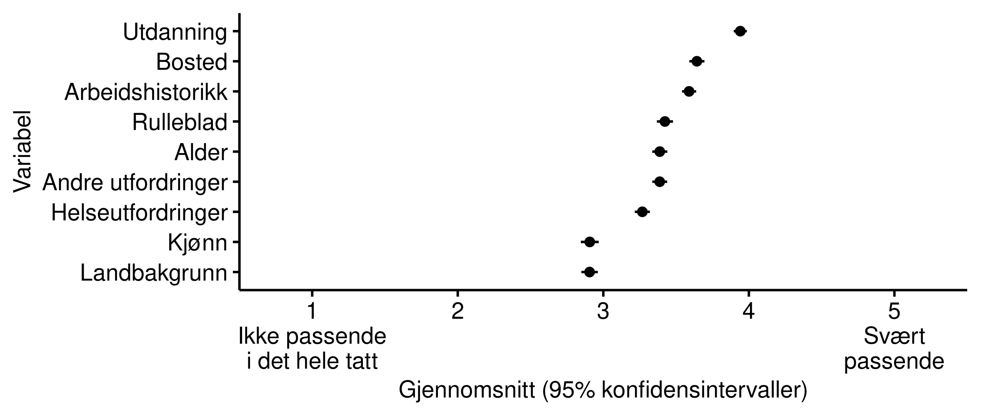
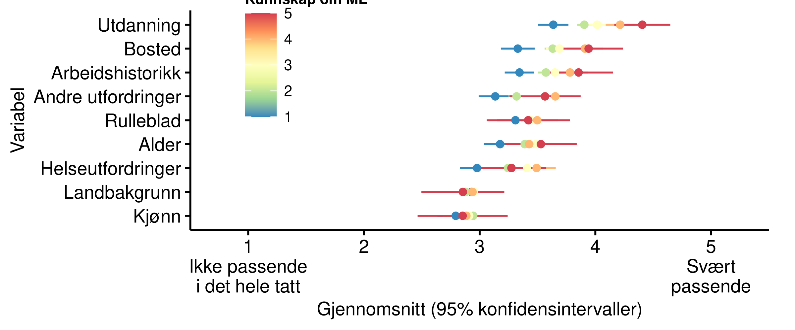

# Hvilken informasjon anses som passende? {#input}

En viktig dimensjon er hvilken informasjon det er rettferdig å bruke. 
(OM DETTE.)
(Definér/forklar "variabel" her.)

(Ekstremt eksempel med rase eller kjønn, for å sette det i perspektiv)

Et realistisk eksempel hvor maskinlæring kan brukes i forvaltninger er hvilke jobbrette tiltak NAV skal tilby en jobbbsøker. Tilgangen til jobbrettede tiltak er behovsbasert og jobbsøkeren har ikke anledning til fritt å velge hvilke tiltak hun eller han ønsker seg. Godt over halvparten av alle jobbsøkere tilbys ingen eller liten bistand fra NAV. Saksbehandler vil på bakgrunn av en individuell vurdering av søkerens behov bestemme innsatsgruppe, og dermed også hvilke tiltak han/hun skal få tilbud om. Tidligere har denne vurderingen blitt gjort av saksbehandleren alene. I dag prøver NAV ut maskinlæring for å bistå saksbehandleren med forslag i denne vurdering. 

I prinsippet finnes det et enormt utvalg av mulige variabler som kan være relevant for en slik prediksjon -- i den forstand at de kan bidra med å gjøre en prediksjon mer nøyaktig. Disse variablene omhandler et stort og variert utvalg informasjon om den enkelte jobbsøker. Det er derfor et godt eksempel på en situasjon hvor det må gjøres en avveining om hvilke variabler man skal bruke, hvor det er sannsynlig at innbyggere vil oppfatte noen variabler som mer eller mindre passende enn andre. I verste fall kan enkelte variabler bli oppfattet som direkte urettferdig.

For å studere dette spurte vi respondentene hvor passende de synes det er å bruke hver av en liste variabler, med utgangspunkt i at de skal brukes for å foreslå jobbrettede tiltak. I spørsmålet satt vi premisset at hver variabel bidrar med å gjøre forslagene mer nøyaktige. Vi spurte dem både om variabler som det har vært aktuelt for NAV å bruke ved en eventuell slik implementering: 

- Helse: Hvorvidt jobbsøkere opplyser at hen har helseutfordringer; 

- Ufordringer: Hvorvidt jobbsøkere opplyser at hen har andre utfordringer som hindrer dem fra å jobbe; 

- Utdanning: Hvorvidt jobbsøkeren har fullført utdanning godkjent i Norge;

- Arbeidshistorikk: Hvorvidt den arbeidssøkende har hatt sammenhengende jobb i 6 av de siste 12 mnd;

- Alder

- Kjønn

(HVILKE VAR DET SOM DE FAKTISK HADDE TENKT Å BRUKE?)
Vi spurte dem også om varabler som det ikke har vært aktuelt å ta bruk, men som representerer andre typer informasjon som i prinsippet kan være informativt:

- Landbakgrunn

- Bosted: Hvor i landet bor brukeren?

- Rulleblad: Har brukere blitt dømt for kriminelle handlinger?

Vi ba dem om å vurdere hver variabel på en fem-punkts skala, fra "Ikke passende i det hele tatt" (1) til "Svært passende" (5). 

Resultatene fra spørsmålet vises i figurene under. 
Den første figurene viser snittet på skalaen for hver variabel, hvor variablene er rangert nedover etter hvor passende respondente synes de var i snitt. Den andre figuren viser hele fordelingen for hver variabel. Samlet sett ser vi at ingen av variablene oppfattes som utvilsomt passende eller upassende. De fleste har et gjennomsnitt mellom 3 ("Noe passende") og 4 ("Passende"). Men noen skiller seg ut. På den ene siden skiller kjønn og landsbakgrunn seg spesielt ut ved å ha et gjennomsnitt under 3, substantielt under de andre; på den andre siden skiller utdanning seg ut ved å ha et gjennomsnitt over 4, substantielt over de andre. Hva variasjonen skyldes vet vi ikke med sikkerhet. At kjønn og landbakgrunn blir sett på som mindre passende er gjerne fordi de er mer direkte knyttet til spørsmål og bekymringer om diskriminering. Samlet sett er det tydelig forskjeller i hvor passende ulike typer informasjon ble oppfattet av respondentene.

De to figurene under sammenligner gjennomsnittet for ulike undergrupper. I den første er det differensiert mellom respondenter med og uten høyere utdanning. Vi ser her at respondenter med ulik utdanning har noe ulikt syn på ulike variablene, og da særskilt når det kommer til nettopp utdanning. De med høyere utdanning synes det er betydelig mer passende enn de uten høyere utdanning å bruke utdanning som variabel. De underliggende årsaken til disse forskjellene kan være mange, men resultatene peker på at grupper med ulik oppfatning, kunnskap, erfaring, etc, kan forholde seg substansielt forskjellig til samme type informasjon.

I den neste figuren er det differensiert etter hvor mye selverklært kunnskap respondenene har om maskinlæring. Her ser vi også noen viktige forskjeller: De med mye selverklært kunnskap om maskinlæring synes at de fire variablene på toppen (som generelt blir sett på som mest passende) er substansielt mer passende enn de uten kunnskap. Dette kan være relatert til underliggende sosioøkonomiske forskjeller mellom de med høy og lav selverklært kunnskap, slik som utdanningsnivå, men det kan også være kunnskap i seg selv som endrer denne oppfatningen. En viktig alternativ mekanisme er at de med mye kunnskap om maskinlæring verdesetter økt nøyaktighet mer enn de uten slik kunnskap, som da endrer hvordan de balanserer ulike hensyn når de vurderer hvor passende variablene er. 

Sett i helhet antyder resultatene at den generelle befolkning er uenig i hvor passende det er å bruke ulike typer informasjon. Samtidig er det tydelig forskjeller mellom variablene, hvor særskilt kjønn og landbakgrunn blir sett på mindre passende av mange. Resultatene viser også at det er viktige systematiske forskjeller mellom ulike grupper for hvordan de gjør denne vurderingen.

(LITREV: HVORDAN RELATERER DETTE SEG TIL HVA ANDRE FINNER?)
Lignende studier gjort med andre eksempelsaker i andre land viser at x. 

