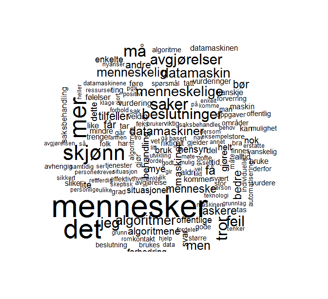

--- 
title: |
  {width=1in}  
  Demokratiske algoritmer: Hvordan oppnå legitimitet og rettferdighet i automatiserte beslutningsprosesser i offentlig forvaltning
author: "Sveinung Arnesen og Mikael P. Johannesson"  
date: "`r Sys.Date()`"
site: bookdown::bookdown_site
documentclass: article
bibliography: [book.bib, packages.bib]
biblio-style: apalike
link-citations: yes
description: "Demokratiske algoritmer: Hvordan oppnå legitimitet og rettferdighet i automatiserte beslutningsprosesser i offentlig forvaltning"
fontsize: 12pt
abstract: "Den pågående automatiseringen av beslutningsprosesser i offentlig forvaltning representerer en omveltning innenfor byråkratisk myndighetsutøvelse. Tilgang på store mengder relevant digital data og økende muligheter for å behandle informasjonen gjør at oppgaver som tidligere måtte behandles manuelt kan overlates til hel- eller halvautomatiserte prosesser med vesentlig redusert menneskelig inngripen. På den ene siden gir denne utviklingen store effektiviseringsmuligheter og potensial for offentlige besparelser. På den andre siden er ivaretakelsen av forvaltningens legitimitet i befolkningen et risikoaspekt i denne utviklingen. Det overordnede målet med denne rapporten er å studere ut fra et demokratiperspektiv om, og i så fall hvordan, oppfattelsen av NAV som institusjon blant innbyggere i Norge påvirkes av en overgang til økt grad av automatisert saksbehandling."
toc: false
output:
  pdf_document:
    toc: false
    includes:
      in_header: preamble.tex
---
```{r setup, include=FALSE}
knitr::opts_chunk$set(echo = FALSE, knitr.kable.NA = " ", cache = FALSE, warning = FALSE)

## if(!require("ggdag")){install.packages("ggdag");  library(ggdag)}
## if(!require("haven")){install.packages("haven");  library(haven)}
## if(!require("here")){install.packages("here");  library(here)}
## if(!require("kableExtra")){install.packages("kableExtra");  library(kableExtra)}
## if(!require("patchwork")){install.packages("patchwork");  library(patchwork)}
## if(!require("readxl")){install.packages("readxl");  library(readxl)}
## if(!require("rio")){install.packages("rio");  library(rio)}
## if(!require("tidyverse")){install.packages("tidyverse");  library(tidyverse)}
```

\newpage
\tableofcontents 

\newpage
# Om rapporten {-}

<!--  -->
<!-- ## Kort sammendrag -->

<!-- Den pågående automatiseringen av beslutningsprosesser i offentlig forvaltning representerer en omveltning innenfor byråkratisk myndighetsutøvelse. -->
<!-- Tilgang på store mengder relevant digital data og økende muligheter for å behandle informasjonen gjør at oppgaver som tidligere måtte behandles manuelt kan overlates til hel- eller halvautomatiserte prosesser med vesentlig redusert menneskelig inngripen. -->
<!-- På den ene siden gir denne utviklingen store effektiviseringsmuligheter og potensial for offentlige besparelser. -->
<!-- På den andre siden er ivaretakelsen av forvaltningens legitimitet i befolkningen et risikoaspekt i denne utviklingen. -->
<!-- Det overordnede målet med denne rapporten er å studere ut fra et demokratiperspektiv om, og i så fall hvordan, oppfattelsen av NAV som institusjon blant innbyggere i Norge påvirkes av en overgang til økt grad av automatisert saksbehandling. -->

## Forfattere {-}


**Sveinung Arnesen** er Forsker I og faglig leder for Demokrati og innovasjon ved [NORCE](https://www.norceresearch.no/personer/sveinung-arnesen), og førsteamanuensis II ved [Institutt for administrasjons- og organisasjonsvitenskap](https://www.uib.no/personer/Sveinung.Arnesen), UiB. 
PhD-graden ble avlagt ved [Institutt for sammenliknende politikk, UiB](https://www.uib.no/sampol). 
Arnesen er Norges nasjonale koordinator for [Den europeiske samfunnsundersøkelsen (ESS)](europeansocialsurvey.org). [ORCID](https://orcid.org/0000-0002-2825-0664). [Github](https://github.com/SveinungA/). [Google Scholar](https://scholar.google.com/citations?user=xz8JwjAAAAAJ&hl=no&oi=ao).

**Mikael P. Johannesson** er forsker III ved [NORCE](https://www.norceresearch.no/personer/sveinung-arnesen) og PhD-kandidat ved [Institutt for Sammenliknende Politikk, UiB](https://www.uib.no/sampol).
Han har bred erfaring med eksperimentelle metoder, maskinlæring (inkludert deep learning), og surveyforskning.
Johannesson har utviklerkompetanse i statistikkprogrammet R, samt erfaring med Python (inkludert TensorFlow og Keras). [Github](https://github.com/mikajoh). [Google Scholar](https://scholar.google.com/citations?user=wG8CyVUAAAAJ&hl=no&oi=ao).

## Referansegruppe  {-}

**Anne Lise Fimreite** er professor ved [Institutt for administrasjons- og organisasjonsvitenskap](https://www.uib.no/personer/Anne.Lise.Fimreite), UiB.
Hun har tidligere ledet den forskningsrådsfinansierte evaluering av NAV-reformen og har arbeidet mye med styringsutfordringer i flernivåsystem. 
Hun har også nylig vært medlem av det offentlige utvalget som i 2019 leverte forslag til ny forvaltningslov (NOU 2019:5) og har egen erfaring fra offentlig forvaltning som prorektor ved UiB i fire år fra 2013 til 2017. 

**Jacob Aars** er professor ved [Institutt for administrasjons- og organisasjonsvitenskap, UiB](https://www.uib.no/personer/Jacob.Aars), og har ledet den NFR-finansierte evalueringen av NAV-reformen (tok over da Fimreite gikk inn i rektoratet ved UiB). 
Han har blant annet forsket på lokaldemokrati og tilfredshet med offentlige tjenester.

## Finansiering {-}
Forskningsrapporten er finansiert av [NAV Forskning og Utvikling](https://www.nav.no/no/nav-og-samfunn/kunnskap/fou-midler/pagaende-fou-prosjekter2/navs-tiltak-og-virkemidler).
Finansieringen er bidragsfinansiert.

## Sitering {-}

Ved referering til rapporten, vennligst bruk følgende sitering:
Arnesen, Sveinung, Mikael P. Johannesson (2022): Demokratiske algoritmer. Norce-rapport #..., Bergen, mars 2022. Url: https://bookdown.org/sveinungarnesen78/NAV/.


```{r}
## ncp21_raw <- import('C:/Users/svein/OneDrive - NORCE/Infrastruktur/Digsscore/Medborgerpanelet/2021-2/Norsk medborgerpanel - runde 21 - v-100-O.sav')
## ncp22_raw <- import('C:/Users/svein/OneDrive - NORCE/Infrastruktur/Digsscore/Medborgerpanelet/2021-3/Norsk medborgerpanel - runde 22 - v-100-O.sav')

## d <- ncp21_raw %>% select(
##   be_internal1 = r21padkom13_1,
##   be_internal2 = r21padkom13_2,
##   be_external1 = r21padkom14_1,
##   be_external2 = r21padkom14_2,
##   nav_trust = r21padkom15,
##   nav_knowledge = r21padkom16,
##   r21padkom17_1_1,
##   r21padkom17_1_2,
##   r21padkom17_1_3,
##   r21padkom17_2_1,
##   r21padkom17_2_2,
##   r21padkom17_2_3,
##   r21padkom17_3_1,
##   r21padkom17_3_2,
##   r21padkom17_4_1,
##   r21padkom17_4_2,
##   r21padkom17_4_3,
##   r21padkom17_5_1,
##   r21padkom17_5_2,
##   r21padkom17_5_3,
##   r21padkom17_6_1,
##   r21padkom17_6_2,
##   r21padkom17_6_3,
##   r21padkom17_7_1,
##   r21padkom17_7_2,
##   r21padkom17_7_3,
##   nav_kontakt = r21padkom18,
##   r21padkom19_ran,
##   caseworker_bias = r21padkom19,
##   ml_knowledge = r21padkom20,
##   ml_interests = r21padkom21,
##   job_prep = r21padkom24,
##   input_health = r21padkom25_1,
##   input_challenges = r21padkom25_2,
##   input_edu = r21padkom25_3,
##   input_work = r21padkom25_4,
##   input_age = r21padkom25_5,
##   input_gender = r21padkom25_6,
##   input_country = r21padkom25_7,
##   input_geo = r21padkom25_8,
##   input_crime = r21padkom25_9,
##   r21padkom29_ran,
##   same_edu = r21padkom29_1,
##   same_geo = r21padkom29_2,
##   same_gender = r21padkom29_3,
##   same_faith = r21padkom29_4,
##   same_age = r21padkom29_5,
##   same_ethnicity = r21padkom29_6,
##   same_polviews = r21padkom29_7,
##   same_workexp = r21padkom29_8,
##   same_sexualorient = r21padkom29_9,
##   ml_worry = r21padkom22,
##   #opentext variable r21padkom23
##   r21padkom26_ran,
##   r21padkom26_ran_contra,
##   parity_post = r21padkom26,
##   parity_reasoning = r21padkom27,
##   systematic_bias = r21padkom28
## )
```


```{r include=FALSE}
# automatically create a bib database for R packages
knitr::write_bib(c(
  .packages(), 'bookdown', 'knitr', 'rmarkdown'
), 'packages.bib')
```
